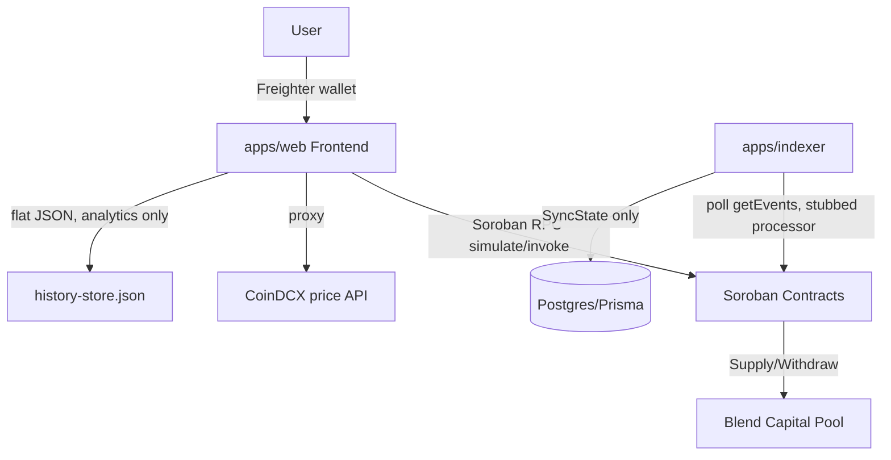
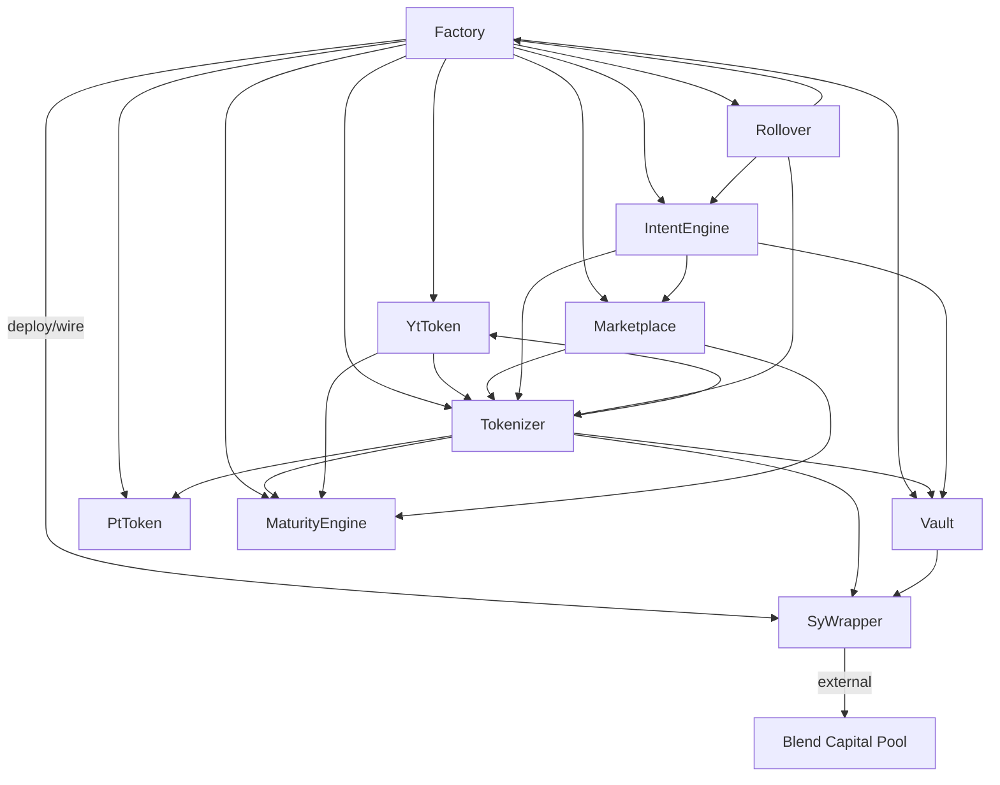
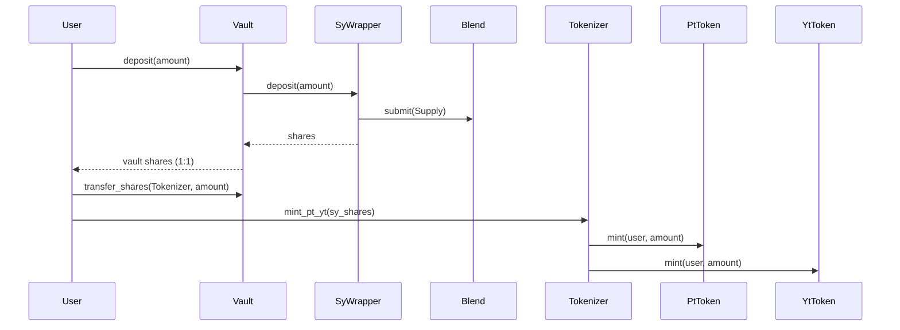
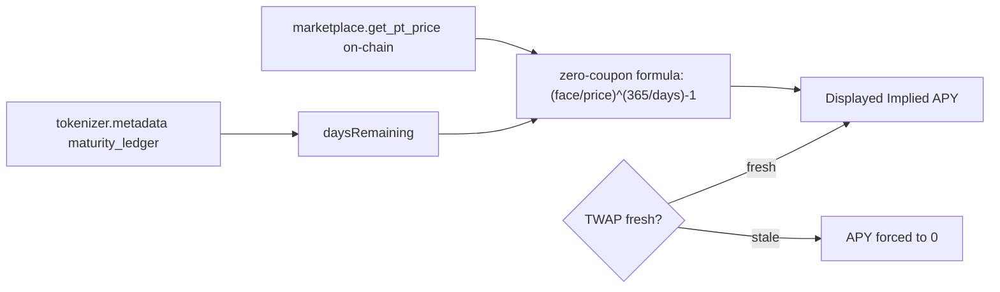
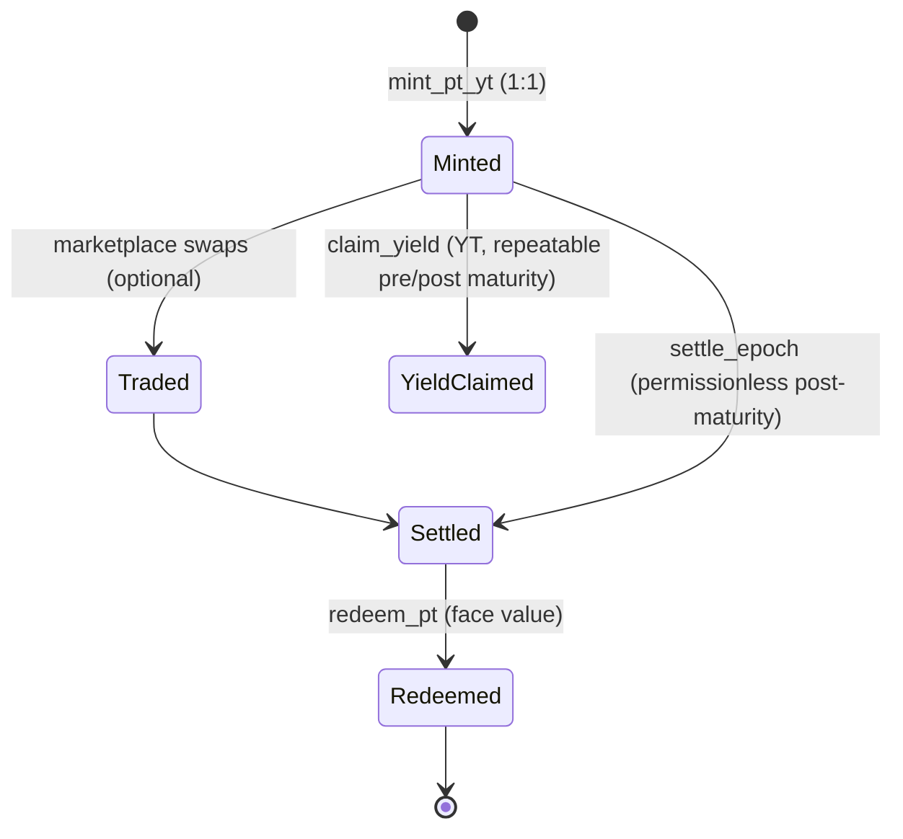
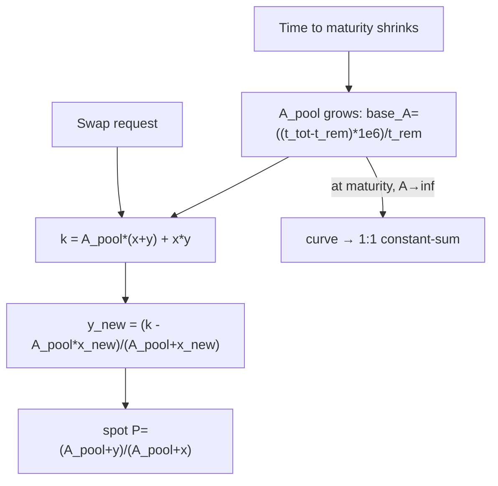
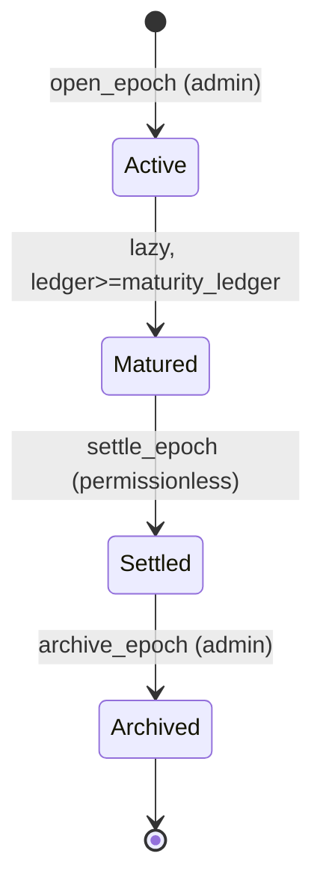
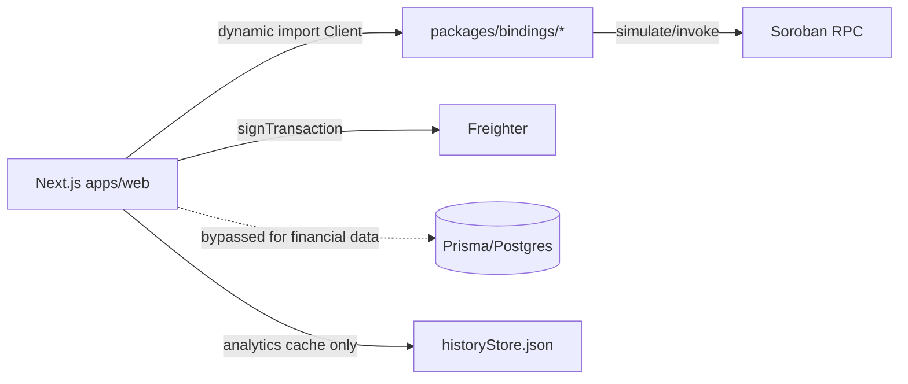
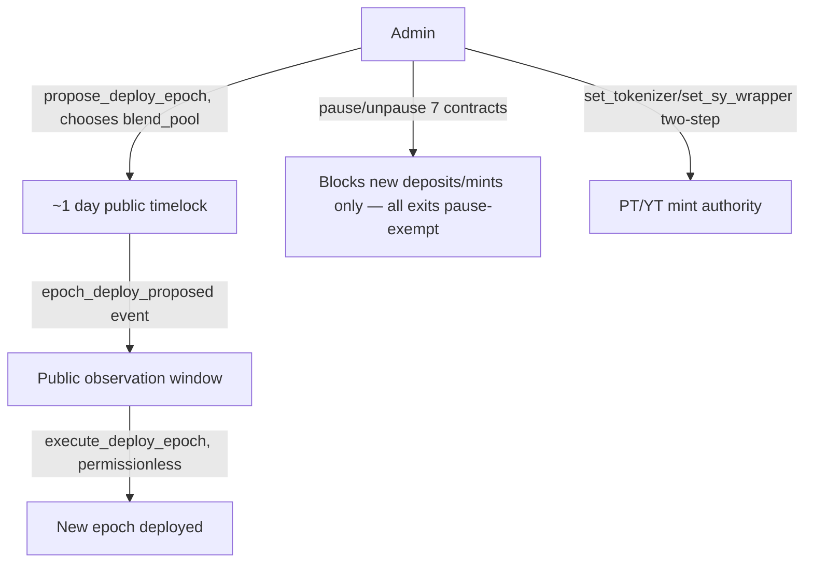
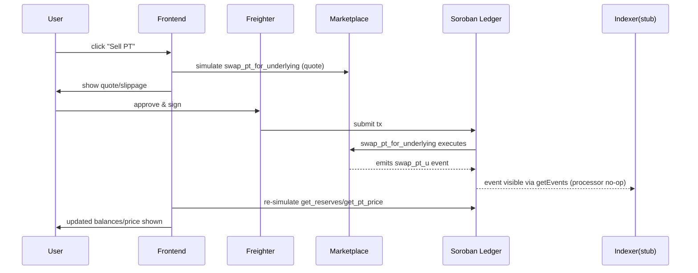

# Novaire Protocol Architecture

> **SUPERSEDED — applies to the pre-2026-08-13 architecture.**
>
> This document describes the **10-contract architecture** (factory, vault, marketplace, maturity_engine, rollover, intent_engine, tokenizer, pt_token, yt_token, sy_wrapper) that was replaced in the migration of **2026-08-13** (commit `7a2f6bbf`). The current architecture is a **6-contract architecture** (5 deployed + 1 library) documented in [`docs/architecture/ARCHITECTURE.md`](./docs/architecture/ARCHITECTURE.md) and [`docs/protocol/CONTRACTS.md`](./docs/protocol/CONTRACTS.md).
>
> This document is retained for historical/audit purposes only. Do not use it to understand the current system.
>
> ---
>
> Read-only, code-grounded architecture extraction. Produced by auditing the actual repository at `/home/ahir/Projects/Novaire` (branch `master`) on 2026-08-09. Every material claim below is cited to a file path and function/line. Where something cannot be verified from code, it is marked **UNKNOWN**. Docs (README, `docs/`) are treated as claims, not truth, and checked against code in Section 23.

---

## 1. Executive Summary

Novaire is a Pendle-style **yield-tokenization protocol on Soroban (Stellar)**: users deposit an underlying asset, receive Principal Tokens (PT) and Yield Tokens (YT) 1:1 against deposited shares, trade PT/YT on a purpose-built AMM, and redeem/claim at or before maturity. Unlike many prototype yield-tokenization projects, the yield source here is **not mocked** — the `sy_wrapper` contract makes real cross-contract calls into a live Blend Capital lending pool (Soroban's largest lending protocol) and derives its exchange rate from Blend's actual `b_rate`.

The protocol consists of **10 Soroban contracts** (factory, tokenizer, pt_token, yt_token, sy_wrapper, vault, marketplace, maturity_engine, rollover, intent_engine), a Next.js frontend (`apps/web`) that reads contract state directly (bypassing the DB), a **currently non-functional indexer** (`apps/indexer` — its event processor is fully stubbed), and a Prisma/Postgres schema that exists but is not populated by anything meaningful today.

Key facts up front:
- **Yield source: REAL**, via Blend Capital pool integration in `sy_wrapper` (`contracts/sy_wrapper/src/lib.rs`).
- **Marketplace pricing: YieldSpace-style time-decaying invariant** (`k = A_pool*(x+y) + x*y`), not plain constant-product, not fixed price.
- **All displayed APY is implied (PT-price-derived), never realized/historical accrual.**
- **No contract upgrade mechanism exists anywhere** — "upgrade" means deploying a whole new epoch's contract set via `factory`.
- **Highest centralization risk**: `factory::propose_deploy_epoch` lets the admin choose the Blend pool address and every contract address for a *future* epoch, mitigated by a ~1-day public timelock and permissionless-after-timelock execution.
- **Indexer/DB is non-authoritative and currently non-functional** — the frontend reads on-chain state directly for everything financial.

---

## 2. System Architecture

```
Repo root
├── contracts/                  Soroban Rust contracts (10 deployable + 1 test crate)
│   ├── factory/                Epoch deployment orchestrator
│   ├── tokenizer/
│   │   ├── tokenizer/          Economic coordinator (mint/claim/settle/redeem)
│   │   ├── pt_token/           Principal Token ledger
│   │   └── yt_token/           Yield Token ledger (reward-per-share accrual)
│   ├── sy_wrapper/              Blend Capital integration, exchange-rate oracle
│   ├── vault/                  1:1 share pass-through to sy_wrapper
│   ├── marketplace/             PT/YT/underlying AMM (YieldSpace-style)
│   ├── maturity_engine/         Canonical epoch FSM (Active/Matured/Settled/Archived)
│   ├── rollover/                Automated PT rollover into next epoch
│   ├── intent_engine/           Multi-hop deposit→mint→sell "intent" orchestrator
│   └── integration_tests/       Test-only crate (e2e, fuzz, invariants, regressions)
├── packages/bindings/            Generated TS client bindings per contract (used by frontend)
├── apps/web/                    Next.js frontend (App Router)
│   ├── src/app/                 Pages + API routes (history, prices, markets, keeper, waitlist)
│   ├── src/services/             protocolService, portfolioService, yieldService, walletService, priceOracleService, etc.
│   ├── src/hooks/                useWallet, useTrade, useYield, usePortfolio, usePrices, useAnalyticsHistory
│   └── src/lib/historyStore.ts   Flat-file JSON store used instead of Prisma for analytics history
├── apps/indexer/                 Soroban RPC event poller — event processor is STUBBED (no DB writes)
├── prisma/schema.prisma          Postgres schema (User/Epoch/Position/Activity/YieldClaim/Rollover/TvlSnapshot/Trade/SyncState/ProtocolHistory) — mostly unused today
├── scripts/                       Deploy, bootstrap, keeper (rollover executor), deprecated yield-injection demo script, verification tooling
├── docs/                          architecture/ARCHITECTURE.md, protocol/CONTRACTS.md, PROTOCOL_INVARIANTS.md — mostly accurate, some stale/self-contradictory sections (Section 23)
└── archive/                       Dead/legacy dev scripts, not part of the live system
```

**Directory responsibilities:**
- `contracts/` — all on-chain logic and state; the actual source of truth for funds, prices, and yield.
- `packages/bindings/` — generated TypeScript `Client` classes per contract, used by `apps/web` for simulation-based reads and signed writes.
- `apps/web/` — the only user-facing surface; reads contract state directly via Soroban RPC simulation (`portfolioService.ts` explicitly bypasses "broken Indexer/DB").
- `apps/indexer/` — intended to reconstruct off-chain queryable state from on-chain events; **currently a no-op except for advancing a ledger sync cursor** (`apps/indexer/src/processor.ts` — every event-type case body is empty).
- `prisma/` — schema exists for a fully-featured indexed backend, but nothing writes to most of its tables today.
- `scripts/` — deployment, bootstrap liquidity, and verification tooling.

---

## 3. Contract Architecture

All contracts: `#![no_std]`, Soroban SDK, `#[contract]`/`#[contractimpl]`. Standard TTL bumping pattern (30/60-day thresholds in ledgers, `DAY_IN_LEDGERS=17280`).

### 3.1 `factory` — `contracts/factory/src/lib.rs`
Orchestrates deployment/wiring of an entire epoch's contract set.

- **Storage**: `Admin`, `ProtocolVersion`, `EpochCount` (instance); `Epoch(u32)`, `Maturity(u32)→epoch_id`, `NextEpoch(u32)→next_epoch_id` (persistent); `PendingDeploy{params, eta}` (instance).
- **Public fns**:
  - `initialize(admin, protocol_version)` — `admin.require_auth()`.
  - `propose_deploy_epoch(params) -> u32` — admin-gated; validates future maturity, no duplicate maturities/addresses; sets `eta = current_ledger + DEPLOY_TIMELOCK_LEDGERS` (~1 day). Publishes `epoch_deploy_proposed`. **Caller supplies `blend_pool`/`underlying_token` and nothing on-chain verifies these are genuine (SEC-10).**
  - `execute_deploy_epoch() -> u32` — **deliberately permissionless** once timelock elapses (liveness even if admin goes dark). Initializes all 9 dependency contracts via generated clients, performs post-wiring sanity checks (`WiringMismatch` on mismatch), writes `EpochRecord`, publishes `epoch_deployed`.
  - `get_epoch`, `latest_epoch`, `epoch_count`, `protocol_version`, `get_next_epoch`, `get_epoch_by_maturity` — read-only.
  - `link_epochs(current_epoch_id, next_epoch_id)` — admin-gated; used by rollover to discover successor epochs.
- **Cross-contract calls**: initializes SyWrapper, Vault, PtToken, MaturityEngine, YtToken, Tokenizer, Marketplace, IntentEngine, RolloverEngine.
- **Admin surface**: `initialize`, `propose_deploy_epoch`, `link_epochs` admin-gated. No pause/upgrade fn in Factory itself.

### 3.2 `tokenizer` — `contracts/tokenizer/tokenizer/src/lib.rs`
The economic coordinator: mints PT/YT against Vault shares, drives settlement.

- **Storage**: `Admin`, `Vault`, `PtToken`, `YtToken`, `SyWrapper`, `MaturityLedger` (display only), `EpochId`, `EpochStartIndex`, `TotalPtMinted`, `SettlementExchangeRate` (Option), `MaturityEngine`, `MaturityEngineEpochId`, `LastRecordedSurplus`.
- Epoch state is NOT stored locally except settlement rate — Open/Matured is derived live via `MaturityEngineClient::live_state`.
- **Public fns**:
  - `initialize(admin, vault, pt_token, yt_token, sy_wrapper, maturity_ledger, maturity_engine, maturity_engine_epoch_id)` — admin-gated; reads `sy_client.get_exchange_rate()` to set `EpochStartIndex`.
  - `mint_pt_yt(user, sy_shares) -> (i128,i128)` — `user.require_auth()`; requires Open. Pulls SY shares (`VaultClient::transfer_shares`), mints PT (`PtTokenClient::mint`) and YT (`YtTokenClient::mint`) 1:1, credits late-minters historical yield = `(exchange_rate - epoch_start_index) * sy_shares / 1e9`. Publishes `tokenizer_minted`. Calls `assert_invariant`.
  - `claim_yield(user) -> i128` — works Open/Matured/Settled. Uses reentry-safe `yt_client.claimable_yield_with_snapshot`. Withdraws physical underlying via `VaultClient::withdraw_for` (self-authorized sub-invocation). Publishes `tokenizer_claimed`.
  - `settle_epoch()` — requires Matured. Calls `sy_client.refresh_rate()`, refreshes yield index, freezes `settlement_rate`, advances `MaturityEngineClient::settle_epoch`. Publishes `tokenizer_settled`.
  - `redeem_pt(user, pt_amount) -> i128` — requires Settled. Burns PT, converts to vault shares via `pt_amount * epoch_start_index / settlement_rate`, withdraws underlying via `VaultClient::withdraw_for`. Publishes `tokenizer_redeemed`.
  - `get_epoch_state()`, `version()`, `metadata()`, `get_surplus_snapshot()` — read-only.
  - `record_surplus_baseline_pub()` — **gated: only the registered YtToken contract may call** (SEC-05).
  - `preview_yield_index()`, `refresh_yield_index()` — permissionless.
- **No pause function and no admin-gated function besides `initialize`** — the economic core has no on-chain kill switch (flagged in Section 16/23).
- **Cross-contract calls**: VaultClient, SyWrapperClient, PtTokenClient, YtTokenClient, MaturityEngineClient.
- **Events**: `tokenizer_minted`, `tokenizer_claimed`, `tokenizer_settled`, `tokenizer_redeemed`.

### 3.3 `pt_token` — `contracts/tokenizer/pt_token/src/lib.rs`
ERC20-like ledger, "Novaire Principal Token" (nPT, 7 decimals).

- **Storage**: `Admin`, `PendingAdmin`, `Tokenizer` (immutable), `TotalSupply`, `Paused`, `Balance`, `Allowance`.
- `mint`/`burn` — **`tokenizer.require_auth()` only**; `burn` bypasses pause.
- `transfer`/`approve`/`transfer_from` — standard, **bypass pause** (secondary-market exit valve by design).
- `pause`/`unpause`, `transfer_admin`/`accept_admin` (two-step) — admin-gated.
- `set_tokenizer`/`accept_tokenizer` — two-step reassignment of minting authority (SEC-06 fix).
- No cross-contract calls; pure token ledger.

### 3.4 `yt_token` — `contracts/tokenizer/yt_token/src/lib.rs`
Reward-per-share yield-accrual token, "Novaire Yield Token" (nYT, 7 decimals), VERSION=2.

- **Storage**: `Admin`, `PendingAdmin`, `Tokenizer` (immutable), `SyWrapper`, `TotalSupply`, `YieldIndex`, `MaturityLedger`, `MaturityEngine`, `MaturityEngineEpochId`, `Paused`, `Balance`, `Allowance`, `UserYieldIndex`, `AccruedYield`.
- `update_yield_index(new_index)` — tokenizer-gated; index cannot decrease.
- `checkpoint_user(user)` — self-auth.
- `reset_claimable`, `add_accrued_yield`, `mint`, `burn` — tokenizer-gated.
- `transfer`/`transfer_from`/`approve` — bypass pause; call `refresh_index_locally` before checkpointing (H4 fix), reading Tokenizer's surplus snapshot and resetting the baseline via self-authorized sub-invocation.
- `claimable_yield(user)` — read-only preview; explicitly documented as unsafe for Tokenizer itself to call (re-entry) — `claimable_yield_with_snapshot` is the safe twin used internally.
- `pause`/`unpause`, `transfer_admin`/`accept_admin` — admin-gated.

### 3.5 `sy_wrapper` — `contracts/sy_wrapper/src/lib.rs`
**The Blend Capital integration point** — the yield source.

- Defines `BlendPoolClient` (`submit`, `get_positions`, `get_reserve`) mirroring the real Blend v2 Pool interface; `BLEND_RATE_SCALAR = 1e12` (Blend's `SCALAR_12`).
- **Storage**: `Admin`, `PendingAdmin`, `Underlying`, `YieldSource` (the Blend pool address — set once at `initialize`, no rotation function), `TotalShares`, `TotalUnderlying`, `Paused`.
- `pool_supplied_value()` — sums bToken position from `pool_client.get_positions(this)`, converts via `bTokens * b_rate / BLEND_RATE_SCALAR` (b_rate from `pool_client.try_get_reserve`).
- `refresh_rate()` — **permissionless**; ratchets `TotalUnderlying` up only, capped at +10%/call, never decreases (else `RateCannotDecrease`).
- `harvest_yield()` — **admin-gated** convenience wrapper around `refresh_rate` + event.
- `mark_loss()` — **permissionless**; down-only correction to measured actual balance (loss realization).
- `deposit(from, amount) -> i128` — `from.require_auth()`; not paused; refreshes rate, `shares_to_mint = amount * 1e9 / rate`; first depositor must exceed 1000 units and permanently locks 1000 shares (inflation-attack mitigation); transfers underlying in, then supplies to Blend via `pool_client.submit(Request{Supply,...})` with CEI ordering (state committed before external call).
- `withdraw(from, shares) -> i128` — bypasses pause; withdraws from Blend then transfers underlying to user.
- `pause`/`unpause`, `transfer_admin`/`accept_admin` (two-step) — admin-gated.
- **Cross-contract calls**: `token::Client` (SEP-41), `BlendPoolClient::submit/get_positions/get_reserve`.
- **Events**: `sy_deposit`, `sy_withdraw`, `sy_loss_realized`, `yield_harvested`.

### 3.6 `vault` — `contracts/vault/src/lib.rs`
Thin 1:1 share pass-through between users and SyWrapper.

- **Storage**: `Admin`, `PendingAdmin`, `Underlying`, `SyWrapper`, `TotalVaultShares`, `Paused` (instance); `UserShares(Address)` (persistent).
- `deposit(depositor, amount)` — pulls underlying, deposits into SyWrapper, credits shares 1:1.
- `withdraw(withdrawer, shares)` — bypasses pause; deducts shares first (reentrancy guard) then calls `sy_client.withdraw`.
- `transfer_shares(from, to, amount)` — internal transfer (Tokenizer uses this to pull user shares).
- `withdraw_for(withdrawer, receiver, shares)` — bypasses pause; proceeds go to `receiver` ≠ caller (used by Tokenizer's claim/redeem on behalf of users).
- `pause`/`unpause`, `transfer_admin`/`accept_admin` — admin-gated.

### 3.7 `marketplace` — `contracts/marketplace/src/lib.rs`
The AMM. **YieldSpace-style time-decaying curve**, not plain x*y=k.

- **Storage**: `Admin`, `PtToken`, `YtToken`, `Underlying`, `SyWrapper`, `Tokenizer`, `MaturityLedger`, `MaturityEngine`, `MaturityEngineEpochId`, `CreatedLedger`, `PtReserves`, `UnderlyingReserves`, `YtReserves`, `TotalLpShares`, `ImpliedRateTwap`, `LastTwapLedger`, `Paused`; `LpBalance(Address)`.
- Pricing (PT/underlying leg):
  ```
  base_A = ((t_tot - t_rem) * 1_000_000) / t_rem     // t_rem shrinks toward 0 as maturity nears
  a_pool = base_A * ((x+y)/2) / 1_000_000
  k      = A_pool * (x + y) + x * y                   // YieldSpace invariant
  y_new  = (k - A_pool * x_new) / (A_pool + x_new)
  P_spot = (A_pool + y) / (A_pool + x)                 // scaled 1e9
  ```
  At/after maturity, `A_pool → "infinity"`, converging the curve to 1:1 constant-sum. Fee = 0.3% (`997/1000`), applied to input on PT swaps / output on YT swaps.
- **YT leg** is priced synthetically off the *same* PT curve (no separate YT-reserve curve): buying YT = "mint SY into paired PT+YT, sell PT leg into curve"; bisection solver (100 iterations) finds YT out for given underlying in. Selling YT uses a closed-form dual.
- **TWAP**: EMA (weight_old=20), recorded pre-swap; `MAX_TWAP_AGE_LEDGERS=200`. **Analytics-only — not used for actual swap execution pricing.**
- **Public fns**: `initialize`, `pause`/`unpause` (admin-gated; `remove_liquidity` pause-exempt for LP exit), `add_liquidity`, `add_yt_liquidity`, `remove_liquidity`, `swap_underlying_for_pt`, `swap_pt_for_underlying`, `swap_underlying_for_yt`, `swap_yt_for_underlying`, `claim_amm_yield()` (permissionless, sweeps AMM's own accrued yield via `TokenizerClient::claim_yield`), plus read-only quotes (`get_pt_price`, `get_twap_rate`, `get_yt_price`, `get_reserves`, etc.).
- **No admin-settable fee, no treasury, no LP whitelist field exists in `DataKey`.**

### 3.8 `maturity_engine` — `contracts/maturity_engine/src/lib.rs`
The canonical epoch clock — single source of truth for Active/Matured/Settled/Archived, consumed by Tokenizer/YtToken/Marketplace via `live_state`.

- **Storage**: `Admin`, `CurrentEpochId` (instance); `Epoch(u32)→EpochRecord` (persistent).
- **FSM**: `Active(0)` → `Matured(1)` (lazily evaluated: `ledger >= maturity_ledger`) → `Settled(2)` → `Archived(3)`.
- `open_epoch(maturity_ledger)` — admin-gated; rejects opening while current epoch still active/unsettled.
- `settle_epoch(epoch_id)` — **permissionless** (cranked by anyone once Matured).
- `archive_epoch(epoch_id)` — admin-gated, requires Settled.
- No fund custody, no cross-contract calls.

### 3.9 `rollover` — `contracts/rollover/src/lib.rs`
Automates rolling matured PT positions into the next epoch via Intent Engine.

- **Storage**: `Admin`, `Tokenizer`, `Vault`, `Marketplace`, `IntentEngine`, `Keeper`, `PtToken` (rotates each roll), `UnderlyingToken`, `Paused`, `GracePeriodLedgers` (default 1 day), `TotalPtHeld`, `Factory`; `RolloverPositions(Address)`.
- `register_rollover(user, pt_amount, current_epoch_maturity, min_rate_bps, min_underlying_out)` — user-auth; transfers PT into contract custody.
- `execute_rollover(user)` — **hybrid auth**: keeper-gated within grace period (default 1 day post-maturity), **permissionless after** grace period expires (liveness fallback). Flow: `TokenizerClient::redeem_pt` → discover next epoch via `FactoryClient::get_epoch_by_maturity`/`get_next_epoch` → `IntentEngineClient::execute_fixed_yield_intent`. Proceeds always paid to position owner, never redirectable to keeper.
- `exit_rollover(user)` — user-auth, pause-exempt (anti-trap).
- `update_keeper(new_keeper)` — admin-gated.
- `pause`/`unpause` — admin-gated.

### 3.10 `intent_engine` — `contracts/intent_engine/src/lib.rs`
Multi-hop "intent" orchestrator: deposit → mint PT/YT → partially sell YT/PT, atomically.

- **Storage**: `Admin`, `Vault`, `Tokenizer`, `Marketplace`, `SyWrapper`, `Underlying`, `PtToken`, `YtToken`, `Paused`; `UserIntents(Address)→CumulativeIntentRecord`.
- `execute_fixed_yield_intent(user, usdc_amount, min_implied_rate, min_underlying_out, yt_sale_percentage)` — user-auth; checks marketplace bootstrapped and `current_twap >= min_implied_rate`; deposit→mint→sell `yt_sale_percentage`% of YT→send remainder to user.
- `execute_yield_speculation_intent(user, usdc_amount, min_yt_out, min_underlying_out)` — deposit→mint→sell the PT leg to lever into YT exposure.
- `pause`/`unpause` — admin-gated.

### 3.11 `integration_tests` — test-only crate
Not a deployed contract. `e2e.rs`, `fuzz.rs`, `invariants.rs`, `l1_regression.rs`, `m1_production_bootstrap.rs`, `m1_regression.rs`…`m5_regression.rs`, `mock_blend_pool.rs`, `reentry_differential.rs`, `reentry_regression.rs`, `reproduce.rs`, `simulation.rs`, `stress.rs`. Naming convention (M1–M5, H3–H5, SEC-01…SEC-14, C1) referenced throughout production code comments and `SECURITY_AUDIT.md`.

---

## 4. Capital Flow

Cross-contract dependency graph (from actual client calls):

```
Factory ──initializes/wires──▶ SyWrapper, Vault, PtToken, MaturityEngine, YtToken,
                                Tokenizer, Marketplace, IntentEngine, RolloverEngine

Tokenizer ──▶ Vault (transfer_shares / withdraw_for / balance_of)
Tokenizer ──▶ SyWrapper (get_exchange_rate / refresh_rate)
Tokenizer ──▶ PtToken (mint / burn / balance / total_supply)
Tokenizer ──▶ YtToken (mint / checkpoint_user / claimable_yield_with_snapshot /
                        reset_claimable / update_yield_index / add_accrued_yield)
Tokenizer ──▶ MaturityEngine (live_state / settle_epoch)

YtToken ──▶ Tokenizer (get_surplus_snapshot / record_surplus_baseline_pub)
YtToken ──▶ MaturityEngine (live_state)

SyWrapper ──▶ Blend Capital Pool (submit / get_positions / get_reserve)  [EXTERNAL PROTOCOL]
SyWrapper ──▶ underlying SEP-41 token

Vault ──▶ SyWrapper (deposit / withdraw)
Vault ──▶ underlying token

Marketplace ──▶ Tokenizer (claim_yield)
Marketplace ──▶ MaturityEngine (live_state)
Marketplace ──▶ PT / YT / underlying tokens (direct SEP-41)

IntentEngine ──▶ Vault (deposit)
IntentEngine ──▶ Tokenizer (mint_pt_yt)
IntentEngine ──▶ Marketplace (swap_yt_for_underlying / swap_pt_for_underlying / rates)
IntentEngine ──▶ PtToken / YtToken / underlying tokens

Rollover ──▶ Tokenizer (redeem_pt)
Rollover ──▶ Factory (get_epoch_by_maturity / get_next_epoch)
Rollover ──▶ IntentEngine (execute_fixed_yield_intent)
Rollover ──▶ PtToken, underlying token
```

**End-to-end capital flow, cited:**

1. **Deposit (direct)**: user → `vault::deposit` (`contracts/vault/src/lib.rs`) → `sy_wrapper::deposit` (`contracts/sy_wrapper/src/lib.rs:deposit`) → Blend `pool_client.submit(Request{Supply})`. User receives Vault shares 1:1.
2. **PT/YT mint**: user's Vault shares are transferred to Tokenizer via `vault::transfer_shares`, then `tokenizer::mint_pt_yt` (`contracts/tokenizer/tokenizer/src/lib.rs`) mints PT and YT 1:1 via `pt_token::mint` / `yt_token::mint`.
3. **Trade (optional)**: PT/YT can be sold/bought on `marketplace` (`contracts/marketplace/src/lib.rs::swap_*`), or the whole deposit→mint→sell path can be done atomically via `intent_engine::execute_fixed_yield_intent`.
4. **YT yield claim**: `tokenizer::claim_yield` (`contracts/tokenizer/tokenizer/src/lib.rs`) computes claimable via `yt_token::claimable_yield_with_snapshot`, withdraws underlying from Vault via `vault::withdraw_for`.
5. **Maturity/settlement**: once `maturity_engine::live_state` reports Matured, anyone calls `tokenizer::settle_epoch`, which freezes `settlement_rate` and advances `maturity_engine::settle_epoch` (permissionless).
6. **PT redemption**: after Settled, `tokenizer::redeem_pt` burns PT and withdraws underlying at guaranteed face value via `vault::withdraw_for`.
7. **Rollover (optional)**: `rollover::execute_rollover` redeems matured PT via `tokenizer::redeem_pt`, discovers the next epoch via `factory::get_next_epoch`, and reinvests via `intent_engine::execute_fixed_yield_intent`.
8. **Withdrawal (direct, no PT/YT)**: `vault::withdraw` → `sy_wrapper::withdraw` → Blend `pool_client.submit(Request{Withdraw})` → underlying to user.

---

## 5. Yield Architecture

**Classification: IMPLEMENTED (real external protocol integration).**

- `sy_wrapper` (`contracts/sy_wrapper/src/lib.rs`) defines its own `BlendPoolClient` mirroring the real Blend v2 Pool interface (comments state the layout was confirmed against `blend-capital/blend-contracts-v2` source), and makes genuine cross-contract calls: `pool_client.submit(...)` (Supply on deposit, Withdraw on withdraw), `pool_client.get_positions(this)`, `pool_client.get_reserve(...)`.
- `scripts/deploy.ts` and `scripts/deploy_xlm_epoch.ts` hardcode a real Blend testnet pool ID as the default `blend_pool` parameter.
- Mock Blend pool implementations (`mock_blend_pool.rs`, and `#[cfg(test)]`-gated mocks in `sy_wrapper`) exist **only in test code**, not in the production path.
- **Exchange rate/yield update**: automatic on every interaction (`refresh_rate()` is called internally by `deposit`), additionally permissionlessly callable by anyone at any time, and wrapped by an admin-gated `harvest_yield()` convenience/eventing function. **No keeper is required for correctness** — this is (d) automatic-on-interaction as primary mechanism, with (a) permissionless refresh as backstop, and (b) admin-only only for a cosmetic harvest/event wrapper.
- Rate can only increase within `refresh_rate` (capped at +10%/call to prevent donation-DoS), and can only be forced down via the permissionless `mark_loss()`, which is floor-bound at the actually-measured Blend balance (cannot be abused to under-report).

---

## 6. Yield Accounting

All formulas cited to `contracts/sy_wrapper/src/lib.rs` and `contracts/tokenizer/tokenizer/src/lib.rs`.

| Mechanism | Input | Formula | Output |
|---|---|---|---|
| SY exchange rate | idle balance + Blend `b_rate`-derived position value | `rate = total_underlying * 1e9 / total_shares` (`EXCHANGE_RATE_SCALAR=1e9`) | i128, scaled 1e9 |
| SY shares on deposit | `amount` (underlying units) | `shares_to_mint = amount * 1e9 / rate` | i128 shares |
| Pool-supplied value | bToken balance from `get_positions`, `b_rate` from `get_reserve` | `pool_value = bTokens * b_rate / BLEND_RATE_SCALAR (1e12)` | underlying units |
| Rate ratchet (per call) | old rate, measured actual balance | `new_rate = min(computed_rate, old_rate * 110 / 100)`; error if `new_rate < old_rate` | i128, monotonic non-decreasing |
| YT reward-per-share index | surplus (assets_held − PT liability), total YT supply | `delta_reward_per_yt = delta_surplus_underlying * 1e9 / total_yt_supply` | i128 index delta |
| Late-minter historical credit | current exchange rate, epoch-start index, deposited sy_shares | `historical_yield = (exchange_rate - epoch_start_index) * sy_shares / 1e9` | i128 underlying-equivalent credited to YT |
| YT claimable → vault shares | claimable underlying amount, current exchange rate | `shares_to_withdraw = claimable * 1e9 / exchange_rate` | i128 vault shares |
| PT redemption at maturity | pt_amount, epoch_start_index, frozen settlement_rate | `shares_to_withdraw = pt_amount * epoch_start_index / settlement_rate` | i128 vault shares (PT redeems at exactly face value) |
| PT/YT mint | deposited SY shares | 1:1 — `pt_minted == yt_minted == sy_shares` | equal PT and YT amounts |

**Solvency invariants** (`tokenizer::assert_invariant`): `pt_outstanding == yt_outstanding` while Open; `surplus = assets_held_raw − pt_liability_raw >= 0` at all times.

---

## 7. APY Architecture

**Classification: ALL APY figures found are IMPLIED (market/discount-derived), NONE are realized/historical-accrual APY.**

- `apps/web/src/utils/apy.ts` — `calculateMarketImpliedApy()`: zero-coupon-bond discount formula
  ```
  apy = (ptFaceValue / ptPrice) ^ (365 / daysRemaining) − 1
  ```
  where `ptPrice` comes from a live on-chain read (`marketplaceClient.get_pt_price()`). This is a **market-implied** APY, not a measurement of realized yield accrual.
- `apps/web/src/utils/yield.ts` — `calculateProjectedDailyYield()` is explicitly documented as an estimate derived from the implied APY above, not from realized yield.
- Stale TWAP (contract-side revert on `get_twap_rate_checked`) forces `impliedYieldApy = 0` in the frontend rather than fabricating a number — `protocolService.ts`.
- All UI surfaces consuming this figure (VaultStatistics, KPICards, AnalyticsKPICards, MarketStatisticsPanel, `yieldService`, `protocolService`) use the same single implied-APY computation — there is no separate "realized APY" surfaced anywhere.
- **No contract-level APY computation exists** — APY is purely a frontend derivation from on-chain PT price + time-to-maturity.
- Contract-level TWAP (`marketplace::get_twap_rate*`) is an EMA of *spot price*, used only for analytics/guard-rail checks (`intent_engine`'s `min_implied_rate` check) — not itself an APY, and **not used in swap execution pricing**.

---

## 8. PT/YT Architecture

- **PT (`pt_token`)**: "Novaire Principal Token" (nPT), 7 decimals. Minted 1:1 with deposited SY shares by `tokenizer::mint_pt_yt`. Redeemable at exactly face value in underlying after settlement (`tokenizer::redeem_pt`), independent of yield performance — this is the "principal guarantee" property. Mint/burn gated to the `tokenizer` contract address only.
- **YT (`yt_token`)**: "Novaire Yield Token" (nYT), 7 decimals, VERSION=2. Minted 1:1 alongside PT. Entitles holder to accrued yield via a reward-per-share (`YieldIndex`) accumulator, checkpointed per-user (`UserYieldIndex`, `AccruedYield`). Late minters (joining after epoch start) receive a one-time historical-yield credit so they aren't diluted by/don't dilute earlier holders.
- Both tokens: transfers/approvals bypass pause (secondary-market exit valve always open); mint/burn strictly gated to Tokenizer; admin controls limited to pause and two-step admin/tokenizer/sy_wrapper address rotation.
- **Solvency**: `pt_outstanding == yt_outstanding` enforced while epoch Open (`tokenizer::assert_invariant`).

---

## 9. Marketplace

**Classification: IMPLEMENTED — YieldSpace-style time-decaying bonding curve, not constant-product, not fixed-price, not oracle-priced.**

- Invariant: `k = A_pool*(x+y) + x*y`, where `A_pool` grows as maturity approaches (`base_A = ((t_tot − t_rem) * 1e6) / t_rem`), converging the curve toward a 1:1 constant-sum AMM exactly at maturity (standard Pendle-style design).
- Spot price: `P = (A_pool + y) / (A_pool + x)`, scaled 1e9.
- Trade execution: `y_new = (k − A_pool*x_new) / (A_pool + x_new)`; fee 0.3% (997/1000) on PT-leg input, output-side haircut on YT-leg.
- **YT leg has no independent reserve curve** — it's synthetically derived from the PT curve via a bisection solver (100 iterations) that finds the largest YT amount whose net cost (mint-then-sell-PT-leg) ≤ input; selling YT uses a closed-form dual of the same relationship.
- **TWAP**: EMA of spot price (weight_old=20), recorded pre-swap, max age 200 ledgers — used only for analytics and as a guard-rail input (`intent_engine`'s `min_implied_rate`), **never used to price actual swaps**.
- PT price → implied APY mapping is done entirely in the frontend (Section 7), not on-chain.
- LP mechanics: `sqrt(x*y)` first-deposit shares minus 1000 permanently-locked minimum-liquidity shares (inflation-attack mitigation), proportional min-ratio thereafter; `remove_liquidity` always callable even while paused.
- No admin-settable fee parameter, no protocol treasury/fee-sweep function, no LP whitelist exist in `marketplace`'s `DataKey`.

---

## 10. Maturity

- `maturity_engine` is the single canonical FSM: `Active(0)` → `Matured(1)` (lazily evaluated: `current_ledger >= maturity_ledger`, no state write needed) → `Settled(2)` (`settle_epoch`, **permissionless**) → `Archived(3)` (`archive_epoch`, admin-only, requires Settled).
- Every other contract (`tokenizer`, `yt_token`, `marketplace`) queries `maturity_engine::live_state(epoch_id)` live rather than tracking its own copy of maturity state, avoiding state-desync bugs.
- Settlement is a two-step handshake: `tokenizer::settle_epoch()` calls `sy_client.refresh_rate()`, freezes `settlement_rate`, then itself calls `maturity_engine::settle_epoch(epoch_id)` in the same transaction — this is why `maturity_engine::settle_epoch` is permissionless (Tokenizer relies on being able to call it without needing separate admin auth).
- PT redemption (`tokenizer::redeem_pt`) is only permitted once Settled, and redeems at exactly face value using the frozen `settlement_rate` (avoids double-rounding vs. sequential division, per `PROTOCOL_INVARIANTS.md` §4).
- `archive_epoch` is purely a bookkeeping/lifecycle marker — no fund implications found.

---

## 11. Rollover

- `rollover` contract automates: redeem matured PT → discover next epoch (`factory::get_next_epoch`, populated by admin-only `factory::link_epochs`) → reinvest via `intent_engine::execute_fixed_yield_intent`.
- `register_rollover(user, pt_amount, ...)` — user opts in by transferring PT into contract custody ahead of maturity, specifying `min_rate_bps` and `min_underlying_out` guardrails.
- `execute_rollover(user)` — **hybrid authorization**: keeper-gated (`Keeper.require_auth()`) within a grace period (default 1 day post-maturity, `GracePeriodLedgers`), then **permissionless** after the grace period lapses (liveness fallback so a dead/malicious keeper cannot permanently trap rollover-registered users).
- Proceeds are always paid to the position owner, never redirectable to the keeper — keeper compromise is a griefing/timing risk (delay), not a theft risk.
- `exit_rollover(user)` lets a user cancel and reclaim PT at any time, including while paused (anti-trap design).
- The unscheduled `scripts/keeper.js` off-chain rollover-execution bot (and its `/api/keeper/register` registration endpoint) was removed; rollover execution relies entirely on the permissionless-after-grace-period fallback described above.

---

## 12. Frontend

`apps/web` (Next.js App Router).

- **Routes**: `page.tsx` (landing), `app/app/{page,trade,vaults,portfolio,analytics}.tsx`, `app/docs/*`, `app/dev/page.tsx`.
- **API routes**: `app/api/history/route.ts`, `history/snapshot`, `history/sync`, `markets/route.ts`, `prices/route.ts`, `waitlist/route.ts`.
- **Components**: `components/{dashboard,trade,vaults,portfolio,analytics,ui}/*`.
- **Hooks**: `useWallet`, `useTrade`, `useYield`, `usePortfolio`, `usePrices`, `useAnalyticsHistory`, `useNotifications`.
- **Services**: `protocolService`, `portfolioService`, `yieldService`, `walletService`, `priceOracleService`, `marketService`, `activityService`, `analyticsHistoryService`, `notificationService`.
- **Wallet integration**: Freighter only, via `@stellar/freighter-api`, wrapped in `walletService.ts` (singleton pub/sub). No multi-wallet support found.
- **Contract SDK usage**: dynamically imports generated `Client` classes from `packages/bindings/{contract}/src/index.ts`, instantiated with `rpcUrl`/`networkPassphrase`/`contractId` from `apps/web/src/config/contracts.ts`, addresses sourced from `scripts/deployments.{testnet,mainnet}.json` selected by `NEXT_PUBLIC_NETWORK`. Reads are simulation calls; writes go through Freighter's `signTransaction`.

**Metric provenance** (see Section 22 for the full table):
- **TVL** — direct on-chain reads (`vault.total_vault_shares` + `marketplace.get_reserves`), USD-converted via a CoinDCX price proxy.
- **APY** — client-side zero-coupon-bond formula off live `marketplace.get_pt_price()` (Section 7). Real, but implied not realized.
- **PT/YT price** — direct on-chain read of `marketplace.get_pt_price()`; YT price derived client-side as `1 − ptPrice`.
- **Maturity countdown** — on-chain `tokenizer.metadata()` for `maturity_ledger`, converted via an assumed 5.5s/ledger constant; falls back to a hardcoded "30 days from now" if unreachable.
- **User positions/portfolio value** — direct on-chain reads per asset (PT/YT balance, vault shares, claimable yield), explicitly documented as bypassing the indexer/DB (`portfolioService.ts` comment: "Fetch protocol positions DIRECTLY from on-chain contracts (bypassing broken Indexer/DB)").
- **Asset USD prices** — third-party CoinDCX ticker API proxied through `/api/prices`.

**Hardcoded/mocked values found in frontend (flag these — not financial-source-of-truth issues, but demo artifacts)**:
1. `yieldService.ts` — static vault capacity `capacityUsd: 2000000`.
2. `yieldService.ts` — hardcoded "30 days from now" maturity fallback on fetch failure.
3. `portfolioService.ts` / `activityService.ts` — hardcoded `'Epoch 17'` / `'Novaire Epoch 17'` labels, not derived from any on-chain epoch enumeration.
4. `priceOracleService.ts` — sparkline and "historical prices" are synthetic interpolations from current/low/high, explicitly commented as mocks.
5. `useTrade.ts` — dummy wallet address used for read-only market-data simulation when no wallet connected.
6. `app/api/waitlist/route.ts` — explicitly simulated ("TODO: Connect to Resend/Airtable/Supabase"), artificial 800ms delay, no real persistence.

---

## 13. Backend

There is no separate backend service beyond the Next.js API routes described in Section 12 and the indexer described in Section 14.

- **API routes are a mix of on-chain-proxy and non-authoritative**: `history/*` routes read/write a flat-file JSON store (`apps/web/src/lib/historyStore.ts`, "Replaces Prisma/SQLite for the dev/testnet environment"), populated by re-querying live chain state — not itself a source of truth, purely a cache for charting.
- `markets`/`prices` routes are pure proxies to the CoinDCX external ticker API.
- **No standalone scheduler/cron/keeper daemon runs in the repo** beyond: (a) the indexer's 5s poll loop (see Section 14, which is a no-op for data), and (b) client-side polling intervals in the frontend itself (`useTrade.ts` 15s market refresh, `analyticsHistoryService` 10s poll triggering `/api/history/sync`). The unscheduled legacy `scripts/keeper.js` rollover-executor script and its `/api/keeper/register` registration endpoint were removed.

---

## 14. Indexer

`apps/indexer/src/index.ts` — polls Soroban testnet RPC every 5s via `getEvents()` for configured contract IDs (from `scripts/deployments.testnet.json`), starting from `SyncState.lastLedger`.

`apps/indexer/src/processor.ts` — `processEvent()` is a switch statement over event topics (`epoch_deployed`, `vault_deposit`, `vault_withdraw`, `pt_mint`/`yt_mint`/`mint`, `pt_burn`/`yt_burn`/`burn`, `transfer`, `swap`, `yield_claimed`, `rollover_registered`, `rollover_executed`) — **every case body is empty** (comment stubs only, `// Handle X`). Only `SyncState` (the ledger cursor) is actually written to the DB.

**Classification: PARTIALLY IMPLEMENTED / effectively NON-FUNCTIONAL.** The indexer confirms it can subscribe to and receive real on-chain events, but currently performs no data reconstruction. This matches the frontend's own internal comment calling it "the broken Indexer/DB."

**Prisma schema** (`prisma/schema.prisma`, Postgres): `User`, `Epoch`, `Position` (unique `[userId, epochId]`), `Activity`, `YieldClaim`, `Rollover`, `TvlSnapshot`, `Trade`, `SyncState`, `ProtocolHistory`. All models except `SyncState` are currently unpopulated by any code path found. `ProtocolHistory`'s shape matches what `historyStore.ts` produces, but the web app does not use Prisma at all — `historyStore.ts` writes to a flat JSON file instead, meaning `ProtocolHistory` is dead schema.

**Is the DB authoritative for anything financially important? No.** Every financially meaningful number the frontend displays is fetched live from Soroban contract reads at request time, explicitly bypassing DB/indexer. In principle the on-chain event stream *is* reconstructable into the Prisma schema's shape (the schema is well-designed for it), but the reconstruction code does not exist yet.

---

## 15. Security

- **Reentrancy**: no explicit lock/flag; mitigated by disciplined checks-effects-interactions ordering — `vault::withdraw` deducts shares before calling `sy_wrapper::withdraw`; `sy_wrapper::deposit` commits `total_shares`/`total_underlying` before calling Blend's `pool_client.submit` (documented SEC-11 fix). `authorize_as_current_contract` grants in `intent_engine`/`rollover` are scoped to single `(contract, fn, args)` triples with empty sub-invocations, preventing delegated re-auth chains.
- **Replay/nonce**: no app-level nonce/deadline fields anywhere (`grep` for nonce/deadline/replay across `intent_engine`/`marketplace` = zero hits); relies entirely on Stellar's native transaction-sequence-number replay protection and live same-transaction `require_auth()`. No defense-in-depth nonce layer exists — relevant if a future meta-transaction/relayer feature is added.
- **Overflow**: workspace-wide `overflow-checks = true` (`contracts/Cargo.toml:19`). Arithmetic overwhelmingly uses `checked_add`/`checked_sub`/`checked_mul` mapped to explicit errors. A few raw (non-checked) divisions exist in `tokenizer` yield/surplus math and `sy_wrapper`'s `b_rate` conversion — since overflow-checks is on workspace-wide, a divide-by-zero there panics/reverts the transaction (fail-safe, not fail-silent), consistent with `SECURITY_AUDIT.md` SEC-03's own characterization.
- **`.unwrap()`/`panic!()`**: exactly 3 `.unwrap()` calls found across all 10 production `lib.rs` files, all inside `MockBlendPool` test-helper code, none in user-facing entrypoints. Zero `panic!()` or `.expect()` calls in production paths.
- **Rounding**: LP-share minting floor-rounds in favor of the protocol/existing LPs; `MINIMUM_LIQUIDITY=1000` permanently locked favors protocol solvency over first depositor; PT settlement uses cross-multiplication against a frozen rate specifically to avoid double-rounding; SY exchange rate only ratchets up except via explicit floor-bound `mark_loss`. No rounding point checked favored an attacker/third party over protocol+user.
- **No `TODO`/`FIXME`/`XXX` comments found** anywhere in production contract source.
- **No contract-upgrade mechanism exists** — zero hits for `update_current_contract_wasm` anywhere in `contracts/`. "Upgrade" = deploy a whole new epoch's contract set via `factory`, individual contracts are immutable post-deploy. This bounds the blast radius of every admin key: a compromised admin can reconfigure/pause/redirect roles but cannot swap contract logic in place.
- **Price-manipulation risk surface**: `sy_wrapper`'s exchange rate is derived from Blend's self-reported `b_rate` — the protocol's real, acknowledged "other oracle" (per `PROTOCOL_INVARIANTS.md` §8), bounded by the 10%/call ratchet cap but not otherwise independently verified.

---

## 16. Permissions

Full privileged/admin function inventory. Severity: P0 = can steal/freeze funds or break protocol; P1 = high-impact but deploy-time-only or requires additional compromise; P2 = DoS/griefing/config only; P3 = minor/informational.

| Function | Contract | Auth | Modifies | Fund/Yield/Price impact | Severity |
|---|---|---|---|---|---|
| `propose_deploy_epoch` | factory | admin | `PendingDeploy` (incl. `blend_pool` address for a *future* epoch) | Malicious/compromised admin could point a future epoch's SY Wrapper at an attacker-controlled "pool," draining all future depositors of that epoch. Nothing on-chain verifies `blend_pool` is genuine Blend (SEC-10). | **P0**, mitigated by ~1-day public timelock + permissionless execution |
| `initialize` (sy_wrapper) | sy_wrapper | admin | `YieldSource` (Blend pool address) — **no rotation function exists after this** | Wrong/malicious pool = total loss of all deposits routed there | **P0**, one-time/deploy-time only |
| `initialize` (vault/marketplace/tokenizer/pt_token/yt_token/factory) | various | admin | Full contract wiring | Wrong wiring = broken/exploitable protocol; deploy-time only, factory validates via `WiringMismatch` | P1 |
| `set_tokenizer`/`accept_tokenizer`, `set_sy_wrapper`/`accept_sy_wrapper` | pt_token, yt_token | admin (two-step, SEC-06 fix) | Mint/burn authority delegation | Highest blast-radius admin fn in token contracts post-deploy; mitigated by two-step accept | P1 |
| `link_epochs` | factory | admin | `NextEpoch` mapping | Misroutes rollover funds to wrong epoch if set wrong (epoch existence is validated) | P1 |
| `pause`/`unpause` (vault, sy_wrapper, marketplace, rollover, intent_engine, pt_token, yt_token) | 7 contracts | admin | `Paused` flag | Blocks new deposits/mints only — **every exit/withdraw path is explicitly pause-exempt** by design across all contracts | P2 |
| `transfer_admin`/`accept_admin` | vault, sy_wrapper, pt_token, yt_token | admin/pending-admin | `Admin` | Two-step, safe by construction | P2 |
| `update_keeper` | rollover | admin | `Keeper` address | Can set unresponsive keeper, forcing rollovers to wait out the grace period before permissionless fallback — griefing/timing only, never redirects funds | P2 |
| `harvest_yield` | sy_wrapper | admin | triggers `refresh_rate` + event | No direct fund movement; cosmetic wrapper | P3 |
| `open_epoch`, `archive_epoch` | maturity_engine | admin | Epoch FSM state | Bookkeeping/lifecycle; `archive_epoch` requires Settled first | P3 |
| `execute_deploy_epoch` | factory | **permissionless** (post-timelock) | Deploys new epoch's contract set per the earlier proposal | Same risk surface as `propose_deploy_epoch`, but the ~1-day public timelock + `epoch_deploy_proposed` event gives a real detection/reaction window | P0 in principle, meaningfully mitigated |
| `settle_epoch` | maturity_engine, tokenizer | **permissionless** (by design) | Epoch → Settled; freezes settlement rate | Intentional liveness design — matches `PROTOCOL_INVARIANTS.md` | P3 |
| `refresh_rate`, `mark_loss` | sy_wrapper | **permissionless** | `TotalUnderlying` | Rate-of-change capped (+10%/call) or floor-bound to real balance — safe by construction | P3 |

**No admin function in any contract can directly transfer, mint to an arbitrary address, or steal user-owned token balances.** `tokenizer` — the economic core — has **no pause function and no admin-gated function besides `initialize`**, meaning it has no on-chain kill-switch at all (every other function is permissionless/user-gated). This is either an intentional design decision (matches the "settlement is permissionless" philosophy) or a gap; the repo does not state which.

---

## 17. Decentralization

**Current centralization surface, gap-to-full-decentralization (report only, no fixes prescribed):**

1. **Factory epoch deployment**: admin unilaterally chooses every contract address (including the Blend pool) for each new epoch, subject only to a ~1-day public timelock before permissionless execution. Full decentralization would require either a DAO/multisig vote gating `propose_deploy_epoch`, or an on-chain allowlist/verification of legitimate Blend pool addresses (neither exists today).
2. **SY Wrapper's `YieldSource`** is set once at deploy time with no rotation function — this is actually a *decentralization-favorable* design (admin can't redirect an existing epoch's funds post-launch) but means a wrong initial choice is permanent for that epoch.
3. **pt_token/yt_token minting authority** (`set_tokenizer`/`set_sy_wrapper`) is admin-controlled (two-step). Full decentralization would require this to be immutable post-deploy or governed by a timelock/DAO similarly to the factory's epoch deployment.
4. **No contract upgrade mechanism exists at all** — this is unusual in that it *reduces* centralization risk relative to typical upgradeable-proxy designs (no single key can rewrite contract logic), at the cost of requiring a full new epoch deployment for any fix.
5. **Rollover keeper** is a single admin-appointed address, though bounded by a permissionless-after-grace-period fallback that prevents fund lock-up — a reasonable middle ground, but the keeper's liveness during the grace period is presently a single point of (delay, not theft) failure.
6. **No DAO/governance token/voting mechanism found anywhere in the repo.** All admin roles are single-EOA/single-multisig addresses (the specific admin address's nature — EOA vs multisig — is **UNKNOWN** from code; only `Address` type is used, which supports either).

---

## 18. External Dependencies

| Dependency | Type | Real or Mocked | Evidence |
|---|---|---|---|
| Blend Capital lending pool | Soroban smart contract, external protocol | **REAL** (testnet) | `contracts/sy_wrapper/src/lib.rs` `BlendPoolClient`, `pool_client.submit/get_positions/get_reserve`; `scripts/deploy.ts` hardcodes a real Blend testnet pool ID |
| Freighter wallet | Browser extension wallet | Real, sole supported wallet | `apps/web/src/services/walletService.ts`, `@stellar/freighter-api` |
| Stellar Horizon API | Network/account queries | Real | `walletService.ts refreshBalances()`, native XLM balance |
| Soroban RPC | Contract simulation/invocation | Real | throughout `packages/bindings/*`, `apps/indexer` |
| CoinDCX ticker API | USD price feed for display | Real third-party API, proxied | `apps/web/src/app/api/prices/route.ts`, `priceOracleService.ts` |
| Postgres (via Prisma) | Intended indexer datastore | Configured but effectively unused | `prisma/schema.prisma`, `apps/indexer` (only `SyncState` written) |

---

## 19. User Lifecycles

**A. New user → deposit → mint → trade → claim → redeem → maturity → withdraw**

1. **Connect wallet**: Frontend → Freighter (`walletService.ts`) → user address obtained.
2. **Deposit**: Frontend (`useTrade`/`protocolService`) → `vault::deposit` (signed via Freighter) → Vault → `sy_wrapper::deposit` → Blend `pool_client.submit(Supply)` → State: `TotalShares`/`TotalUnderlying` updated in SyWrapper, `UserShares` in Vault → Event: `sy_deposit`, `vault_deposit` → Indexer: subscribed but **no-op** (stubbed processor) → Frontend: re-reads on-chain balance directly, not via indexer.
3. **Mint PT/YT**: `vault::transfer_shares` (to Tokenizer) → `tokenizer::mint_pt_yt` → `pt_token::mint`/`yt_token::mint` → Event: `tokenizer_minted` → Frontend re-reads PT/YT balances on-chain.
4. **Trade**: `marketplace::swap_underlying_for_pt` (or YT variant) → YieldSpace curve math → Event: `swap_u_pt` etc. → Frontend re-reads reserves/price on-chain.
5. **Claim YT yield**: `tokenizer::claim_yield` → `yt_token::claimable_yield_with_snapshot` → `vault::withdraw_for` → Event: `tokenizer_claimed`.
6. **Maturity arrives**: `maturity_engine` lazily reports `Matured` once `ledger >= maturity_ledger`; anyone calls `tokenizer::settle_epoch` → freezes `settlement_rate`, advances `maturity_engine::settle_epoch`.
7. **Redeem PT**: `tokenizer::redeem_pt` → burns PT, withdraws face-value underlying via `vault::withdraw_for`.
8. **Rollover (optional)**: `rollover::register_rollover` pre-maturity → `rollover::execute_rollover` (keeper within grace period, else permissionless) → redeem + reinvest into next epoch via `intent_engine`.
9. **Direct withdrawal (no PT/YT)**: `vault::withdraw` → `sy_wrapper::withdraw` → Blend `Request{Withdraw}` → underlying to user.

**B. Loss scenario**: If Blend suffers a loss/exploit, `sy_wrapper::mark_loss()` (permissionless) can push `TotalUnderlying` down to the measured actual on-chain balance — this correctly socializes the loss across all SY shareholders (lower exchange rate), but PT redemption still promises face value from `settlement_rate` — **UNKNOWN** what happens if `settlement_rate` at settlement time is insufficient to cover all outstanding PT face value (i.e., whether PT holders could be partially unable to redeem full face value in a severe-loss scenario) — this was not independently verified by the research agents beyond confirming the surplus invariant (`assert_invariant`: surplus `>= 0`) is checked at mint/claim time, not explicitly re-verified as unbreakable under an external-protocol-loss event. Flagged as **UNKNOWN / needs deeper trace** rather than asserted safe or unsafe.

**C. External-yield-failure scenario**: If Blend's pool becomes unresponsive/reverts, `refresh_rate()` and `deposit`/`withdraw` (which call into Blend) would fail their cross-contract calls and revert — **UNKNOWN** whether any circuit-breaker/fallback path lets users withdraw without a live Blend pool call (no such fallback was identified in `sy_wrapper::withdraw`, which unconditionally calls `pool_client.submit(Request{Withdraw})`).

---

## 20. Failure Modes

| Failure | Effect | Can users still withdraw/redeem/claim? |
|---|---|---|
| Blend pool down/reverting | `sy_wrapper::deposit`/`withdraw`/`refresh_rate` calls into Blend revert | **UNKNOWN/likely NO** for `vault::withdraw` (unconditionally calls into Blend); no fallback path identified |
| Blend pool loses money | `mark_loss()` (permissionless) floors `TotalUnderlying` to real balance | Yes for SY/vault holders (at reduced rate); PT face-value guarantee at settlement in a severe-loss scenario is **UNKNOWN** (see Section 19B) |
| Keeper (rollover) offline | Rollover execution blocked during grace period | Yes — `execute_rollover` becomes permissionless after grace period lapses; `exit_rollover` always available (pause-exempt) |
| Indexer/DB down or disappears | No effect on financial functionality — frontend reads on-chain directly, bypassing DB by design | Yes, fully — DB was never authoritative for balances/positions |
| RPC/Soroban node down | Frontend cannot simulate/submit transactions | No — this is a hard dependency for all on-chain interaction; **UNKNOWN** whether multiple RPC endpoints/failover exist (only one `rpcUrl` per network config was found) |
| Marketplace has zero liquidity | Swaps revert or produce unusable slippage; `add_liquidity`/`add_yt_liquidity` still open | Yes for direct deposit/withdraw and PT/YT mint/claim/redeem paths (marketplace is optional for those) |
| PT price invalid/stale TWAP | `get_twap_rate_checked` reverts past `MAX_TWAP_AGE_LEDGERS`; frontend implied APY forced to 0 rather than fabricated | Yes — swap execution prices off live curve reserves, not TWAP, so this only affects the displayed APY figure and `intent_engine`'s `min_implied_rate` guard, not core solvency |
| Settlement fails/never called | Epoch stuck in Matured, PT/YT unredeemable | Permissionless `settle_epoch` means anyone can crank it — no admin dependency; **UNKNOWN** edge cases if `sy_client.refresh_rate()` itself reverts inside `settle_epoch` |
| Admin key lost/compromised | Cannot pause new deposits/mints (P2), cannot propose new epochs, cannot reassign tokenizer/sy_wrapper pointers | Yes — every exit path (withdraw, redeem, claim, exit_rollover) is explicitly pause-exempt across every contract; no admin function can seize funds |

---

## 21. Architecture Diagrams

### 21.1 High-level architecture


### 21.2 Contract dependency graph


### 21.3 Capital flow


### 21.4 Yield flow


### 21.5 APY calc flow (frontend, off-chain)


### 21.6 PT/YT lifecycle


### 21.7 Marketplace pricing


### 21.8 Maturity lifecycle


### 21.9 Frontend → chain architecture


### 21.10 Admin/decentralization surface


### 21.11 End-to-end transaction (trade example)


---

## 22. Source-of-Truth Tables

| Data item | Source | On/Off-chain | Authoritative? | Used by |
|---|---|---|---|---|
| Underlying balance | `sy_wrapper` idle balance + Blend `get_positions` | On-chain (partly external protocol state) | Yes | `sy_wrapper.total_backing`, TVL calc |
| SY exchange rate | `sy_wrapper::get_exchange_rate` (derived from Blend b_rate) | On-chain, backed by external Blend state | Yes | mint/claim/redeem/withdraw math everywhere |
| Blend b_rate | Blend pool's `get_reserve` | External protocol, on-chain | Yes (trusted input, protocol's "other oracle") | `sy_wrapper.pool_supplied_value` |
| Yield index (YT reward/share) | `tokenizer::refresh_yield_index_and_get_surplus` → `yt_token.YieldIndex` | On-chain | Yes | YT claimable yield calc |
| PT price | `marketplace::get_pt_price` (live curve state) | On-chain | Yes (market price, not a "true value" oracle) | Frontend display, implied APY calc |
| TWAP | `marketplace::get_twap_rate*` (EMA of spot) | On-chain | Yes for its narrow purpose (guard-rail/analytics), **not used for swap execution** | `intent_engine` rate guard, frontend analytics |
| Implied APY | Frontend `apy.ts::calculateMarketImpliedApy` | **Off-chain, frontend-computed** | No — derived/estimated, not authoritative "yield" | Dashboard/KPI displays |
| Underlying/"realized" APY | **Not found anywhere in codebase** | N/A | N/A — **does not exist** | N/A |
| YT claimable yield | `yt_token::claimable_yield` / `claimable_yield_with_snapshot` | On-chain | Yes | Claim flow, portfolio display |
| Maturity | `tokenizer::metadata` (`maturity_ledger`) / `maturity_engine::get_epoch` | On-chain | Yes | Countdown display, epoch FSM |
| TVL | Frontend-computed from `vault.total_vault_shares` + `marketplace.get_reserves`, USD via CoinDCX | On-chain data, off-chain USD conversion | Partially — underlying units authoritative, USD conversion depends on third-party price feed | Dashboard |
| User position (PT/YT/vault shares) | Direct on-chain balance reads per contract | On-chain | Yes | Portfolio page (explicitly bypasses DB) |
| Portfolio USD value | On-chain balances × CoinDCX USD price | On-chain + third-party price | Partially (balances authoritative; USD conversion is third-party, not a protocol oracle) | Portfolio page |
| Indexed history (Position/Activity/Trade/etc. Prisma tables) | Nothing writes to them (stubbed processor) | Intended on-chain-derived, off-chain store | **No — non-functional today** | Nothing currently reads them meaningfully |
| Analytics/price history charts | `historyStore.ts` flat JSON file, populated by polling live chain state | Off-chain cache of on-chain reads | No — cache only, reconstructable from chain | Analytics charts |

---

## 23. Architecture Gaps

Explicit discrepancies between docs and code, cited both sides:

1. **Self-contradictory "upgradeable" claim within `docs/architecture/ARCHITECTURE.md` itself.** Line ~7 states contracts are "isolat[ed]... into distinct, **upgradeable** smart contracts," while the same file's later section states "Contracts are currently immutable on Testnet... Future versions will utilize a DAO-governed proxy architecture" and `docs/PROTOCOL_INVARIANTS.md` §9 states flatly "No contract upgrade / WASM-swap function exists anywhere" — confirmed by code (zero hits for `update_current_contract_wasm` in `contracts/`).
2. **`docs/protocol/CONTRACTS.md` describes a stale Factory API.** It claims a single `create_epoch(maturity_ledger)` function and states "Only the protocol admin can currently trigger epoch creation." The actual code (`contracts/factory/src/lib.rs`) implements a two-call, ~1-day-timelocked flow: `propose_deploy_epoch` (admin) then `execute_deploy_epoch` (**permissionless** once timelock elapses). The doc omits this real, protective timelock mechanism entirely.
3. **"Yield is not determined by an oracle" (ARCHITECTURE.md design principle) is true only for AMM swap pricing, not for protocol solvency.** `sy_wrapper`'s exchange rate is fully derived from Blend's self-reported `b_rate` — `PROTOCOL_INVARIANTS.md` §8 itself calls this "the protocol's other oracle," creating an internal terminology inconsistency the reader must reconcile.
4. **`SECURITY.md`'s Access Control narrative is stale relative to `SECURITY_AUDIT.md`'s own remediation log.** `SECURITY.md` describes `set_tokenizer`/`set_sy_wrapper` as taking effect immediately on one admin signature; `SECURITY_AUDIT.md` marks this fixed (SEC-06) via a two-step `set_X`/`accept_X` pattern, confirmed present in code (`pt_token`/`yt_token`). The two docs disagree with each other about the current state of the same fix.
5. **README's Security section undersells the Factory timelock's mitigation.** It correctly flags admin-gated epoch creation as a "centralization risk during testnet phase" but omits that execution becomes permissionless after a public ~1-day delay — a reader of only the README would incorrectly assume instant, silent admin control over epoch deployment.
6. **README's Blend integration claim is confirmed accurate, not a discrepancy** — included here for completeness since it was a primary thing to verify: "SY Wrapper deposits route into Blend correctly" is true and substantively implemented, not a stub.

No discrepancies were found regarding: AMM YieldSpace pricing model claims, TWAP pre-swap recording, checked-arithmetic claims, pause-exemption-for-exit-paths claims, first-depositor inflation-attack mitigation, or the two-step admin-transfer pattern — all verified present in code exactly as documented.

---

## 24. Known Limitations

- **Indexer is non-functional** — event processor stubbed, no financial data reconstruction happens today (Section 14).
- **No realized/historical APY figure exists anywhere** — only market-implied APY is computed or displayed (Section 7).
- **`tokenizer` (the economic core) has no pause/kill-switch** — every function beyond `initialize` is permissionless or user-gated (Section 16).
- **No independent verification of Blend pool legitimacy** at epoch-proposal time (SEC-10, Section 16/17).
- **No fallback if Blend pool is unresponsive** — `sy_wrapper::withdraw`/`deposit` unconditionally call into Blend; no circuit breaker identified (Section 20). **UNKNOWN** if this has been stress-tested.
- **Single RPC endpoint** configured per network in frontend config — no identified failover (Section 20). **UNKNOWN** if there's redundancy elsewhere not found by this audit.
- **`scripts/keeper.js` was unscheduled and has been removed** — rollover execution relies entirely on the permissionless-after-grace-period fallback.
- **Waitlist API route is a non-production placeholder** (simulated persistence) — not financially relevant but indicates parts of the app are demo-stage.
- **PT face-value guarantee under severe external-protocol-loss scenario is not independently re-verified** by this audit beyond the standing `assert_invariant` checks at mint/claim time (Section 19B) — flagged UNKNOWN, not asserted safe.

---

## 25. Production Readiness

Based purely on code-level evidence gathered in this audit (not a formal security audit, and not exhaustive):

**What looks production-oriented:**
- Real external yield integration (Blend), not mocked, with sensible rate-of-change guards.
- Extensive invariant checks (`assert_invariant` in tokenizer, marketplace, rollover), overflow-checks on, checked arithmetic almost everywhere, no stray `panic!`/`.unwrap()` in production paths.
- Two-step admin transfer patterns, pause-exemption for all exit paths, permissionless liveness fallbacks (settlement, epoch execution, rollover-after-grace-period) — thoughtful centralization mitigations.
- A documented, numbered remediation history (SEC-01…SEC-14, H3-H5, M1-M5, C1) suggesting iterative security hardening has genuinely occurred, largely matching the current code state.

**What is not production-ready:**
- Indexer/DB layer is non-functional — any feature requiring historical/aggregate off-chain queries (analytics, activity feeds, cross-user leaderboards) doesn't work today; the frontend's workaround (reading everything live on-chain) works for correctness but won't scale to heavy read traffic without RPC rate-limit/cost concerns.
- Several frontend demo artifacts (hardcoded epoch labels, simulated waitlist, flat-file persistence for keeper registration) indicate the product is at testnet/demo maturity, not a polished production release.
- `tokenizer`'s lack of any kill-switch is a design choice that should be explicitly confirmed as intentional before mainnet.
- No independent on-chain verification of the Blend pool address at epoch-proposal time is a real (if timelock-mitigated) trust assumption that should be resolved before non-testnet deployment.
- Documentation inconsistencies (Section 23) should be resolved before external audit/user-facing claims are made, since they currently could mislead both users and auditors.

---

## IF I HAD TO EXPLAIN THIS PROTOCOL TO A NEW ENGINEER IN 10 MINUTES

1. Novaire is Pendle-style yield tokenization on Soroban: deposit underlying → get PT (principal, redeems at face value at maturity) + YT (yield claim) 1:1, tradeable on a custom AMM before maturity.
2. The yield source is **real**, not simulated: `sy_wrapper` actually calls into a live Blend Capital lending pool and derives its exchange rate from Blend's real `b_rate` — there's a deprecated fake-yield injection script but it's explicitly retired.
3. The exchange rate can only increase (capped +10% per refresh call) or be forced down to the real measured balance via a permissionless `mark_loss` — no admin lever can arbitrarily inflate yield.
4. The AMM is not textbook constant-product — it's a YieldSpace-style curve (`k = A(x+y)+xy`) where the curve tightens toward a 1:1 constant-sum swap as maturity approaches; YT has no independent reserve, it's priced synthetically off the PT curve via a bisection solver.
5. Every APY number anywhere in the app (frontend `apy.ts`) is a **market-implied** discount-rate APY computed from PT's live on-chain price — there is no realized/historical-yield APY calculation anywhere in the codebase.
6. Maturity/settlement/rollover are driven by a dedicated `maturity_engine` FSM that everyone else queries live; settlement and post-timelock epoch deployment are deliberately **permissionless** so the protocol can't be bricked by an unresponsive admin.
7. The biggest centralization risk is `factory::propose_deploy_epoch` — admin picks the Blend pool address and every contract for the *next* epoch — but it's gated by a public ~1-day timelock before permissionless execution, and existing epochs' `sy_wrapper` yield-source is immutable once deployed (no rotation function).
8. Every contract's exit path (withdraw/redeem/claim/exit_rollover) is deliberately pause-exempt — an admin can block new deposits/mints but can never trap existing user funds.
9. The indexer (`apps/indexer`) is currently a stub — it polls real on-chain events but its event processor writes nothing to the DB except a sync cursor. The frontend already knows this and bypasses the DB entirely, reading every balance/price/position live from contract simulation calls.
10. Docs are mostly accurate and unusually detailed/code-cited, but contain a few real gaps worth knowing: `ARCHITECTURE.md` self-contradicts on "upgradeable" vs "immutable," `CONTRACTS.md`'s Factory API description is stale (doesn't mention the real timelock), and `SECURITY.md` vs `SECURITY_AUDIT.md` disagree about whether `set_tokenizer`/`set_sy_wrapper` are one-step or two-step (code confirms two-step/fixed).
