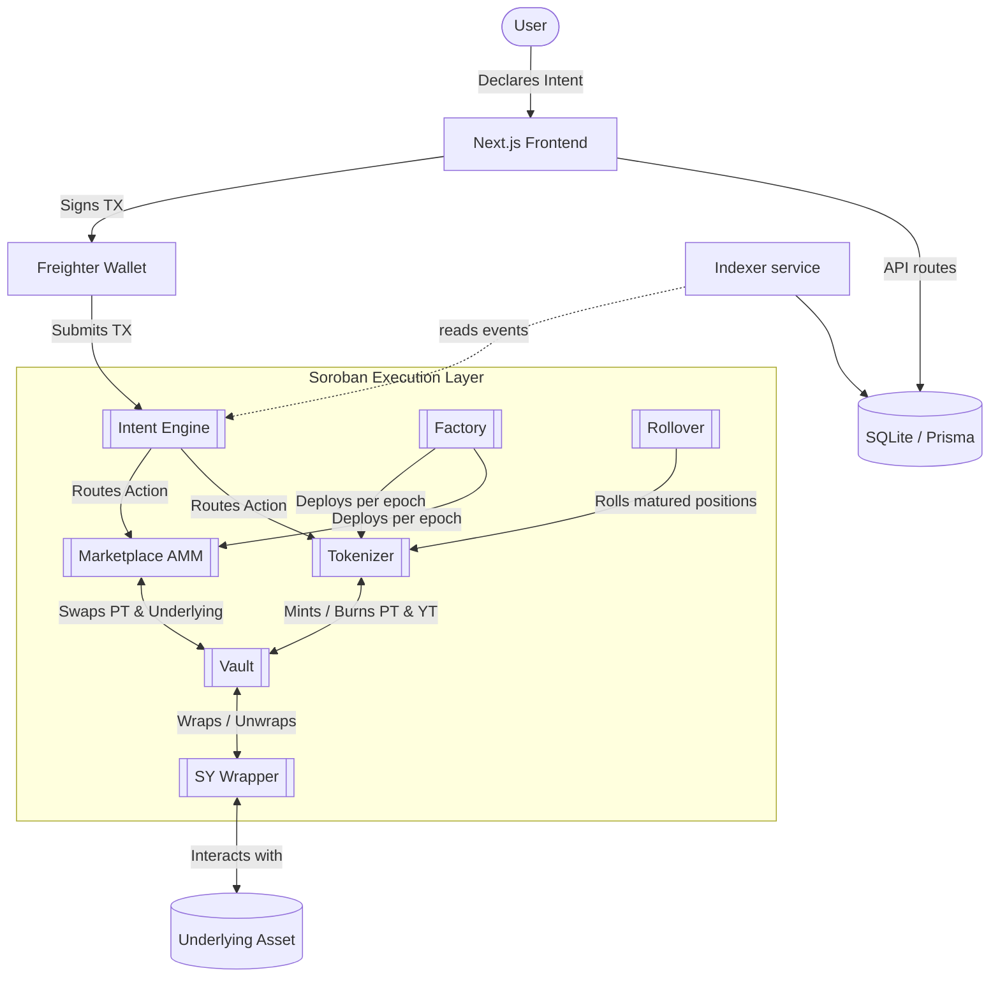

<div align="center">
  <h1 align="center">Novaire</h1>
  <p align="center">
    <strong>Intent-Based Fixed Yield Protocol on Stellar (Testnet)</strong>
  </p>
  <p align="center">
    
    
    
    
    
  </p>
</div>

<br />

> **Status:** This project is deployed and exercised on **Stellar Testnet** only. No independent security audit has been performed, and it is not intended for use with real funds. See [Security Considerations & Known Limitations](#security-considerations--known-limitations).

## Table of Contents

- [Overview](#overview)
- [Architecture](#architecture)
- [Repository Structure](#repository-structure)
- [Prerequisites](#prerequisites)
- [Installation](#installation)
- [Environment Variables](#environment-variables)
- [Commands](#commands)
- [Deploying to Stellar Testnet](#deploying-to-stellar-testnet)
- [Deployed Contract Addresses](#deployed-contract-addresses)
- [Running the Frontend Locally](#running-the-frontend-locally)
- [Running the Backend / Indexer Locally](#running-the-backend--indexer-locally)
- [API Documentation](#api-documentation)
- [Tech Stack](#tech-stack)
- [Security Considerations & Known Limitations](#security-considerations--known-limitations)
- [Troubleshooting](#troubleshooting)
- [FAQ](#faq)
- [Contributing](#contributing)
- [License](#license)
- [Acknowledgements](#acknowledgements)

## Overview

Novaire brings fixed-yield and yield-stripping mechanics to the Stellar ecosystem. It wraps a yield-bearing underlying asset into a Standardized Yield (SY) representation and splits that position into two tradeable components:

- **Principal Tokens (PT)** — represent the underlying principal. Holding PT to maturity secures a fixed return.
- **Yield Tokens (YT)** — represent the variable yield stream generated by the underlying asset until maturity.

An **Intent Engine** contract routes multi-step actions (minting, swapping, liquidity provisioning) so that a user can express a high-level goal (e.g. "deposit and mint PT/YT") in a single transaction rather than orchestrating each Soroban call manually.

The repository contains three parts:

1. **Soroban smart contracts** (`contracts/`) — the on-chain protocol, written in Rust.
2. **A Next.js application** (`src/`) — frontend UI plus a small set of Next.js API routes and a Prisma/SQLite database used for off-chain indexing/caching (prices, TVL history, waitlist, keeper registration).
3. **Off-chain scripts and services** (`scripts/`, `apps/indexer/`, `packages/bindings/`) — deployment tooling, an event indexer, and generated TypeScript contract bindings.

---

## Architecture



**Contract dependency graph** (see [CONTRACTS.md](CONTRACTS.md) for full per-contract detail):

- `factory` deploys and wires together `tokenizer`, `marketplace`, `pt_token`, and `yt_token` for each epoch.
- `vault` custodies the underlying asset and talks to `sy_wrapper` to standardize yield accounting.
- `tokenizer` locks SY shares and mints/burns `pt_token` / `yt_token`.
- `marketplace` is the AMM where PT is traded against the underlying asset.
- `intent_engine` routes multi-contract user intents through `vault`, `tokenizer`, and `marketplace`.
- `rollover` moves matured PT positions into a new epoch via `tokenizer`.

For deeper architectural background, see [ARCHITECTURE.md](ARCHITECTURE.md).

---

## Repository Structure

```text
Novaire/
├── contracts/                # Rust/Soroban workspace
│   ├── factory/               # Epoch deployment factory
│   ├── intent_engine/         # Intent routing
│   ├── marketplace/           # AMM for PT/underlying trading
│   ├── maturity_engine/       # Maturity/settlement logic
│   ├── rollover/               # Rolls matured PT into new epochs
│   ├── sy_wrapper/             # Standardized Yield accounting
│   ├── tokenizer/
│   │   ├── tokenizer/          # PT/YT minting logic
│   │   ├── pt_token/            # Principal Token contract
│   │   └── yt_token/            # Yield Token contract
│   ├── vault/                  # Underlying asset custody
│   └── integration_tests/      # Cross-contract integration tests
├── packages/bindings/         # Generated TS client bindings, one package per contract
├── apps/indexer/              # Standalone Soroban event indexer (writes to Prisma DB)
├── scripts/                   # Deployment / bootstrap / debug TS scripts (stellar-sdk)
├── prisma/schema.prisma       # SQLite schema used by the frontend + indexer
└── src/                       # Next.js application
    ├── app/                    # Routes, layouts, and API routes (src/app/api/*)
    ├── components/             # UI components
    ├── config/                 # Contract/network configuration
    ├── hooks/                  # React hooks
    ├── services/                # Protocol interaction / data-fetching logic
    ├── lib/, utils/, providers/, types/
```

Note: a number of one-off debug/trace scripts live at the repository root (`check_balances.js`, `check_spot_price.js`, `debug_trade.js`, `decode_events.js`, `get_marketplace_state.sh`, `run_bootstrap.sh`, `run_invokes*.sh`, `trade_audit.sh`, `test_*.{ts,js,rs}`, `patch_*.py`). These are ad hoc developer tooling used while building against testnet, not part of the supported public interface — treat anything not referenced in this README or `package.json` as unmaintained/experimental.

---

## Prerequisites

| Tool | Notes |
| :--- | :--- |
| **Node.js** | v18+ recommended (no `engines` field is enforced in `package.json`) |
| **npm** | Used for install/scripts; workspaces are configured for `apps/*` and `packages/*` |
| **Rust + Cargo** | Required to build the Soroban contracts in `contracts/` |
| **Soroban WASM target** | `rustup target add wasm32-unknown-unknown` |
| **Stellar CLI** (`stellar`) | Required by `scripts/deploy.ts` and `scripts/bootstrap_liquidity.ts` (contract build/upload/deploy/invoke). Install per the [Stellar CLI docs](https://developers.stellar.org/docs/tools/developer-tools/cli). |

> `scripts/initialize.ts` invokes the legacy `soroban` CLI (not `stellar`) and reads a `deployments.json` file that does not exist in this repo (deployments are tracked per-network in `scripts/deployments.testnet.json` / `scripts/deployments.mainnet.json`). It is stale relative to `deploy.ts` and `bootstrap_liquidity.ts` — prefer those two scripts.

---

## Installation

```bash
git clone <repo-url>
cd Novaire
npm install
```

Create a `.env` file at the repo root (see [Environment Variables](#environment-variables) below) before running deploy/bootstrap scripts or the dev server.

---

## Environment Variables

Only variables actually read by the codebase are listed. `RPC_URL` / `NETWORK` / `NETWORK_PASSPHRASE` are consumed by the deployment scripts (`scripts/deploy.ts`, `scripts/bootstrap_liquidity.ts`); the `NEXT_PUBLIC_*` variants are consumed by the frontend at build/runtime.

| Variable | Used by | Required | Description |
| :--- | :--- | :--- | :--- |
| `RPC_URL` | `scripts/deploy.ts`, `scripts/bootstrap_liquidity.ts`, `apps/indexer` | No | Soroban RPC endpoint. Defaults to `https://soroban-testnet.stellar.org` (testnet) or `https://mainnet.sorobanrpc.com` when `NETWORK=mainnet`. |
| `NETWORK` | `scripts/deploy.ts`, `scripts/bootstrap_liquidity.ts` | No | `testnet` (default) or `mainnet`. Selects RPC URL, passphrase, and which `deployments.<network>.json` file is read/written. |
| `NETWORK_PASSPHRASE` | `scripts/deploy.ts`, `scripts/bootstrap_liquidity.ts` | No | Overrides the network passphrase; defaults based on `NETWORK`. |
| `ADMIN_SECRET` | `scripts/deploy.ts` (and legacy `scripts/initialize.ts`) | Yes, for deployment | Secret key of the account used to build/upload/deploy/initialize contracts. |
| `KEEPER_SECRET` | `scripts/deploy.ts` (and legacy `scripts/initialize.ts`) | Yes, for deployment | Secret key of the account registered as the protocol keeper. |
| `BOOTSTRAP_AMOUNT` | `scripts/bootstrap_liquidity.ts` | No | Amount used to seed initial vault/marketplace liquidity. |
| `SKIP_BOOTSTRAP` | `scripts/bootstrap_liquidity.ts` | No | If set, skips the liquidity bootstrap step. |
| `NEXT_PUBLIC_RPC_URL` | Frontend (`src/`) | No | Soroban RPC endpoint the browser client talks to. |
| `NEXT_PUBLIC_NETWORK` | Frontend (`src/`) | No | Network label surfaced to the client. |
| `NEXT_PUBLIC_NETWORK_PASSPHRASE` | Frontend (`src/`) | No | Passphrase used by client-side transaction building. |

No `.env.example` file is currently committed — create `.env` manually using the table above. `.env*` is git-ignored.

---

## Commands

All commands below are exact scripts defined in the root `package.json` unless noted otherwise.

| Command | Description |
| :--- | :--- |
| `npm run dev` | Starts the Next.js dev server (`next dev`) at `http://localhost:3000`. |
| `npm run build` | Runs `prisma generate` then `next build` for a production build. |
| `npm start` | Starts the built Next.js app (`next start`). |
| `npm run lint` | Runs ESLint (`eslint`) using `eslint.config.mjs`. |
| `npm run deploy` | Runs `tsx --env-file=.env scripts/deploy.ts` — builds, uploads, and deploys all contracts to `NETWORK` (default `testnet`). |
| `npm run deploy:epoch` | Alias for the same `scripts/deploy.ts` entrypoint. |
| `npm run bootstrap` | Runs `tsx --env-file=.env scripts/bootstrap_liquidity.ts` — seeds initial liquidity into the deployed contracts. |

There is currently **no root-level `npm test` script** (neither the root `package.json` nor `scripts/package.json` defines a working test command — `scripts/package.json`'s `test` script is the default `npm init` placeholder that exits with an error).

**Contract build/test** (from `contracts/`, uses Cargo directly — there is no wrapper npm script):

```bash
cd contracts
cargo build --target wasm32-unknown-unknown --release   # build all workspace crates
cargo test                                                # run Rust unit/integration tests, including contracts/integration_tests
```

The Soroban-optimized release profile (size-optimized, LTO, symbol-stripped) is defined in `contracts/Cargo.toml`. A `release-with-logs` profile is also available for debugging (`cargo build --profile release-with-logs`).

**Contract bindings** (`packages/bindings/<contract>/`, one package per contract — `factory`, `intent_engine`, `marketplace`, `pt_token`, `rollover`, `sy_wrapper`, `tokenizer`, `vault`, `yt_token`):

```bash
cd packages/bindings/<contract>
npm run build   # tsc
```

These bindings are also regenerated as part of `scripts/deploy.ts` via `stellar contract bindings`.

**Indexer** (`apps/indexer/`):

```bash
cd apps/indexer
npx ts-node src/index.ts
```

There is no build/start script defined in `apps/indexer/package.json`; run the entrypoint directly with `ts-node` (a dependency of that package).

---

## Deploying to Stellar Testnet

1. Install the [Stellar CLI](https://developers.stellar.org/docs/tools/developer-tools/cli) and ensure `stellar` is on your `PATH`.
2. Add the WASM build target: `rustup target add wasm32-unknown-unknown`.
3. Create `.env` at the repo root with at least `ADMIN_SECRET` and `KEEPER_SECRET` (testnet keypairs — `scripts/deploy.ts` funds them via Friendbot automatically if unfunded).
4. Run:
   ```bash
   npm run deploy
   ```
   This builds each contract with `stellar contract build`, uploads WASM (`stellar contract upload`), deploys instances (`stellar contract deploy`), wires them together via `stellar contract invoke`, generates TS bindings (`stellar contract bindings`), and writes resulting contract IDs to `scripts/deployments.testnet.json`.
5. Optionally seed liquidity:
   ```bash
   npm run bootstrap
   ```

`NETWORK` defaults to `testnet` in both scripts — no flag is needed for a testnet deploy. Pass `NETWORK=mainnet` only if you intend to target Mainnet.

---

## Deployed Contract Addresses

`scripts/deployments.testnet.json` currently tracks only the underlying test asset — the full protocol suite has not been deployed to a persisted testnet record in this repository at the time of writing:

| Contract | Testnet Address |
| :--- | :--- |
| **Underlying Token** | `CAS3J7GYLGXMF6TDJBBYYSE3HQ6BBSMLNUQ34T6TZMYMW2EVH34XOWMA` |
| **Factory** | _not yet recorded — run `npm run deploy` and see `scripts/deployments.testnet.json`_ |
| **SY Wrapper** | _not yet recorded_ |
| **Vault** | _not yet recorded_ |
| **Tokenizer** | _not yet recorded_ |
| **PT Token** | _not yet recorded_ |
| **YT Token** | _not yet recorded_ |
| **Marketplace** | _not yet recorded_ |
| **Intent Engine** | _not yet recorded_ |
| **Rollover** | _not yet recorded_ |

`scripts/deployments.mainnet.json` does contain a full set of addresses, but per this project's testnet-only status, treat that file as a historical/reference record rather than a live, supported Mainnet deployment. Always verify addresses against your own `scripts/deployments.testnet.json` after running `npm run deploy`.

---

## Running the Frontend Locally

```bash
npm install
npm run dev
```

Visit `http://localhost:3000`. The app expects `NEXT_PUBLIC_RPC_URL`, `NEXT_PUBLIC_NETWORK`, and `NEXT_PUBLIC_NETWORK_PASSPHRASE` in `.env` to point at your testnet deployment, and reads contract addresses from `scripts/deployments.testnet.json`.

Wallet connectivity is via `@stellar/freighter-api` (Freighter browser extension) — no other wallet integration is present in `package.json` despite prior claims otherwise.

## Running the Backend / Indexer Locally

The "backend" is two pieces:

1. **Next.js API routes** (`src/app/api/*`), served automatically by `npm run dev` / `npm start`:
   - `GET /api/prices`
   - `GET /api/markets`
   - `GET /api/history`, `POST /api/history/snapshot`, `POST /api/history/sync`
   - `POST /api/keeper/register`
   - `POST /api/waitlist`

   These read/write the Prisma/SQLite database (`dev.db`, schema in `prisma/schema.prisma`) and, in the keeper case, a flat `registered_users.json` file.

2. **Standalone indexer** (`apps/indexer/`), which polls the Soroban RPC endpoint for events on the contracts listed in `scripts/deployments.testnet.json` and writes them into the same Prisma database:
   ```bash
   cd apps/indexer
   npx ts-node src/index.ts
   ```

Run `npx prisma generate` (or `npm run build`, which includes it) after cloning so the Prisma client matches `prisma/schema.prisma`.

---

## API Documentation

All routes are Next.js Route Handlers under `src/app/api/`. There is no OpenAPI/Swagger spec in the repo; this table reflects what is actually implemented.

| Route | Method | Purpose |
| :--- | :--- | :--- |
| `/api/prices` | GET | Returns current PT/YT price data. |
| `/api/markets` | GET | Returns market/epoch listing data. |
| `/api/history` | GET | Returns protocol history (TVL/APY/price series from `ProtocolHistory`). |
| `/api/history/snapshot` | POST | Records a new history snapshot. |
| `/api/history/sync` | POST | Triggers a sync of history data. |
| `/api/keeper/register` | POST | Registers a wallet address (body: `{ user: string }`) into `registered_users.json` for keeper/automation eligibility. |
| `/api/waitlist` | POST | Records a waitlist signup. |

---

## Tech Stack

| Domain | Technology |
| :--- | :--- |
| **Smart Contracts** | Rust, Soroban SDK |
| **Network** | Stellar (Testnet) |
| **Frontend Framework** | Next.js 16, React 19 |
| **Language** | TypeScript |
| **Styling & UI** | Tailwind CSS, Framer Motion |
| **Charts** | Recharts, `lightweight-charts` |
| **Database / ORM** | SQLite via Prisma |
| **Wallet Connection** | `@stellar/freighter-api` |
| **Deployment Tooling** | `@stellar/stellar-sdk`, Stellar CLI (`stellar`), `tsx` |

---

## Security Considerations & Known Limitations

- **Testnet only.** Contract addresses recorded in `scripts/deployments.testnet.json` are incomplete/experimental; the addresses in `scripts/deployments.mainnet.json` should not be treated as a supported, audited Mainnet deployment.
- **No independent audit.** The contracts in `contracts/` have not undergone third-party security review as documented in this repository.
- **Admin-privileged operations.** Per `CONTRACTS.md`, epoch creation on the `factory` contract is currently gated to a protocol admin key — this is centralization risk during the testnet phase.
- **Secrets in `.env`.** `ADMIN_SECRET` and `KEEPER_SECRET` are raw Stellar secret keys read from environment variables by deploy/bootstrap scripts — never commit `.env` or reuse a funded Mainnet key for testnet development.
- **Local file-based state.** `registered_users.json` and the SQLite `dev.db` are plain files with no access control; they are appropriate for local/testnet development only, not multi-user production deployment.
- **Legacy/inconsistent script.** `scripts/initialize.ts` targets the deprecated `soroban` CLI and a `deployments.json` path that doesn't match the rest of the tooling — do not rely on it; use `scripts/deploy.ts`.
- **TWAP pricing** is used in the marketplace AMM to resist flash-loan/oracle-manipulation style attacks per `ARCHITECTURE.md`/`CONTRACTS.md`, but has not been independently verified for this audit-less codebase.

---

## Troubleshooting

**`stellar: command not found` when running `npm run deploy` / `npm run bootstrap`**
Install the [Stellar CLI](https://developers.stellar.org/docs/tools/developer-tools/cli) and confirm `stellar --version` works before deploying.

**Contract build fails with a missing `wasm32-unknown-unknown` target**
Run `rustup target add wasm32-unknown-unknown`.

**Friendbot funding errors during `deploy`/`bootstrap`**
Both scripts call `https://friendbot.stellar.org` to fund `ADMIN_SECRET`/`KEEPER_SECRET` accounts. A `400` response is treated as "already funded" and ignored; other failures are logged as warnings and the scripts proceed assuming the account already has funds. If deployment then fails with an underfunded-account error, fund the account manually via [Friendbot](https://friendbot.stellar.org) and retry.

**`ADMIN_SECRET and KEEPER_SECRET environment variables are required`**
Set both in `.env` at the repo root before running `npm run deploy`, `npm run bootstrap`, or the legacy `scripts/initialize.ts`.

**Deploy script hangs or retries repeatedly**
`scripts/deploy.ts` retries failed Stellar CLI invocations up to 5 times with exponential backoff — this is expected under RPC rate limiting or network congestion; let it finish or reduce concurrent activity against the RPC endpoint.

**Frontend shows stale prices/markets**
The frontend reads from the local Prisma/SQLite database, which is only kept current if the indexer (`apps/indexer`) is running and pointed at the same `RPC_URL`/deployment set.

**Prisma client errors after `npm install`**
Run `npx prisma generate` (already part of `npm run build`) so the generated client matches `prisma/schema.prisma`.

---

## FAQ

**Is this deployed on Stellar Mainnet?**
No. The project is exercised on Stellar Testnet only. `scripts/deployments.mainnet.json` exists as a historical/reference file but is not a supported, audited deployment — see [Security Considerations & Known Limitations](#security-considerations--known-limitations).

**Which wallet do I need to use the frontend?**
[Freighter](https://www.freighter.app/), via `@stellar/freighter-api`. No other wallet integration is present in `package.json`.

**Where do I get testnet funds?**
`scripts/deploy.ts` and `scripts/bootstrap_liquidity.ts` fund `ADMIN_SECRET`/`KEEPER_SECRET` automatically via [Friendbot](https://friendbot.stellar.org). For a personal wallet, fund it directly through Friendbot or the Freighter testnet faucet link.

**How do I get the full set of testnet contract addresses?**
Run `npm run deploy` yourself and read the resulting `scripts/deployments.testnet.json` — the addresses committed in this repo are incomplete (see [Deployed Contract Addresses](#deployed-contract-addresses)).

**Is there a public API or SDK for third-party integration?**
Not yet implemented. The only HTTP endpoints are the internal Next.js routes under `src/app/api/`, and the only public TypeScript packages are the per-contract bindings under `packages/bindings/`.

## Contributing

There is no `CONTRIBUTING.md` in this repository yet. If you'd like to contribute:

1. Open an issue describing the change before submitting a large PR.
2. Keep contract changes and their corresponding `packages/bindings/<contract>` regeneration in the same PR.
3. Run `npm run lint` and `cargo test` (from `contracts/`) before submitting.
4. Do not commit `.env`, secret keys, or any `*_keys.json` files (already git-ignored).

## License

No `LICENSE` file is currently present in this repository. All rights are reserved by default under applicable copyright law unless/until a license is added — do not assume MIT or any other permissive terms.

## Acknowledgements

- [Stellar Development Foundation](https://stellar.org) and the [Soroban](https://soroban.stellar.org) smart contract platform.
- [Freighter](https://www.freighter.app/) wallet for Stellar account signing.
- Built with [Next.js](https://nextjs.org), [Prisma](https://www.prisma.io), and the [Stellar SDK](https://github.com/stellar/js-stellar-sdk).
