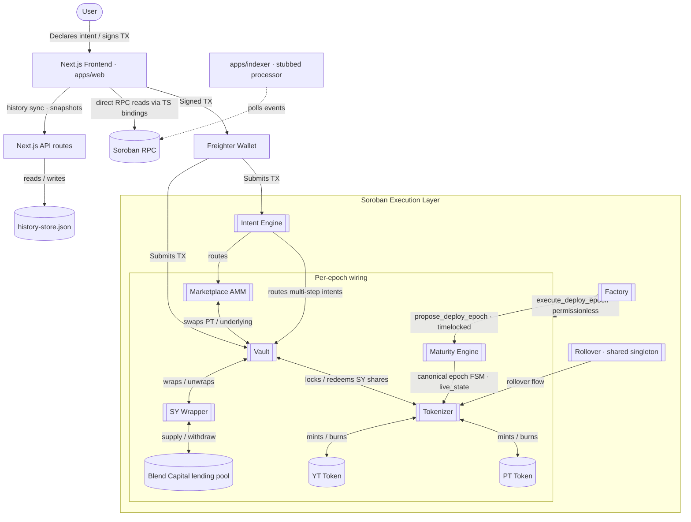

<div align="center">
  <h1 align="center">Novaire</h1>
  <p align="center">
    <strong>Intent-Based Fixed Yield Protocol on Stellar (Testnet)</strong>
  </p>
  <p align="center">
    
    
    
    
    
  </p>
</div>

<br />

> **Status: v0.2.0 — deployed and exercised on Stellar Testnet only.** The protocol runs on real Testnet contracts (Epoch 4; see [Deployed Contract Addresses](#deployed-contract-addresses)) with a live verification suite, but no independent third-party security audit has been performed and it is **not intended for use with real funds**. See [Security Considerations & Known Limitations](#security-considerations--known-limitations).

## Table of Contents

- [Overview](#overview)
- [Architecture](#architecture)
- [Repository Structure](#repository-structure)
- [Prerequisites](#prerequisites)
- [Installation](#installation)
- [Environment Variables](#environment-variables)
- [Commands](#commands)
- [Deploying to Stellar Testnet](#deploying-to-stellar-testnet)
- [Deployed Contract Addresses](#deployed-contract-addresses)
- [Running the Frontend Locally](#running-the-frontend-locally)
- [Running the Backend / Indexer Locally](#running-the-backend--indexer-locally)
- [API Documentation](#api-documentation)
- [Testnet Verification](#testnet-verification)
- [Testing](#testing)
- [Tech Stack](#tech-stack)
- [Security Considerations & Known Limitations](#security-considerations--known-limitations)
- [Related Documentation](#related-documentation)
- [Troubleshooting](#troubleshooting)
- [FAQ](#faq)
- [Contributing](#contributing)
- [License](#license)
- [Acknowledgements](#acknowledgements)

## Overview

Novaire brings fixed-yield and yield-stripping mechanics to the Stellar ecosystem. It wraps a yield-bearing underlying asset into a Standardized Yield (SY) representation and splits that position into two tradeable components:

- **Principal Tokens (PT)** — represent the underlying principal. Holding PT to maturity secures a fixed return.
- **Yield Tokens (YT)** — represent the variable yield stream generated by the underlying asset until maturity.

The yield source is **real, not simulated**: the SY Wrapper supplies capital into a live [Blend Capital](https://blend.capital) lending pool on Testnet and derives its exchange rate from Blend's on-chain `b_rate`. The exchange rate can only increase (capped by a +10% per-refresh ratchet) or be forced down to the real measured balance via a permissionless `mark_loss` — there is no admin lever that can arbitrarily inflate yield.

An **Intent Engine** contract routes multi-step actions (depositing, minting PT/YT, selling YT) so that a user can express a high-level goal (e.g. "deposit and mint PT/YT") in a single transaction rather than orchestrating each Soroban call manually.

The repository contains three parts:

1. **Soroban smart contracts** (`contracts/`) — an on-chain protocol of **10 contracts**, written in Rust: `factory`, `maturity_engine`, `sy_wrapper`, `vault`, `tokenizer`, `pt_token`, `yt_token`, `marketplace`, `intent_engine`, `rollover`.
2. **A Next.js application** (`apps/web`) — frontend UI plus a set of Next.js API routes. The frontend reads all financial state **live from the contracts over Soroban RPC** (generated TypeScript bindings); off-chain history is kept in a small file-based JSON store.
3. **Off-chain tooling** (`scripts/`, `apps/indexer/`, `packages/bindings/`) — deployment/bootstrap/verification scripts, a Soroban event indexer (currently a stubbed poller — see [Backend / Indexer](#running-the-backend--indexer-locally)), and generated TypeScript contract bindings.

---

## Architecture



**Contract roles** (see `docs/protocol/CONTRACTS.md` for full per-contract detail, and `docs/PROTOCOL_INVARIANTS.md` for the on-chain invariant catalog):

- `factory` — epoch deployment manager. An admin **proposes** an epoch (`propose_deploy_epoch`, timelocked); execution (`execute_deploy_epoch`) is deliberately **permissionless** so the protocol cannot be bricked by an unresponsive admin.
- `maturity_engine` — the canonical per-epoch lifecycle FSM (`NO_EPOCH → ACTIVE → MATURED → SETTLED → ARCHIVED`). Tokenizer, YT Token, and Marketplace delegate all maturity checks to it via `live_state`. It is deployed per epoch and self-assigns epoch id `1` for the single epoch it opens.
- `sy_wrapper` — Standardized Yield wrapper over a Blend lending pool (deposit/withdraw, refresh rate with ratchet, permissionless `mark_loss`, harvest, pause, two-step admin).
- `vault` — custodies the underlying asset / SY shares (`deposit`, `withdraw`, `transfer_shares`, `withdraw_for`).
- `tokenizer` (+ `pt_token`, `yt_token`) — locks SY shares and mints/burns the PT/YT pair; YT accrues a yield index with per-user checkpoints and reentry-safe claimable yield.
- `marketplace` — the AMM where PT is traded against the underlying (YieldSpace-style curve, TWAP with staleness guard, liquidity provision, pause).
- `intent_engine` — routes multi-contract user intents (`execute_fixed_yield_intent`, `execute_yield_speculation_intent`) through vault/tokenizer/marketplace.
- `rollover` — a **long-lived, shared singleton across every epoch** (not redeployed per epoch). It locks matured PT positions per position/token and re-enters a new epoch after maturity; execution is permissionless after a grace period.

**Off-chain data flow:** the frontend reads balances/prices/APY directly from the contracts via RPC simulation — it does **not** depend on a database. Protocol history for charts is stored in a file-based JSON store (`history-store.json`, git-ignored) that is written by the Next.js API routes: a server-side sync (`GET /api/history/sync`) polls Soroban events on Marketplace/Vault and records protocol-price snapshots, while client-side analytics snapshots (`POST /api/history/snapshot`) attach wallet balances to those points. The standalone indexer (`apps/indexer`) polls events too but its processor is **stubbed** (no data reconstruction; only a ledger cursor is persisted).

For a full code-grounded architecture analysis see [`ARCHITECTURE.md`](./ARCHITECTURE.md).

---

## Repository Structure

```text
Novaire/
├── apps/
│   ├── web/                       # Next.js 16 application (frontend + API routes)
│   │   ├── src/app/               # pages + API routes (src/app/api/*)
│   │   ├── src/config/            # network + contract config (copies of deployments.*.json)
│   │   ├── src/services/          # protocol / wallet / price / portfolio services
│   │   ├── src/hooks/             # React hooks (useTrade, useWallet, usePortfolio, ...)
│   │   ├── src/lib/               # historyStore (file-based) + utils
│   │   └── e2e/                   # Playwright specs (UI, real-wallet, portfolio verification)
│   └── indexer/                   # standalone Soroban event poller (processor stubbed)
├── packages/bindings/             # generated TS bindings, one package per contract (9)
├── contracts/                     # Rust/Soroban workspace (10 contracts + integration tests)
│   ├── factory/  maturity_engine/  sy_wrapper/  vault/
│   ├── tokenizer/                 # tokenizer + pt_token + yt_token
│   ├── marketplace/  intent_engine/  rollover/
│   └── integration_tests/         # cross-contract integration, fuzz, invariants, regression suites
├── scripts/                       # deployment / bootstrap / verification TS scripts
│   ├── deploy.ts                  # main deployment script (stellar CLI)
│   ├── bootstrap_liquidity.ts     # seeds initial liquidity
│   ├── verify-testnet.ts          # live testnet verification suite (see scripts/verify_testnet/)
│   ├── deployments.testnet.json   # current testnet deployment record (epoch 4)
│   ├── deployments.mainnet.json   # historical/reference only — NOT a verified deployment
│   └── deprecated/                # retired scripts (e.g. inject_yield.ts)
├── prisma/                        # Postgres schema (schema-only at runtime today)
├── docs/                          # protocol/architecture deep docs + PROTOCOL_INVARIANTS.md
├── .github/workflows/             # CI/CD — see .github/workflows/README.md and CI.md
├── archive/                       # one-off debug/trace scripts from testnet development
├── .env.example
├── ARCHITECTURE.md  SECURITY.md  SECURITY_AUDIT.md  CHANGELOG.md  CI.md
├── CONTRIBUTING.md  DEBUGGING.md  deployment-summary.md  RELEASE_NOTES.md
└── registered_users.json          # flat file appended to by POST /api/keeper/register
```

> `archive/root-dev-scripts/` and other one-off debug/trace scripts (both `scripts/*` extras and `archive/`) are ad hoc developer tooling used while building against testnet, not a supported public interface — treat anything not referenced in this README or `package.json` as unmaintained/experimental.

---

## Prerequisites

| Tool | Notes |
| :--- | :--- |
| **Node.js** | **≥ 20.9** (required by Next.js 16; no `engines` field is enforced in `package.json`) |
| **npm** | Used for install/scripts; workspaces are configured for `apps/*` and `packages/*` |
| **Rust + Cargo** | Required to build the Soroban contracts in `contracts/` |
| **Soroban WASM target** | `rustup target add wasm32-unknown-unknown` |
| **Stellar CLI** (`stellar`) | Required by `scripts/deploy.ts` and `scripts/bootstrap_liquidity.ts` (contract build/upload/deploy/invoke/bindings). Install per the [Stellar CLI docs](https://developers.stellar.org/docs/tools/developer-tools/cli). |

> `scripts/initialize.ts` invokes the legacy `soroban` CLI (not `stellar`) and reads a `deployments.json` file that does not exist in this repo. It is stale relative to `deploy.ts` and `bootstrap_liquidity.ts` — prefer those two scripts.

---

## Installation

```bash
git clone <repo-url>
cd Novaire
npm install
cp .env.example .env   # defaults are sufficient for local frontend development
```

The Next.js app loads environment variables from the repo **root** `.env` (`next.config.ts` uses `loadEnvConfig` at the monorepo root), and `.env*` is git-ignored (`.env.example` is committed). Full details in [Environment Variables](#environment-variables).

---

## Environment Variables

Only variables actually read by the codebase are listed. `.env.example` at the repo root contains all of them.

| Variable | Used by | Required | Description |
| :--- | :--- | :--- | :--- |
| `NETWORK` | `scripts/deploy.ts`, `scripts/bootstrap_liquidity.ts` | No | `testnet` (default) or `mainnet`. Selects RPC URL, passphrase, and which `deployments.<network>.json` is read/written. |
| `RPC_URL` | `scripts/deploy.ts`, `scripts/bootstrap_liquidity.ts`, `apps/indexer` | No | Soroban RPC endpoint. Defaults to `https://soroban-testnet.stellar.org` (testnet) or `https://mainnet.sorobanrpc.com` when `NETWORK=mainnet`. |
| `NETWORK_PASSPHRASE` | `scripts/deploy.ts`, `scripts/bootstrap_liquidity.ts` | No | Overrides the network passphrase; defaults based on `NETWORK`. |
| `BLEND_POOL` | `scripts/deploy.ts`, `scripts/deploy_xlm_epoch.ts` | Only for mainnet | Blend Capital pool address wired into the epoch's SY Wrapper. Defaults to the live Testnet pool `CCEBVDYM32YNYCVNRXQKDFFPISJJCV557CDZEIRBEE4NCV4KHPQ44HGF`; must be set explicitly for mainnet. |
| `BOOTSTRAP_AMOUNT` | `scripts/bootstrap_liquidity.ts` | No | Amount used to seed initial vault/marketplace liquidity (default `120000000`, ~12 XLM). |
| `SKIP_BOOTSTRAP` | `scripts/deploy.ts` | No | If set to `true`, skips the automatic liquidity bootstrap step after deploy. |
| `ADMIN_SECRET` | legacy only: `scripts/initialize.ts`, `scripts/audit_mint.ts`, `scripts/check_keys.js` | No | **`npm run deploy` / `npm run bootstrap` do NOT read these** — they manage `scripts/testnet_keys.json` (auto-generated random admin/issuer keypairs, git-ignored). Only legacy scripts require `ADMIN_SECRET`. |
| `KEEPER_SECRET` | `scripts/keeper.js` (rollover executor), legacy `scripts/initialize.ts` | Only for those scripts | Secret key of the rollover-executor account. `scripts/keeper.js` also requires `ROLLOVER_CONTRACT_ID`. |
| `NEXT_PUBLIC_RPC_URL` | Frontend (`apps/web`) | No | Soroban RPC endpoint the browser client talks to. Defaults per [Environment notes](#running-the-frontend-locally). |
| `NEXT_PUBLIC_NETWORK` | Frontend (`apps/web`) | No | `TESTNET` (default) or `MAINNET`; selects the deployment set in `apps/web/src/config/`. |
| `NEXT_PUBLIC_NETWORK_PASSPHRASE` | Frontend (`apps/web`) | No | Passphrase used by client-side transaction building. |
| `DATABASE_URL` | `apps/indexer` (Prisma), `prisma.config.ts` | Only if running the indexer or Prisma commands | Postgres connection string (e.g. Neon). Not needed for the frontend: history is file-based and API routes never touch the DB. |
| `DATABASE_URL_UNPOOLED` | Prisma config / CI | No | Unpooled Postgres connection string, for migrations/uses that can't use pgbouncer. |

---

## Commands

All commands below are exact scripts defined in the root `package.json` unless noted otherwise.

| Command | Description |
| :--- | :--- |
| `npm run dev` | Starts the Next.js dev server (workspace `apps/web`) at `http://localhost:3000` (`next dev`). |
| `npm run build` | Runs `prisma generate` (schema validation only — no DB connection needed) then `next build` for a production build. |
| `npm start` | Starts the built Next.js app (`next start`). |
| `npm run lint` | Runs ESLint on `apps/web` (`eslint` using `eslint.config.mjs`). |
| `npm run deploy` | Runs `tsx --env-file=.env scripts/deploy.ts` — builds, uploads, deploys, and wires all contracts to `NETWORK` (default `testnet`). |
| `npm run deploy:epoch` | Alias for the same `scripts/deploy.ts` entrypoint. |
| `npm run bootstrap` | Runs `tsx --env-file=.env scripts/bootstrap_liquidity.ts` — seeds initial liquidity into the deployed contracts. |
| `npm run verify:testnet` | Runs the live Testnet verification suite (`scripts/verify-testnet.ts`) — see [Testnet Verification](#testnet-verification). |
| `npm run test:scripts` | Runs the vitest unit tests under `scripts/` (`scripts/utils.test.ts`). |

There is **no plain root `npm test`**; use `npm run test:scripts` or `npm run test -w web` (see [Testing](#testing)). `scripts/package.json`'s own `test` script is the default `npm init` placeholder.

**Contract build/test** (from `contracts/`, uses Cargo directly — there is no wrapper npm script):

```bash
cd contracts
cargo build --target wasm32-unknown-unknown --release   # build all workspace crates
cargo test                                                # run Rust unit/integration tests
cargo clippy --all-targets --all-features -D warnings     # lint (enforced in CI)
cargo fmt --all --check                                   # formatting (enforced in CI)
```

The Soroban-optimized release profile (size-optimized, LTO, symbol-stripped, overflow checks) is defined in `contracts/Cargo.toml`. A `release-with-logs` profile is also available for debugging (`cargo build --profile release-with-logs`).

**Contract bindings** (`packages/bindings/<contract>/`, one package per contract — `factory`, `intent_engine`, `marketplace`, `pt_token`, `rollover`, `sy_wrapper`, `tokenizer`, `vault`, `yt_token`; note there is **no** `maturity_engine` binding):

```bash
cd packages/bindings/<contract>
npm run build   # tsc
```

These bindings are also regenerated as part of `scripts/deploy.ts` via `stellar contract bindings`.

**Indexer** (`apps/indexer/`):

```bash
cd apps/indexer
npx ts-node src/index.ts   # requires DATABASE_URL (Postgres); processor is stubbed
```

---

## Deploying to Stellar Testnet

1. Install the [Stellar CLI](https://developers.stellar.org/docs/tools/developer-tools/cli) and ensure `stellar` is on your `PATH`.
2. Add the WASM build target: `rustup target add wasm32-unknown-unknown`.
3. Ensure Node.js ≥ 20.9 and copy `.env.example` to `.env` (defaults point at Testnet; nothing else is required).
4. Run:
   ```bash
   npm run deploy
   ```
   This builds each contract with `stellar contract build`, uploads WASM (`stellar contract upload`), deploys the top-level instances (`factory`, `sy_wrapper`, `vault`, `tokenizer`, `pt_token`, `yt_token`, `marketplace`, `intent_engine`, `rollover`), initializes the factory, invokes `factory.deploy_epoch` to wire the per-epoch contracts (including the per-epoch `maturity_engine`), regenerates TS bindings (`stellar contract bindings`), runs the liquidity bootstrap, and writes resulting contract IDs to `scripts/deployments.testnet.json`.
   - Account management: `deploy.ts` does **not** read `ADMIN_SECRET`/`KEEPER_SECRET`. It reads (or auto-generates with random keypairs) `scripts/testnet_keys.json` (git-ignored) and funds the accounts via [Friendbot](https://friendbot.stellar.org) automatically.
5. Optionally seed liquidity separately:
   ```bash
   npm run bootstrap
   ```
6. After deploying, verify the new deployment:
   ```bash
   npm run verify:testnet
   ```

`NETWORK` defaults to `testnet` — no flag is needed for a testnet deploy. Pass `NETWORK=mainnet` only if you intend to target Mainnet.

> ⚠️ **Known deploy-script issue (needs confirmation before relying on a fresh end-to-end deploy):** the current factory contract's `DeployEpochParams` **requires** a `maturity_engine` address (`contracts/factory/src/lib.rs`), but the committed `scripts/deploy.ts` and `scripts/deploy_xlm_epoch.ts` do not pass one when invoking `deploy_epoch`. The live Epoch 4 deployment was made before the scripts' last edits. If a fresh `npm run deploy` fails at the epoch-wiring step, update the deploy script's params payload to match `DeployEpochParams` (deploy/upload a `maturity_engine` instance and record `maturity_engine`/`maturity_engine_wasm` in `deployments.testnet.json`, mirroring the current file).

---

## Deployed Contract Addresses

The full protocol suite is deployed and wired on Stellar Testnet — **Epoch 4**, maturity ledger `4135061`, per `scripts/deployments.testnet.json` (an identical copy lives in `apps/web/src/config/deployments.testnet.json` for the frontend):

| Contract | Testnet Address |
| :--- | :--- |
| **Underlying Token** (native XLM SAC) | `CDLZFC3SYJYDZT7K67VZ75HPJVIEUVNIXF47ZG2FB2RMQQVU2HHGCYSC` |
| **Blend Pool** (lending pool used by SY Wrapper) | `CCEBVDYM32YNYCVNRXQKDFFPISJJCV557CDZEIRBEE4NCV4KHPQ44HGF` |
| **Factory** | `CAYYQE2L5F3UUNXJ6JBE667VDF7GVKMK6CO6U33J3GMHNFT5YCRA5LAB` |
| **Maturity Engine** | `CARZ26MGU3FX2VAP4346DKFDM4VAYD2LLSKVWTQ2O5HC2GIYL5RIBD4R` |
| **SY Wrapper** | `CDA5QOLRZWJLWHMKD2IPUFFZNXEAFRCFUWKBUZWP6X6RDXWS52SB42ZO` |
| **Vault** | `CCQOZDSOC3LZ7UW5SSGBMVBB65IOA7XXDQHRPB6WGDA5RWUDE6QFHTDW` |
| **Tokenizer** | `CAERQIJESV5K3K75WKB6W2UZGEMRE7SZCHZBGH766PQFDQ5GGZ57GB5E` |
| **PT Token** | `CCF4IUEV73G5FUE6QPSWRYSS4COYU67NPBOVKE4HFA6QCAGHGVJSKLCV` |
| **YT Token** | `CD4T6Z55OTUXTJM3V4SIIW2W7LBP6CER26F2RHGD57VN3O6PI2RX2OTO` |
| **Marketplace** | `CCTSO5FM2LOSHNH4VMMUKBHT4273KDXB4LKGHVXC6AYEZKTZ4VSH5NBZ` |
| **Intent Engine** | `CACPDKF7WEDRJYUB2MTIVG2B6VTCJN3WLFXWCV54EH5SOFKM7DJ5WP5H` |
| **Rollover** | `CCAAVSY4RNROHJSCJON6BP4BRID5ZZCMVK7Z7GBTH5KKS6E47PL6UJPK` |

Notes:

- The SY Wrapper deposits into Blend's live Testnet lending pool (`CCEBVDYM32...`), and the underlying token is the pool's reserve asset (native XLM SAC), so wrapped deposit funds route into Blend correctly. In frontend config this address is (mis)named `MOCK_USDC` — a legacy label; it is the native XLM SAC.
- **Deprecated instances** are preserved for audit trail in `scripts/deployments.testnet.json`: `_deprecated_epoch1` (stale, non-existent underlying token), `_deprecated_epoch2` (predates the Blend `b_rate` accounting fix), `_deprecated_epoch3` (reused stale WASM hashes), `_deprecated_factory` (predates Maturity Engine wiring). **Do not use these addresses.**
- After any redeploy, update **both** `scripts/deployments.testnet.json` and `apps/web/src/config/deployments.testnet.json` (deploy.ts updates the former automatically; copy to the latter).
- `scripts/deployments.mainnet.json` contains a full set of addresses, but per this project's testnet-only status, treat that file as a historical/reference record rather than a live, supported Mainnet deployment.

---

## Running the Frontend Locally

```bash
npm install
npm run dev
```

Visit `http://localhost:3000`. The app expects `NEXT_PUBLIC_RPC_URL`, `NEXT_PUBLIC_NETWORK`, and `NEXT_PUBLIC_NETWORK_PASSPHRASE` in the root `.env` to point at your testnet deployment (defaults are Testnet), and reads contract addresses from `apps/web/src/config/deployments.testnet.json`.

Wallet connectivity is via `@stellar/freighter-api` (Freighter browser extension) — no other wallet integration is present in `apps/web/package.json`.

---

## Running the Backend / Indexer Locally

The "backend" is two pieces:

1. **Next.js API routes** (`apps/web/src/app/api/*`), served automatically by `npm run dev` / `npm start`. These use a **file-based history store** (`history-store.json`, git-ignored, scoped by network + SY wrapper) and flat files — they do **not** use a database:
   - `GET /api/prices`, `GET /api/markets` — CoinDCX market-data proxies (see [API Documentation](#api-documentation)).
   - `GET /api/history`, `POST /api/history/snapshot`, `GET /api/history/sync` — protocol-history read/write/sync backed by `HistoryStore` (`apps/web/src/lib/historyStore.ts`), which replaces the previously-planned Prisma-backed history pipeline for the dev/testnet environment.
   - `POST /api/keeper/register` — appends a wallet address to `registered_users.json` (legacy name; no keeper/automation logic).
   - `POST /api/waitlist` — simulated signup (placeholder until a real integration is added).

2. **Standalone indexer** (`apps/indexer/`), which polls the Soroban RPC endpoint for events on the contracts in `scripts/deployments.testnet.json`:
   ```bash
   cd apps/indexer
   npx ts-node src/index.ts
   ```
   **Status: partially implemented / effectively a stub.** It successfully subscribes to real on-chain events, but `processEvent` (`apps/indexer/src/processor.ts`) has empty case bodies for every event type — the only write is the `SyncState` ledger cursor (via Prisma/Postgres, so it needs `DATABASE_URL`). No financial data is reconstructed from events today, and the frontend deliberately bypasses the indexer/DB entirely (see [Architecture](#architecture)).

There is no separate backend service beyond these pieces. The Prisma `postgresql` schema (`prisma/schema.prisma`) models users/positions/epochs/history but is currently **not populated by anything at runtime**.

---

## API Documentation

All routes are Next.js Route Handlers under `apps/web/src/app/api/`. There is no OpenAPI/Swagger spec in the repo; this table reflects what is actually implemented.

| Route | Method | Purpose |
| :--- | :--- | :--- |
| `/api/prices` | GET | Proxy for the CoinDCX exchange ticker (`https://api.coindcx.com/exchange/ticker`, 10s revalidate). Used by `priceOracleService` for USD reference prices. |
| `/api/markets` | GET | Proxy for CoinDCX market details (`https://api.coindcx.com/exchange/v1/markets_details`, 60s revalidate). Used by `marketService`. |
| `/api/history` | GET | Returns stored protocol history from the file-based `HistoryStore`, scoped by (network, SY wrapper), capped at 5000 entries. |
| `/api/history/snapshot` | POST | Records a history snapshot combining client-supplied wallet balances with latest protocol prices (called by `analyticsHistoryService`). |
| `/api/history/sync` | GET | Server-side sync: checks Soroban events on Marketplace/Vault via `getEvents` and records protocol-price snapshots when new events exist; maintains a per-scope ledger cursor. Returns `{ success, syncedTo, skipped? }`. |
| `/api/keeper/register` | POST | Appends `{ user }` to `registered_users.json` (legacy "keeper" naming; no keeper logic). |
| `/api/waitlist` | POST | Records a waitlist signup (`{ email }`) — **simulated** (no real persistence/integration yet; code contains a `TODO` for Resend/Airtable/Supabase). |

---

## Testnet Verification

`npm run verify:testnet` runs a live verification suite against the deployed Testnet contracts (`scripts/verify-testnet.ts` + `scripts/verify_testnet/`). No CI, no mocks, no browser automation: it creates fresh (or `--deterministic`) Testnet wallets, funds them via Friendbot, executes **real signed transactions** (`vault.deposit`, `tokenizer.mint_pt_yt`, `marketplace.swap_underlying_for_pt`), reads balances directly from the contracts, and cross-checks **two independently implemented formulas** (`computeIndependent` vs `computeAppFormula`, mirroring `apps/web/src/services/portfolioService.ts`) against the on-chain numbers. It prints a per-scenario PASS/FAIL report (5 scenarios) that must show `RESULT: PASS`.

```bash
npm run verify:testnet           # live run against deployments.testnet.json
npm run verify:testnet -- --deterministic   # reuse a fixed wallet set
```

See `scripts/verify_testnet/README.md` for scenario details and known scope limits. The GitHub Actions workflow `.github/workflows/verify-testnet.yml` can run the same suite (with optional Playwright real-wallet/portfolio traces) manually against live Testnet.

---

## Testing

| Suite | Command | Notes |
| :--- | :--- | :--- |
| Contracts (Rust) | from `contracts/`: `cargo test` | Unit + integration tests, including `contracts/integration_tests/` (framework, invariants, fuzz state machine over 50 randomized scenarios, regression suites M1–M5/L1, reentry differential tests) and `contracts/rollover/tests/e2e.rs`. |
| Scripts (TS) | `npm run test:scripts` | Vitest over `scripts/*.test.ts` (e.g. `utils.test.ts`). |
| Frontend unit (TS) | `npm run test -w web` | Vitest in `apps/web` (`src/**/*.test.ts`: `protocolService`, `historyStore`, `apy`/`yield` math). |
| Frontend e2e (UI) | `npm run test:e2e -w web` | Playwright `chromium` project: dashboard UI + deposit flows; auto-serves the app on `http://localhost:3100`. |
| Frontend e2e (real wallet) | `npm run vendor:freighter -w web` then `npm run test:e2e:real -w web` | Playwright `real-wallet` project: drives the real Freighter extension against live Testnet. |
| Frontend e2e (portfolio) | `npm run vendor:freighter -w web` then `npm run test:e2e:portfolio -w web` | Playwright `portfolio-e2e` project: verifies portfolio math vs real Testnet contracts (240s timeouts, traces). |

CI (`.github/workflows/ci.yml`) runs the same quality gates: Rust fmt/clippy/test/audit, WASM builds for all 10 contracts, Node tsc/lint/vitest/build for `apps/web`, `apps/indexer`, and `scripts`, gated by a final `ci-gate` job. See [`CI.md`](./CI.md) and [`.github/workflows/README.md`](./.github/workflows/README.md).

---

## Tech Stack

| Domain | Technology |
| :--- | :--- |
| **Smart Contracts** | Rust, Soroban SDK |
| **Network** | Stellar (Testnet) |
| **Frontend Framework** | Next.js 16, React 19 |
| **Language** | TypeScript |
| **Styling & UI** | Tailwind CSS v4, Framer Motion, lucide-react icons |
| **Charts** | Recharts, `lightweight-charts`, mermaid (docs diagrams) |
| **Data / Persistence** | Prisma (Postgres schema; indexer cursor only) + file-based `history-store.json` for protocol history |
| **Market data** | CoinDCX (via `/api/prices`, `/api/markets` proxies) |
| **Wallet Connection** | `@stellar/freighter-api` |
| **Testing** | Vitest, Playwright (`@playwright/test`) |
| **Deployment Tooling** | `@stellar/stellar-sdk`, Stellar CLI (`stellar`), `tsx` |

---

## Security Considerations & Known Limitations

- **Testnet only.** The protocol is deployed and wired on Testnet (see [Deployed Contract Addresses](#deployed-contract-addresses)); `scripts/deployments.mainnet.json` is a historical/reference record and **not** a supported, audited Mainnet deployment.
- **No independent audit.** The contracts in `contracts/` have not undergone third-party security review. An AI-assisted internal review is documented in [`SECURITY_AUDIT.md`](./SECURITY_AUDIT.md) — all findings raised there (SEC-01 through SEC-14) have been remediated in-repo, and [`SECURITY.md`](./SECURITY.md) documents the threat model and trust assumptions, but this is not a substitute for a licensed third-party audit before Mainnet use.
- **Decentralization model.** Single-key admin control over mint authority, withdrawals, epoch creation, and loss accounting was removed (`9356ca73`). Epoch creation is now admin-`propose` + **timelocked**, `execute` is permissionless; settlement and post-grace rollover execution are permissionless; all exit paths (withdraw/redeem/claim/exit_rollover) are pause-exempt. Remaining centralization risk: the admin picks the Blend pool address and epoch parameters when proposing an epoch (immutable once deployed — SEC-10), and a protocol admin still exists for admin functions.
- **Blend dependency.** SY Wrapper deposits/withdrawals unconditionally call into the configured Blend pool; there is no circuit breaker if Blend is unresponsive, and no on-chain check can distinguish a genuine Blend pool from a convincing fake (deployment-time verification required — see SECURITY.md).
- **Oracle/TWAP.** The marketplace uses TWAP pricing to resist flash-loan/oracle-manipulation style attacks; refresh-rate clamping (+10% ratchet) and permissionless `mark_loss` bound the SY exchange rate. None of this has been independently verified by a third-party audit.
- **Secrets and key files.** `npm run deploy`/`bootstrap` auto-generate `scripts/testnet_keys.json` / `mainnet_keys.json` (git-ignored via `*_keys.json`) — treat them as secrets. Legacy scripts read `ADMIN_SECRET`/`KEEPER_SECRET` from `.env` (`scripts/keeper.js` also needs `ROLLOVER_CONTRACT_ID`). Never commit `.env`, keys files, or reuse a funded Mainnet key for testnet development.
- **Flat-file / demo-grade state.** `history-store.json`, `registered_users.json`, and the simulated `/api/waitlist` are plain files with no access control — appropriate for local/testnet development only, not multi-user production deployment. The Prisma Postgres schema is not populated at runtime today.
- **Indexer is a stub.** No on-chain event reconstruction exists (`apps/indexer/src/processor.ts`); the DB is non-authoritative and the frontend reads everything live from the chain.
- **Legacy/inconsistent scripts.** `scripts/initialize.ts` targets the deprecated `soroban` CLI; `scripts/keeper.js` is a standalone rollover-executor script with no known scheduler (no cron/systemd/CI found — rollover execution relies on the permissionless post-grace fallback). See also the deploy-script `maturity_engine` params caveat in [Deploying to Stellar Testnet](#deploying-to-stellar-testnet).

---

## Related Documentation

| Document | Contents |
| :--- | :--- |
| [`ARCHITECTURE.md`](./ARCHITECTURE.md) | Code-grounded architecture extraction (read-only audit with `file:line` citations) |
| [`docs/protocol/CONTRACTS.md`](./docs/protocol/CONTRACTS.md) | Per-contract API breakdown, dependency graph, deployment sequence |
| [`docs/architecture/ARCHITECTURE.md`](./docs/architecture/ARCHITECTURE.md) | High-level architecture overview (layers, lifecycle, pricing, security) |
| [`docs/PROTOCOL_INVARIANTS.md`](./docs/PROTOCOL_INVARIANTS.md) | On-chain invariant catalog (supply, solvency, settlement, rollover custody, AMM) |
| [`SECURITY.md`](./SECURITY.md) | Security policy, threat model, trust assumptions, vulnerability reporting |
| [`SECURITY_AUDIT.md`](./SECURITY_AUDIT.md) | Point-in-time internal audit findings (SEC-01…SEC-14) and remediation notes |
| [`CHANGELOG.md`](./CHANGELOG.md) | Release changelog (Keep a Changelog format; v0.2.0) |
| [`CI.md`](./CI.md) + [`.github/workflows/README.md`](./.github/workflows/README.md) | CI/CD workflow documentation |
| [`DEBUGGING.md`](./DEBUGGING.md) | Soroban VM resource-budget failure debugging |
| [`deployment-summary.md`](./deployment-summary.md) | Testnet deployment record (epoch 4) |
| [`CONTRIBUTING.md`](./CONTRIBUTING.md) | Contribution workflow and quality gates |

---

## Troubleshooting

**`stellar: command not found` when running `npm run deploy` / `npm run bootstrap`**
Install the [Stellar CLI](https://developers.stellar.org/docs/tools/developer-tools/cli) and confirm `stellar --version` works before deploying.

**Contract build fails with a missing `wasm32-unknown-unknown` target**
Run `rustup target add wasm32-unknown-unknown`.

**Friendbot funding errors during `deploy`/`bootstrap`**
`deploy.ts` calls `https://friendbot.stellar.org` to fund the admin/issuer accounts from `scripts/testnet_keys.json`. A `400` response is treated as "already funded" and ignored; other failures are logged as warnings and the script proceeds assuming the account already has funds. If deployment then fails with an underfunded-account error, fund the account manually via [Friendbot](https://friendbot.stellar.org) and retry.

**`ADMIN_SECRET and KEEPER_SECRET environment variables are required`**
This error comes only from the **legacy** `scripts/initialize.ts` (deprecated `soroban` CLI) — prefer `npm run deploy`, which auto-generates `scripts/testnet_keys.json`. To run the rollover executor `scripts/keeper.js`, set `KEEPER_SECRET` and `ROLLOVER_CONTRACT_ID`.

**Deploy script hangs or retries repeatedly**
`scripts/deploy.ts` retries failed Stellar CLI invocations up to 5 times with exponential backoff — expected under RPC rate limiting or network congestion; let it finish or reduce concurrent activity against the RPC endpoint.

**`npm run deploy` fails at the epoch-wiring step**
The `deploy_epoch` params payload in the committed deploy scripts may be out of date with the factory contract's `DeployEpochParams` (missing `maturity_engine`) — see the known-issue note in [Deploying to Stellar Testnet](#deploying-to-stellar-testnet).

**Frontend shows stale prices / empty charts**
Prices and positions are read live from the chain at request time, so they update when the RPC is reachable. Chart history is written by `GET /api/history/sync` (triggered by `analyticsHistoryService` polling on the client) and is only as fresh as the last sync; ensure the RPC endpoint (`NEXT_PUBLIC_RPC_URL`) is reachable.

**Prisma client errors after `npm install`**
Run `npx prisma generate` (already part of `npm run build`) so the generated client matches `prisma/schema.prisma`. This is only needed for the indexer/Prisma tooling — the frontend API routes do not use Prisma at runtime.

**Indexer crashes with a missing `DATABASE_URL`**
The indexer persists its ledger cursor via Prisma/Postgres. Set `DATABASE_URL` (and `DATABASE_URL_UNPOOLED` for migrations) before running it.

---

## FAQ

**Is this deployed on Stellar Mainnet?**
No. The project is exercised on Stellar Testnet only (Epoch 4). `scripts/deployments.mainnet.json` exists as a historical/reference file but is not a supported, audited deployment.

**Which wallet do I need to use the frontend?**
[Freighter](https://www.freighter.app/), via `@stellar/freighter-api`. No other wallet integration is present in `apps/web/package.json`.

**Where do I get testnet funds?**
`scripts/deploy.ts` funds its own admin/issuer accounts automatically via [Friendbot](https://friendbot.stellar.org). For a personal wallet, fund it directly through Friendbot or the Freighter testnet faucet link.

**Where are the current testnet contract addresses?**
Committed in `scripts/deployments.testnet.json` (Epoch 4 — the full set including the Maturity Engine is present, along with deprecated epoch records), mirrored for the frontend in `apps/web/src/config/deployments.testnet.json`. Update both when you redeploy.

**Is there a public API or SDK for third-party integration?**
Not yet implemented. The only HTTP endpoints are the internal Next.js routes under `apps/web/src/app/api/`, and the only publishable TypeScript packages are the per-contract bindings under `packages/bindings/`.

**Why does the frontend config call the underlying token `MOCK_USDC`?**
Legacy label; the configured address is the native XLM SAC (`CDLZFC3SYJYDZT7K67VZ75HPJVIEUVNIXF47ZG2FB2RMQQVU2HHGCYSC`), which `deploy.ts` sets via `Asset.native().contractId(...)`.

**How is historical chart data produced?**
`GET /api/history/sync` (server) records protocol-price snapshots when on-chain events occur on Marketplace/Vault; `POST /api/history/snapshot` (client) records wallet balances at that time. Both write to the file-based `history-store.json`, scoped by (network, SY wrapper) so redeployed epochs never mix.

---

## Contributing

See [`CONTRIBUTING.md`](./CONTRIBUTING.md) for the full contribution workflow, repository layout, dev environment, and quality gates (including the paired-review requirement for `contracts/` changes).

Quick checklist:

1. Open an issue describing the change before submitting a large PR.
2. Keep contract changes and their corresponding `packages/bindings/<contract>` regeneration in the same PR.
3. Run `npm run lint`, `npm run test:scripts`, `npm run test -w web`, and `cargo test`/`cargo clippy` (from `contracts/`) before submitting.
4. Do not commit `.env`, secret keys, or any `*_keys.json` files (already git-ignored).

## License

MIT — see [`LICENSE`](./LICENSE).

## Acknowledgements

- [Stellar Development Foundation](https://stellar.org) and the [Soroban](https://soroban.stellar.org) smart contract platform.
- [Blend Capital](https://blend.capital) — the lending pool that powers the SY Wrapper's real yield source on Testnet.
- [Freighter](https://www.freighter.app/) wallet for Stellar account signing.
- Built with [Next.js](https://nextjs.org), [Prisma](https://www.prisma.io), and the [Stellar SDK](https://github.com/stellar/js-stellar-sdk).