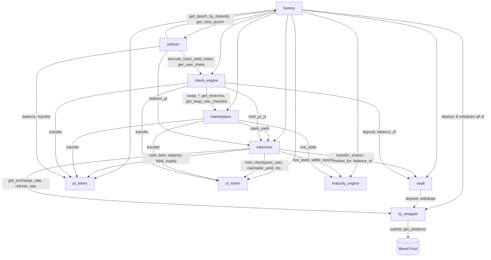

## Reading the graph

- **`factory`** is the only contract that touches all nine — every other edge is a runtime call between two already-deployed contracts.
- **`maturity_engine`** has no outgoing edges to other Novaire contracts — it is a pure, dependency-free epoch clock that `tokenizer` and `marketplace` query, never the other way around.
- **`sy_wrapper`** is the only contract with an edge leaving the protocol entirely, into the external Blend Capital pool. Every other yield-related computation elsewhere in the protocol is downstream of `sy_wrapper.get_exchange_rate()`.
- **`intent_engine`** and **`rollover`** are the two "composing" contracts — they don't hold protocol state of their own beyond user-facing bookkeeping (`UserIntents`, `RolloverPositions`); they orchestrate calls into the others.

A cycle worth noting: `rollover → intent_engine → marketplace/tokenizer → maturity_engine`, and separately `rollover → factory` to discover the next epoch. `rollover` never calls `marketplace` directly — swaps only happen inside `intent_engine`.
