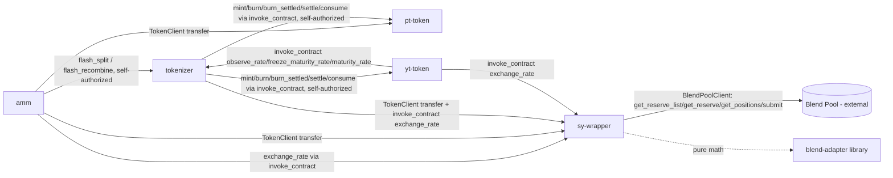

## Call patterns worth knowing

- **`amm` → `tokenizer`** for flash routes is self-authorized (`authorize_as_current_contract`) rather than requiring the user to sign a second, separate authorization — the [auth invariant tests](/testing/integration-tests) specifically check that this doesn't widen what the user is implicitly authorizing beyond the top-level swap call.
- **`tokenizer` → `pt-token`/`yt-token`** mint/burn calls are raw `env.invoke_contract` calls, not typed client calls, self-authorized the same way.
- **`yt-token` → `tokenizer`** for `observe_rate`/`freeze_maturity_rate`/`maturity_rate` exists so that holder-direct paths (like a plain `transfer` or `burn` of YT) still settle yield through the same frozen-rate mechanism as tokenizer-mediated paths — a YT holder can never get a raw, unfrozen post-maturity rate by going around the tokenizer.
- **`sy-wrapper` → Blend** is the only contract boundary that leaves the Novaire trust domain entirely. Every other cross-contract call in the diagram above is between contracts Novaire itself controls and initializes together.
- **No contract calls `amm` from outside a user transaction** — the AMM is not itself a dependency of `sy-wrapper`, `tokenizer`, `pt-token`, or `yt-token`. It's a leaf consumer of all four.

## Initialization order

Because of the dependency graph above, contracts must be initialized in this order (matching both `contracts/scripts/deploy-testnet-resilient.sh` and `contracts/scripts/deploy-mainnet.sh`):

1. `sy-wrapper` (needs the Blend pool + underlying asset addresses)
2. `pt-token`, `yt-token` (each needs the tokenizer's address + `maturity`)
3. `tokenizer` (needs `sy_token`, `pt_token`, `yt_token` addresses + `maturity`)
4. `amm` (needs `pt_token`, `sy_token`, `yt_token`, `tokenizer` addresses + curve parameters)

See [Testnet Deployment](/deployment/testnet) and [Mainnet Deployment](/deployment/mainnet) for the concrete deployment scripts that carry out this order.
