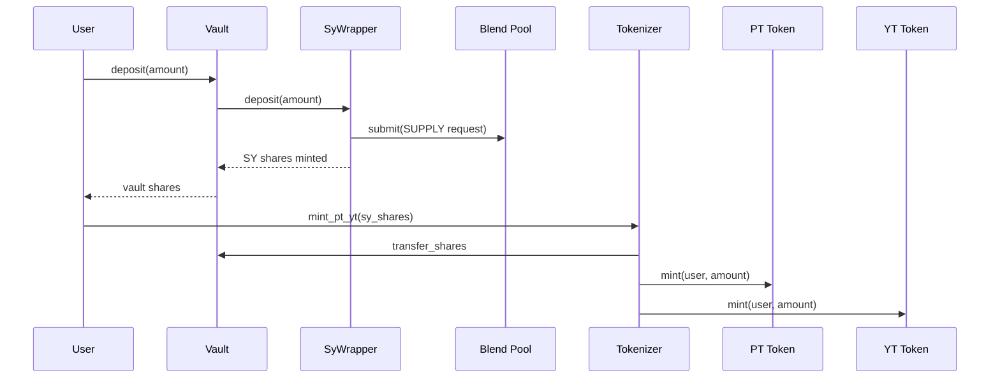
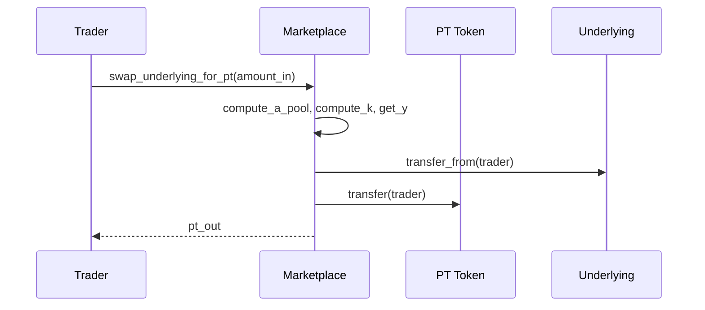
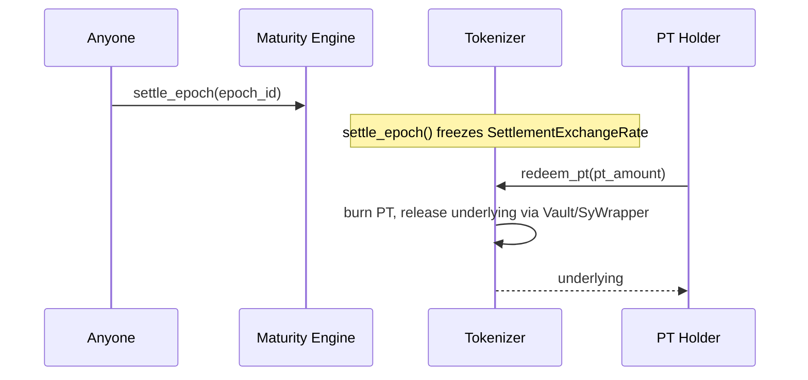

## Deposit → SY → PT/YT

`sy_wrapper`'s exchange rate (`TotalUnderlying * 1e9 / TotalShares`) only ratchets upward, and only when `refresh_rate()` observes the Blend pool's reported value has genuinely grown — capped at 10% per call as a defense against a compromised or lying pool. See [SY](/protocol/sy).

## PT/YT trading

YT trades are priced off the same PT/underlying curve via a virtual-sale simulation rather than against a separate reserve — see [AMM](/protocol/amm).

## Settlement → redemption

`settle_epoch()` on both `maturity_engine` and `tokenizer` is **permissionless** — anyone can trigger it once the maturity ledger has passed, so settlement doesn't depend on a keeper being online.

## State that lives where

| State | Owner contract | Notes |
| --- | --- | --- |
| SY exchange rate | `sy_wrapper` | 1e9-scaled, ratchets up only |
| Vault share balances | `vault` | Per-user, 1:1 with deposited SY shares |
| Epoch lifecycle state | `maturity_engine` | Canonical; other contracts query `live_state()` |
| PT/YT total supply, settlement rate | `tokenizer` | `SettlementExchangeRate` frozen at settlement |
| AMM reserves, TWAP | `marketplace` | `PtReserves`, `UnderlyingReserves`, `YtReserves`, `ImpliedRateTwap` |
| Rollover positions | `rollover` | `RolloverPosition` per user, independent of `intent_engine`'s lifetime totals |
