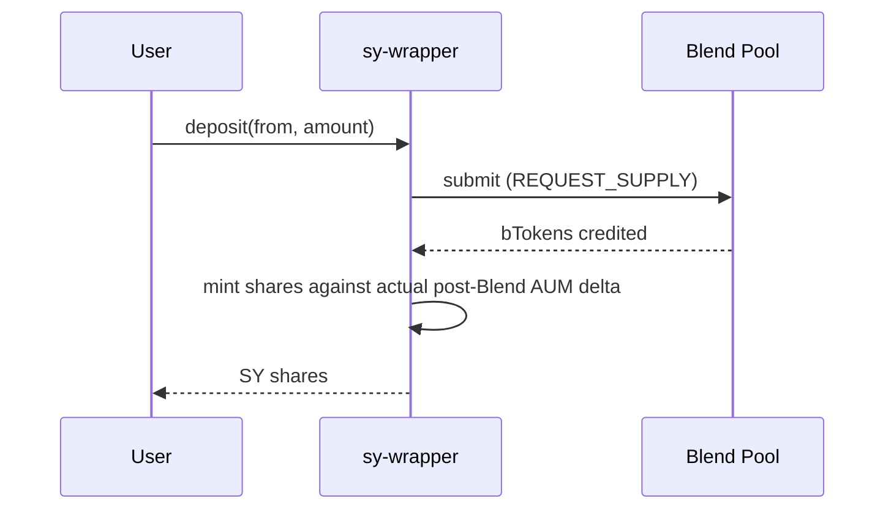
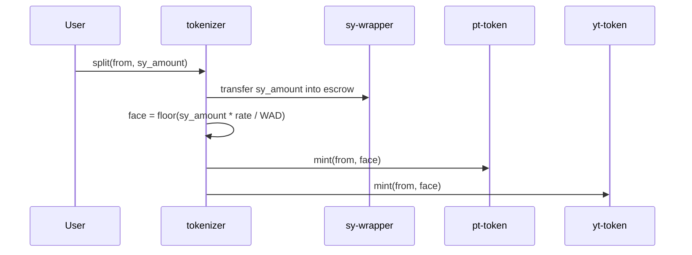
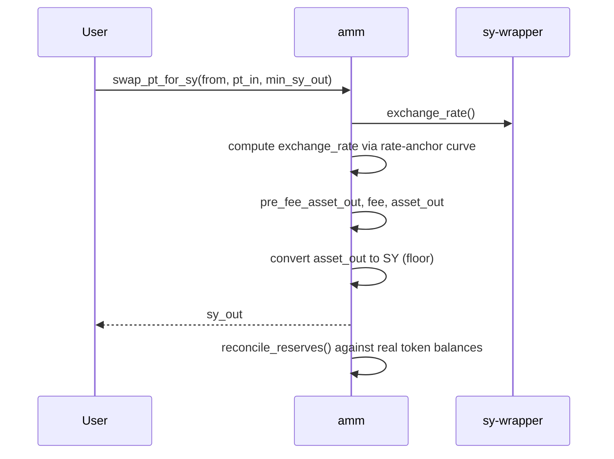
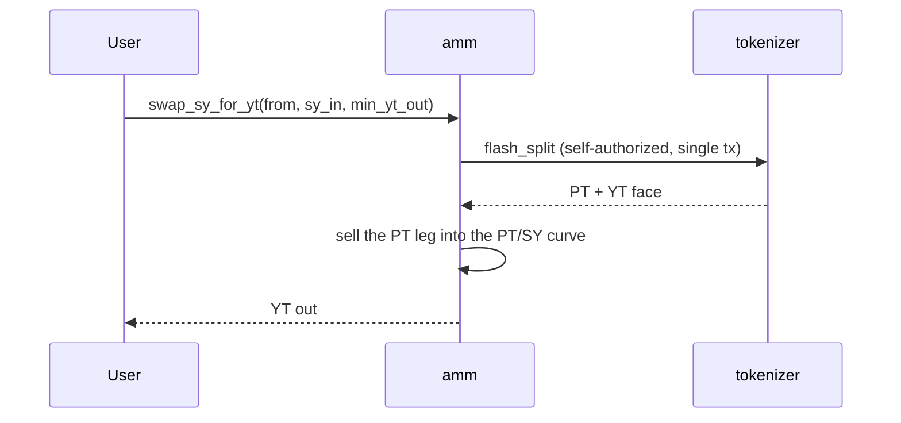
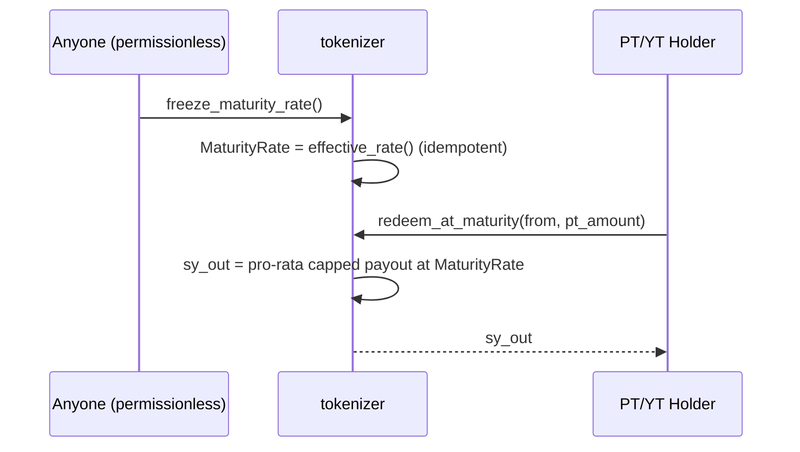

## Deposit → SY

Shares are minted against the *actual* AUM delta observed after the Blend call, not the raw transferred amount — this avoids rate dilution from bToken rounding (`sy-wrapper/src/lib.rs`).

## Split → PT + YT

No solvency gate at mint — this is a deliberate Pendle-style design (see [Trust Boundaries](/security/trust-boundaries)), not a missing check.

## Swap (PT → SY, through the AMM)

## SY ⇄ YT (flash-routed)

There is no independent YT pricing curve — every SY⇄YT trade is a same-transaction flash split/recombine through the tokenizer plus a PT/SY curve trade. This is why YT price is fully derived from the PT curve and the live SY rate, not set independently. See [Pricing](/protocol/pricing).

## Settlement at maturity

See [Settlement](/protocol/settlement) for the exact pro-rata cap formula and what happens under a rate regression.
