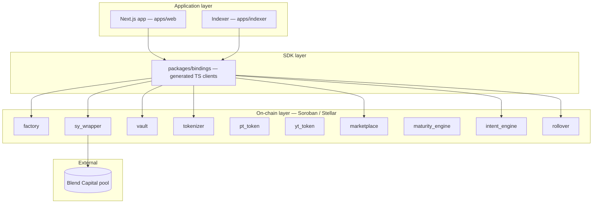

Novaire has three layers: on-chain Soroban contracts, off-chain deployment/indexing tooling, and a Next.js application. This page covers all three; contract-level detail is in [Contract Architecture](/architecture/contract-architecture).

## Layers

- **On-chain layer** — 9 Soroban contracts (`factory`, `sy_wrapper`, `vault`, `tokenizer` + `pt_token`/`yt_token`, `marketplace`, `maturity_engine`, `intent_engine`, `rollover`), deployed and wired per-epoch by `factory`.
- **SDK layer** — `packages/bindings/` contains one generated TypeScript package per contract, produced by `stellar contract bindings typescript` during deployment.
- **Application layer** — `apps/web` (Next.js 16 frontend + a small set of API routes backed by Prisma/Postgres for off-chain indexing/caching) and `apps/indexer` (an event indexer using `@stellar/stellar-sdk` directly, not the generated bindings).

## Deployment model: epochs

Every fixed-term market is an **epoch** — a full set of freshly deployed `sy_wrapper`, `vault`, `pt_token`, `yt_token`, `tokenizer`, `marketplace`, `intent_engine`, and `rollover` instances, wired together in one atomic call: `factory.deploy_epoch(params)`. `factory` verifies the wiring is self-consistent post-init and records an `EpochRecord`. Epochs can be explicitly linked (`factory.link_epochs`) so `rollover` can discover the "next" epoch for a matured position.

There is **no contract upgrade mechanism** — each epoch's contracts are immutable once deployed (confirmed in `SECURITY.md` and `docs/PROTOCOL_INVARIANTS.md`; note that `docs/architecture/ARCHITECTURE.md`'s mention of a future "DAO-governed proxy architecture" is explicitly aspirational, not current behavior).

## Off-chain tooling

| Tool | Purpose |
| --- | --- |
| `scripts/deploy.ts` | Full pipeline: build → upload → deploy → wire (`factory.deploy_epoch`) → generate bindings → bootstrap liquidity |
| `scripts/deploy_xlm_epoch.ts` | Deploy a new epoch on top of an existing `factory` |
| `scripts/bootstrap_liquidity.ts` | Seed initial `marketplace` liquidity |
| `apps/indexer` | Off-chain event indexing into Postgres for the frontend |

See [Deployment](/deployment/testnet) for the full pipeline walkthrough.
