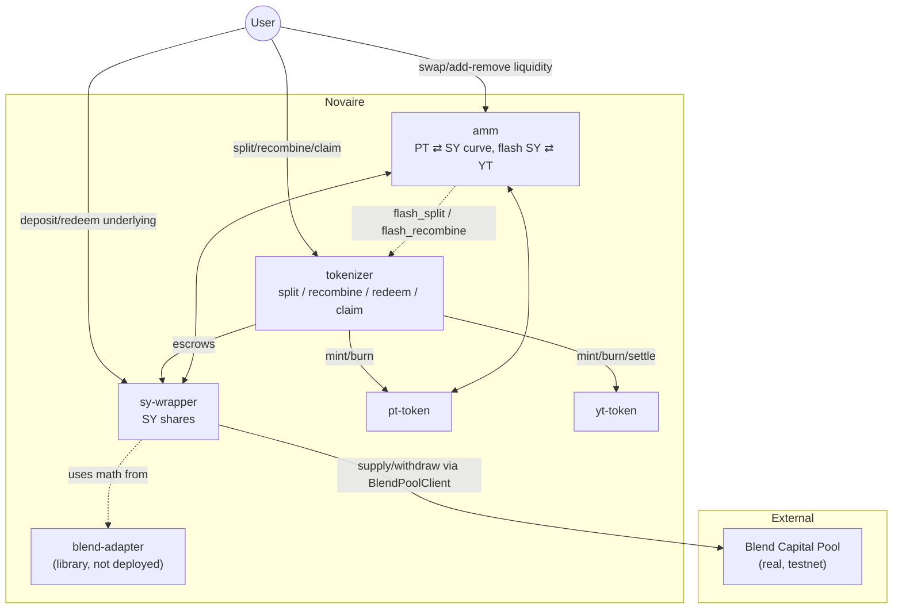

<Warning>
  Some documents historically associated with this repository (and earlier drafts of this documentation) describe a superseded 10-contract design — a `factory`, `vault`, `marketplace`, `maturity_engine`, `rollover`, and `intent_engine` alongside the tokenizer/PT/YT/SY-wrapper. **None of those six components exist in `contracts/` today.** This page — and everything else in this documentation site — describes only what is actually implemented in the current `contracts/` workspace, verified directly against source.
</Warning>

## The five deployed contracts (+ one library)

| Crate | Deployed? | Role |
|---|---|---|
| `sy-wrapper` | Yes | Wraps a Blend Capital pool position into a fungible SY share token |
| `blend-adapter` | **No — library only** | Shared Blend client bindings + pure rate math, used by `sy-wrapper` |
| `tokenizer` | Yes | Splits SY into PT + YT, handles recombine/redeem/claim and maturity freeze |
| `pt-token` | Yes | SEP-41 token, mint-gated to the tokenizer |
| `yt-token` | Yes | SEP-41 token + per-holder yield-accrual ledger, mint/settle-gated to the tokenizer |
| `amm` | Yes | PT/SY market with a time-decaying pricing curve; synthesizes SY/YT trades via flash routes through the tokenizer |

There is **no factory, vault, marketplace, rollover, or intent-engine contract** in `contracts/`. This deployment is one market: one underlying asset, one maturity, one AMM.

## Component diagram

## Layers

1. **Asset layer** — the real Blend USDC pool. Fully external, fully trusted (see [Trust Boundaries](/security/trust-boundaries)).
2. **SY layer** (`sy-wrapper`) — standardizes the Blend position into a single fungible, transferable share token with a derived exchange rate.
3. **Split layer** (`tokenizer` + `pt-token` + `yt-token`) — turns SY into a principal claim and a yield claim.
4. **Market layer** (`amm`) — prices PT against SY, and synthesizes YT pricing via flash routes rather than a second curve.

## Where each responsibility actually lives

- Rate derivation: `blend-adapter::derived_exchange_rate` (library function), called by `sy-wrapper`.
- Face-amount conversion (SY ⇄ PT/YT face) at split time: `tokenizer::split`/`recombine`.
- Yield accrual per holder: `yt-token`'s `Checkpoint`/`AccruedYield` storage, updated via `settle()`, callable only by the tokenizer.
- Price discovery: entirely inside `amm` — no oracle, no external price feed.

## Next

<CardGroup cols={2}>
  <Card title="Contract Architecture" href="/architecture/contract-architecture">Per-contract storage, functions, and events.</Card>
  <Card title="Data Flow" href="/architecture/data-flow">Token and value flow through the system.</Card>
  <Card title="Contract Dependencies" href="/architecture/contract-dependencies">Who calls whom.</Card>
  <Card title="Transaction Lifecycle" href="/architecture/transaction-lifecycle">What happens inside a single call.</Card>
</CardGroup>
