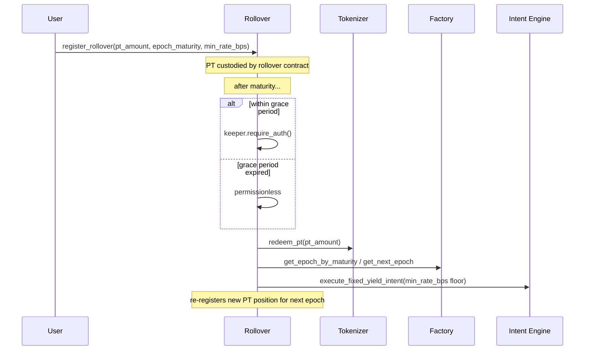

`intent_engine` exists so a user submits one Soroban transaction instead of three-plus manual calls. It exposes exactly two strategies.

## Fixed-yield intent

`execute_fixed_yield_intent(user, usdc_amount, min_implied_rate, min_underlying_out, yt_sale_percentage)`

<Steps>
  <Step title="Rate gate">
    Reads `marketplace.get_twap_rate_checked()` (reverts if the TWAP is older than `MAX_TWAP_AGE_LEDGERS`) and requires it to be at least `min_implied_rate` before doing anything else — this is the user's slippage/rate protection.
  </Step>
  <Step title="Deposit">
    Calls `vault.deposit(user, usdc_amount)`, which forwards into `sy_wrapper`.
  </Step>
  <Step title="Mint">
    Calls `tokenizer.mint_pt_yt(user, sy_shares)` — mints PT and YT 1:1.
  </Step>
  <Step title="Sell part of the YT">
    Sells `yt_sale_percentage`% of the newly minted YT into `marketplace` for underlying (`swap_yt_for_underlying`), subject to `min_underlying_out`.
  </Step>
  <Step title="Deliver">
    Transfers the retained PT and the underlying proceeds to the user. Returns a `CumulativeIntentRecord`.
  </Step>
</Steps>

This is the "I want a fixed return" path: sell the yield exposure, keep the principal.

## Yield-speculation intent

`execute_yield_speculation_intent(user, usdc_amount, min_yt_out, min_underlying_out)`

Same deposit → mint pipeline, but instead sells the **PT** leg into `marketplace` for underlying and keeps 100% of the YT. This is the "I want leveraged yield exposure" path — the user ends up holding only YT plus the proceeds from selling PT.

## Rollover lifecycle

`rollover.execute_rollover` diffs `CumulativeIntentRecord` before/after each call rather than reading it directly — `intent_engine` tracks a *lifetime* running total per caller, not a per-call delta, so a naive read would misattribute PT from other positions sharing the same intent engine.

A user can `exit_rollover` at any time — even while the contract is paused — to prevent funds getting trapped.
