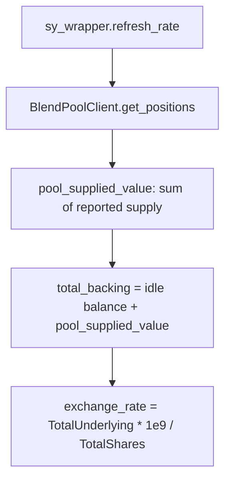
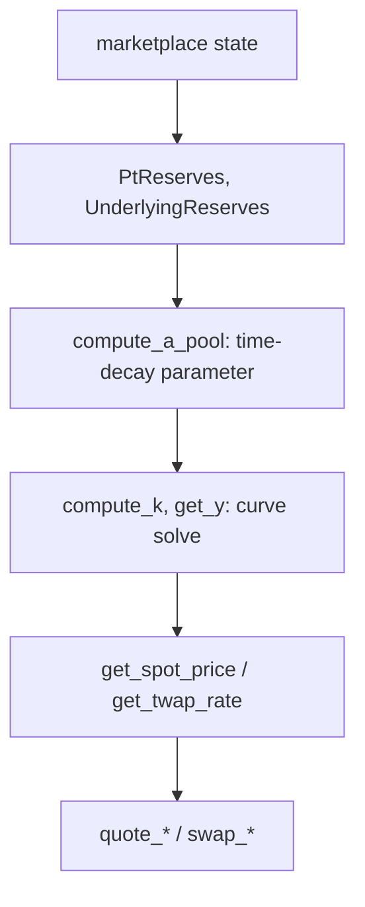
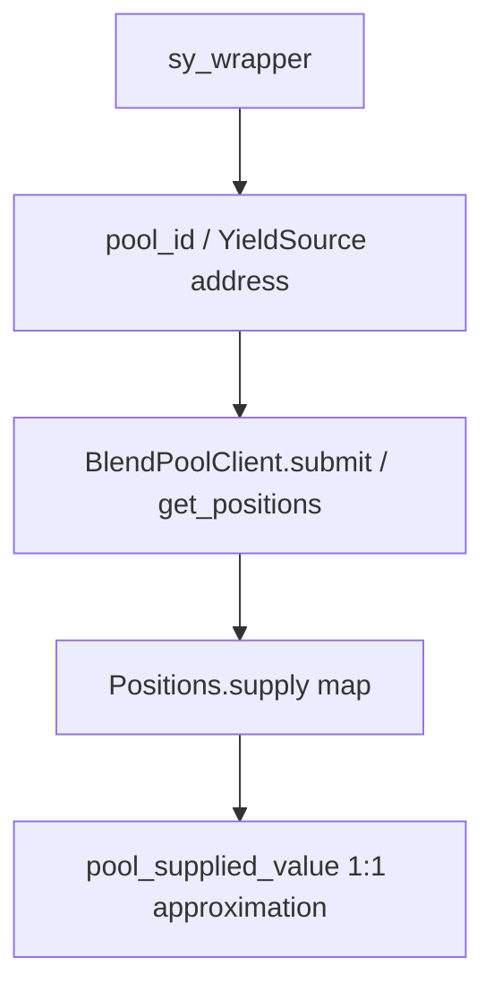

## SY exchange-rate issue

Inspect, in order:
1. `contracts/sy_wrapper/src/lib.rs` — `pool_supplied_value()` (the AUM approximation), `refresh_rate()` (the 10%-ratchet clamp), `EXCHANGE_RATE_SCALAR`.
2. Whether `refresh_rate()` has been called recently — the rate is not automatically pushed; it's only updated when someone calls `refresh_rate()`.
3. If the rate seems stuck: check `TotalShares` for zero (division-by-zero guard) and `Paused` state.
4. Remember: 1e9 scaling, not WAD (1e18) — a common off-by-9-orders-of-magnitude bug when integrating.

See [SY](/protocol/sy) and [Blend Integration](/protocol/blend-integration).

## AMM pricing issue

Inspect, in order:
1. `contracts/marketplace/src/lib.rs` — `compute_a_pool` (confirm `maturity_ledger`, `created_ledger` are what you expect — a wrong `created_ledger` skews the whole time-decay curve).
2. `get_reserves()` — confirm `PtReserves`/`UnderlyingReserves`/`YtReserves` match actual on-chain balances (if they don't, `assert_invariant()` should have already reverted the transaction that caused it).
3. `get_twap_rate_checked()` vs `get_twap_rate()` — if a caller is getting unexpected staleness reverts, check `get_twap_age()` against `MAX_TWAP_AGE_LEDGERS = 200`.
4. For YT pricing specifically: `solve_yt_out_for_underlying_in`'s bisection search is capped at `YT_PRICE_SEARCH_ITERS = 100` — an extreme trade size relative to reserves could hit the iteration cap before converging.

See [AMM](/protocol/amm) and [Pricing](/protocol/pricing).

## Blend issue

Inspect, in order:
1. `contracts/sy_wrapper/src/lib.rs` — confirm the `YieldSource` address stored at `initialize()` is genuinely the intended Blend pool (there is no on-chain way to verify this — see [Deployment → Verification](/deployment/verification)).
2. `BlendPoolClient`'s `Request`/`Positions` struct definitions — if Blend's real interface has changed, cross-contract calls could fail or silently misparse data.
3. Whether the failure reproduces against `MockBlendPool` (in `integration_tests/src/mock_blend_pool.rs` or any contract's own test module) — if it doesn't reproduce against the mock, the issue is likely specific to the real pool's actual behavior, which this repository's tests cannot help you debug directly (see [Blend Testing](/testing/blend-testing)).

## General approach

For any cross-contract issue, start from [Contract Dependencies](/architecture/contract-dependencies) to confirm which contract is actually responsible for the state you're debugging, then go to that contract's `DataKey` enum in its `src/lib.rs` — it's the fastest way to see every piece of state a contract can be in.
