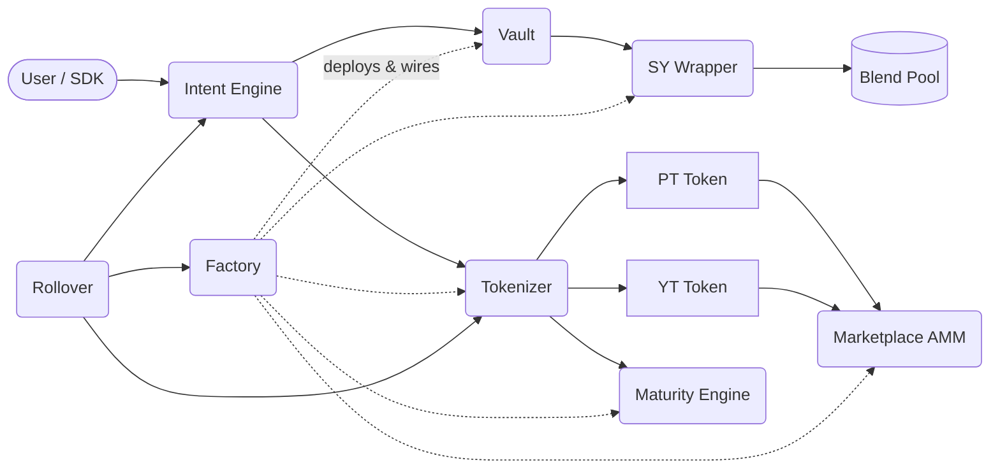

<Warning>
  Novaire is deployed and exercised on **Stellar Testnet only**. No independent, licensed security audit has been performed. Do not use with real funds. See [Security Status](/security/security-status).
</Warning>

Novaire is an intent-based fixed-yield protocol on Stellar (Soroban). It wraps a yield-bearing underlying asset into a Standardized Yield (SY) position, splits that position into a Principal Token (PT) and a Yield Token (YT), and runs a time-decaying AMM so the market — not an oracle — prices the fixed rate.

This is the technical documentation for the actual implementation: 9 Soroban contracts, a TypeScript SDK, and the off-chain tooling around them.

<CardGroup cols={2}>
  <Card title="Architecture" icon="sitemap" href="/architecture/system-architecture">
    How the 9 contracts are wired together, and what calls what.
  </Card>
  <Card title="Protocol" icon="layer-group" href="/protocol/sy">
    SY, Blend integration, PT/YT, the AMM pricing curve, and settlement.
  </Card>
  <Card title="Security" icon="shield-halved" href="/security/security-model">
    Trust boundaries, threat model, and the actual findings register.
  </Card>
  <Card title="Testing" icon="flask" href="/testing/testing-strategy">
    What's actually tested — unit, integration, regression, and what is not yet verified.
  </Card>
  <Card title="Developers" icon="code" href="/developers/setup">
    Clone, build, deploy to testnet, and run the contract test suite.
  </Card>
  <Card title="Deployment" icon="rocket" href="/deployment/testnet">
    The real deployment pipeline, testnet state, and mainnet status.
  </Card>
  <Card title="Reference" icon="book" href="/reference/glossary">
    Contract interfaces, SDK bindings, configuration, and glossary.
  </Card>
  <Card title="Quickstart" icon="bolt" href="/introduction/quickstart">
    Get the protocol running locally in a few commands.
  </Card>
</CardGroup>

## System at a glance

Nine Soroban contracts, deployed and wired per epoch by `factory`: `sy_wrapper`, `vault`, `tokenizer` (plus `pt_token`/`yt_token`), `marketplace`, `maturity_engine`, `intent_engine`, and `rollover`. Full breakdown in [Contract Architecture](/architecture/contract-architecture).

## Current implementation status

| Area | Status |
| --- | --- |
| Testnet deployment | Deployed, exercised |
| Mainnet deployment | Not verified as live — see [Mainnet](/deployment/mainnet) |
| Independent security audit | Not performed — see [Security Status](/security/security-status) |
| Real Blend pool integration (production code) | Implemented (real cross-contract calls) |
| Real Blend pool integration (tested against live pool) | Not verified — only `MockBlendPool` used in tests |
