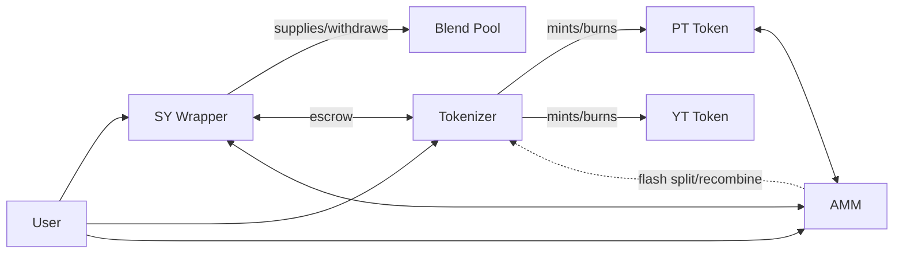

<Note>
  Novaire is deployed on **Stellar Testnet only**. There is no mainnet deployment and the protocol has not undergone an independent third-party security audit. See [Security Status](/security/security-status) before integrating.
</Note>

Novaire is a yield-tokenization protocol built on Soroban that splits a yield-bearing position into a **Principal Token (PT)** and a **Yield Token (YT)**, and trades them against a purpose-built AMM. This site documents the system exactly as it is implemented today — a single-market, 6-crate architecture — not as it was originally designed or as it may become.

<CardGroup cols={2}>
  <Card title="Architecture" icon="sitemap" href="/architecture/system-architecture">
    How the SY Wrapper, Tokenizer, PT/YT tokens, and AMM fit together.
  </Card>
  <Card title="Protocol" icon="function" href="/protocol/sy">
    SY accounting, Blend integration, PT/YT lifecycle, AMM pricing curve.
  </Card>
  <Card title="Security" icon="shield-halved" href="/security/security-model">
    Trust boundaries, threat model, known risks, and current findings.
  </Card>
  <Card title="Testing" icon="flask" href="/testing/testing-strategy">
    What is actually covered by unit tests, integration tests, and live-testnet verification.
  </Card>
  <Card title="Developers" icon="code" href="/developers/setup">
    Clone, build, test, and run the protocol locally.
  </Card>
  <Card title="Deployment" icon="rocket" href="/deployment/testnet">
    How the current testnet deployment was produced and how to reproduce it.
  </Card>
  <Card title="Reference" icon="book" href="/reference/contract-reference">
    Contract interfaces, SDK bindings, constants, and glossary.
  </Card>
  <Card title="Quickstart" icon="bolt" href="/introduction/quickstart">
    Get the workspace running end to end.
  </Card>
</CardGroup>

## System at a glance

Five contracts are deployed per market (`sy-wrapper`, `tokenizer`, `pt-token`, `yt-token`, `amm`); `blend-adapter` is a shared library, not a deployed contract. There is no factory, vault, marketplace, rollover, or intent-engine contract in the current architecture — earlier design documents describing those components are superseded and are not reproduced here. See [System Architecture](/architecture/system-architecture) for the full breakdown.
