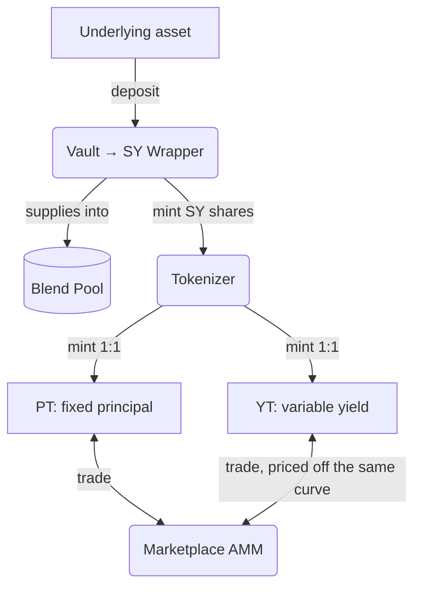

## The problem

A yield-bearing position — say, an underlying asset supplied into a lending pool — has one variable interest rate attached to one lump of capital. Everyone holding that position is exposed to the same floating rate, whether they want fixed income, leveraged yield exposure, or neither.

## The mechanism

Novaire separates a yield-bearing position into two components with different risk profiles, then lets a market price the split:

1. **Deposit** — underlying goes into `vault`, which forwards it to `sy_wrapper`, which supplies it into a Blend Capital lending pool.
2. **Tokenize** — `tokenizer` mints PT and YT 1:1 against the resulting SY shares, for a fixed-term epoch ending at a `maturity_ledger`.
3. **Trade** — `marketplace` is a YieldSpace-style AMM: PT trades against the underlying at a discount that implies a fixed rate; YT is priced off the same curve via a virtual-sale derivation, not a separate pool.
4. **Settle** — at maturity, `tokenizer` freezes the settlement exchange rate; PT redeems 1:1 for underlying; accrued yield is claimable by YT holders.
5. **Roll over** (optional) — `rollover` can automatically redeem a matured PT position and reinvest it into the next epoch via `intent_engine`.

## Who this is for

- **Fixed-yield seekers**: buy PT at a discount, redeem 1:1 at maturity — return is locked in the moment you buy.
- **Yield speculators**: buy YT to get leveraged exposure to the variable yield stream without buying principal.
- **Liquidity providers**: supply PT + underlying to `marketplace` and earn the 0.3% swap fee.
- **Integrators**: use `intent_engine` to compose a deposit-to-position flow into one transaction, or `packages/bindings` for direct contract access.

For a deeper technical walkthrough of each piece, start with [Core Concepts](/introduction/core-concepts), then [Architecture](/architecture/system-architecture).
