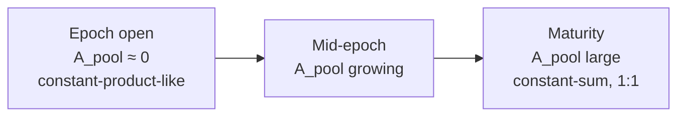

`marketplace` is a YieldSpace-style automated market maker for PT against the underlying asset, with YT priced off the same curve rather than through a second pool. This is the deepest technical section in these docs — every formula below is quoted directly from `contracts/marketplace/src/lib.rs`.

## The invariant

```rust
fn compute_a_pool(env, maturity, x, y) -> i128 {
    // if matured: (x + y) * 1_000_000_000   — approximates a 1:1 constant-sum curve
    // t_rem = maturity - current_ledger
    // t_tot = maturity - created_ledger
    // base_a = ((t_tot - t_rem) * 1_000_000) / t_rem
    // a_pool = base_a * ((x + y) / 2) / 1_000_000
}

fn compute_k(a_pool, x, y) -> i128 {
    // k = a_pool * (x + y) + x * y
}

fn get_y(a_pool, k, x_new) -> i128 {
    // y_new = (k - a_pool * x_new) / (a_pool + x_new)
}

fn get_spot_price(a_pool, x, y) -> i128 {
    // P = (a_pool + y) / (a_pool + x), scaled to 1e9
}
```

`A_pool` is the curve's time-varying parameter: it grows from near-zero at epoch genesis (behaving like a constant-product curve, high price sensitivity to trade size) to a large value as maturity approaches (behaving like a constant-sum, 1:1 curve — the definition of "PT converges to par at maturity"). This is the standard Pendle/Notional-style time-decaying AMM invariant `k = A_pool*(x+y) + x*y`, where `x` = PT reserves and `y` = underlying reserves.

<Frame caption="A_pool grows over the epoch's life, flattening the curve toward 1:1 as maturity approaches.">

</Frame>

## Units

| Variable | Unit | Notes |
| --- | --- | --- |
| `PtReserves`, `UnderlyingReserves` | underlying-equivalent token units | Actual on-chain balances of PT/underlying held by `marketplace` |
| `YtReserves` | YT token units | A separate one-way liquidity pool, not part of the `x,y` curve |
| `a_pool`, `k` | 1e9-scaled fixed-point | Internal curve parameters, not directly meaningful outside `compute_*` |
| `ImpliedRateTwap` | 1e9-scaled rate | EMA of the implied fixed rate, weighted `weight_old = 20` ledgers |
| Swap fee | `SWAP_FEE_NUM/DEN = 997/1000` | 0.3%, applied on PT/underlying swaps |

## PT/underlying swaps

`swap_underlying_for_pt` and `swap_pt_for_underlying` both: read current `a_pool` via `compute_a_pool`, compute `k`, solve `get_y` for the new reserve given the trade input net of the 0.3% fee, and update reserves. `assert_invariant()` runs after every state-mutating call, checking `PtReserves`/`UnderlyingReserves` against the contract's actual on-chain token balances.

## YT pricing — a derived route, not a separate pool

YT does not have its own AMM curve. Instead, `marketplace` simulates what would happen if YT were sold or bought against the existing PT/underlying curve:

- `simulate_pt_sale_proceeds` / `net_cost_for_yt` — models a hypothetical PT sale to derive the equivalent cost of buying YT.
- `solve_yt_out_for_underlying_in` — a **bisection search**, capped at `YT_PRICE_SEARCH_ITERS = 100` iterations, solving for how much YT a given underlying input buys.
- `compute_yt_sell_proceeds` — the closed-form dual for selling YT back.

`YtReserves` is a real, separately-tracked balance — funded one-way via `add_yt_liquidity` — that YT buys/sells draw down or replenish, but the **price** always comes from the PT/underlying curve simulation, not from `YtReserves` itself acting as an AMM leg.

## TWAP and staleness

`ImpliedRateTwap` is an EMA of the implied rate, updated on-swap. `get_twap_rate_checked()` reverts if the last update is older than `MAX_TWAP_AGE_LEDGERS = 200` ledgers — this is what `intent_engine` calls to gate its strategies against a stale or flash-loan-manipulated rate. See regression tests `test_6_flash_loan_twap_resistance` and `test_6b_h3_twap_temporal_ordering_regression` in [AMM Tests](/testing/amm-tests).

## Fees and liquidity

- Swap fee: 0.3% (`997/1000`), retained in reserves for LPs.
- `MINIMUM_LIQUIDITY = 1000` — permanently locked on first `add_liquidity`, the standard donation-attack defense (see `test_m5_donation_attack_impossible`).
- LP shares are tracked via `TotalLpShares` / `LpBalance(Address)`; `remove_liquidity` returns a `(pt, underlying, yt)` tuple.
- `claim_amm_yield()` pulls accrued yield from `tokenizer` into `UnderlyingReserves`, benefiting LPs.

See [Liquidity](/protocol/liquidity) and [Pricing](/protocol/pricing) for the LP and rate-discovery perspective on the same mechanics.
