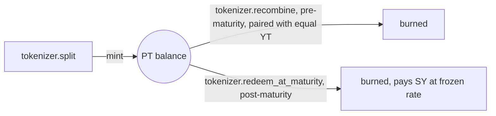

## What PT is

A SEP-41 fungible token (`pt-token`, symbol `sPT`, 7 decimals) representing a claim on principal value, redeemable at maturity. `mint` is gated to `config.tokenizer.require_auth()` — only the `tokenizer` contract can mint PT; there is no other minting path.

## Minted by split

`tokenizer.split(from, sy_amount)` escrows `sy_amount` SY and mints equal PT and YT face amounts:

```
face = floor(sy_amount * rate / WAD)
```

where `rate` is the live SY exchange rate at the moment of the split. PT face is therefore denominated in **underlying-asset terms as of split time**, not in raw SY shares.

There is no solvency gate on `split` — it mints exactly `face` PT and `face` YT regardless of anything else happening in the market. This is a deliberate design choice (Pendle-style: minting never reverts on collateralization), not a missing check. See [Trust Boundaries](/security/trust-boundaries) for why this is safe.

## Redemption logic lives in the tokenizer, not PT

`pt-token` itself has no `redeem` function and no rate awareness beyond a stored `maturity` timestamp for display. All redemption math — the frozen maturity rate, the pro-rata cap under a rate regression — lives in `tokenizer.redeem_at_maturity` and `tokenizer.recombine`. This is intentional: PT lacks the escrow/rate data needed to price its own redemption correctly, so that logic isn't duplicated.

## Burn paths

- `burn(from, amount)` — holder-authorized, standard SEP-41 burn (used internally by `tokenizer.recombine`/`redeem_at_maturity`).
- `burn_from(spender, from, amount)` — allowance-gated burn.

## Lifecycle summary



See [Settlement](/protocol/settlement) for the exact recombine/redeem payout formulas.
