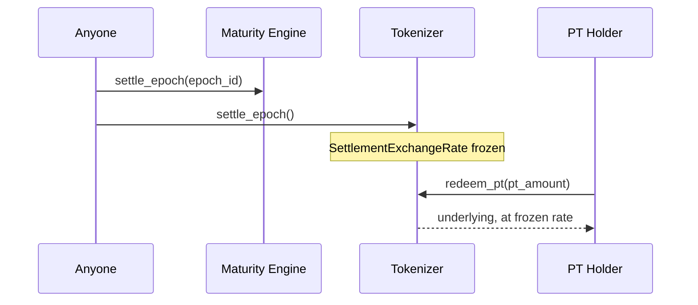

## The epoch state machine

`maturity_engine` is the canonical clock: `Active(0) → Matured(1) → Settled(2) → Archived(3)`.

- **Active → Matured** is not a stored transition — it's dynamically evaluated by `evaluate_state()` (`ledger().sequence() >= maturity_ledger`), so `live_state()` always reflects reality even if no one has "poked" the contract. The `state` field on `EpochRecord` can remain "Active" in storage while `live_state()` correctly reports "Matured" — this is an intentional lazy-evaluation model, not a bug.
- **Matured → Settled** happens via `settle_epoch(epoch_id)` on `maturity_engine`, and separately via `tokenizer.settle_epoch()` which freezes economics. Both are **permissionless** — callable by anyone once matured, so settlement doesn't depend on a keeper being online. Repeated calls after the first are rejected (`test_repeated_settle_epoch_spam_all_fail_after_first`, `test_settle_epoch_repeated_calls_all_fail_after_first`).
- **Settled → Archived** via `archive_epoch(epoch_id)`, admin-gated.

## What `tokenizer.settle_epoch()` actually does

Freezes `SettlementExchangeRate` — the SY exchange rate at the moment of settlement — so that every subsequent `redeem_pt` call uses a single, fixed rate rather than whatever `sy_wrapper.get_exchange_rate()` happens to report at redemption time. This prevents redemption value from drifting between the first and last person to redeem in the same settled epoch.

## Redemption after settlement

`redeem_pt` is tested down to dust amounts, against double-redemption, against zero-amount calls, and against redeeming with a zero PT balance — see [Testing](/testing/testing-strategy).

## Rollover into the next epoch

Settlement doesn't require a user to manually redeem-then-reinvest. `rollover` automates this: once an epoch matures, `execute_rollover` redeems the custodied PT via `tokenizer.redeem_pt`, discovers the linked next epoch via `factory.get_epoch_by_maturity`/`get_next_epoch`, and reinvests via `intent_engine.execute_fixed_yield_intent` at the user's pre-set minimum rate. See [Transaction Lifecycle](/architecture/transaction-lifecycle).

## What YT holders get at maturity

YT is not burned or frozen at maturity — `test_transfer_still_works_after_maturity` confirms it remains transferable. Its yield-accrual index simply stops advancing once the underlying position's yield generation for that epoch is done; holders continue to be able to `claim_yield` whatever had already accrued.
