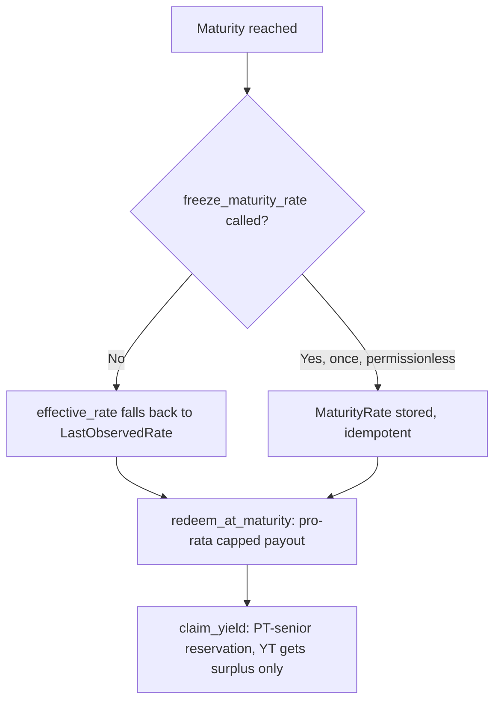

## The rate freeze

Before maturity, `tokenizer.observe_rate()` reads the live SY rate on demand and stores it as `LastObservedRate` — this is a fallback, not the committing value. At or after maturity, `freeze_maturity_rate()` computes and stores `MaturityRate` exactly once (idempotent — calling it again just returns the already-stored value). It's **permissionless**: anyone can call it, not just an admin.

```
effective_rate():
  if now < maturity:  return live SY rate
  else:                return MaturityRate if set, else LastObservedRate
```

Post-maturity, redemption logic never reads a live SY rate directly — only `effective_rate()`, which after freezing always returns the frozen value. This means yield that accrues on the underlying Blend position *after* maturity never leaks into PT/YT redemption.

## Recombine (pre-maturity)

`recombine(from, pt_amount, yt_amount)` requires `pt_amount == yt_amount`. It computes:

```
full      = pt_amount * WAD / rate
pro_rata  = escrow_shares * pt_amount / pt_supply
payout    = min(full, pro_rata)
```

`rate` here is the live rate (pre-maturity). Burns PT directly; burns YT via `burn_settled` (settling any accrued yield into the holder's ledger first, at the same rate, before the burn).

## Redemption at maturity

`redeem_at_maturity(from, pt_amount)` — post-maturity only, same pro-rata-capped formula as `recombine` but using `effective_rate()` (the frozen rate) instead of a live rate:

```
full      = pt_amount * WAD / maturity_rate
pro_rata  = escrow_shares * pt_amount / pt_supply
payout    = min(full, pro_rata)
```

## Why the pro-rata cap exists

Because PT/YT minting has no solvency gate (see [PT](/protocol/pt)), it's possible in principle for the SY escrowed against outstanding PT to fall short of what a naive `full` payout to every PT holder would require — e.g. under a rate regression between split and redemption. The pro-rata cap means that shortfall, if any, is **shared proportionally across all PT holders**, not paid first-come-first-served to whoever redeems first. This is a deliberate design decision, tested directly by dedicated rate-regression integration tests (see [Integration Tests](/testing/integration-tests)).

## YT's claim is subordinated to PT's

`claim_yield` computes a PT-senior reservation and only pays YT out of whatever surplus SY exists beyond that reservation:

```
pt_face_reservation = ceil(pt_supply * WAD / rate)
surplus              = max(0, escrow_shares - pt_face_reservation)
pay                  = min(owed, surplus)
```

This is the mechanism that keeps PT's principal claim senior to YT's yield claim on the same shared SY escrow — see [YT](/protocol/yt) for the full accrual-ledger mechanics, and [Integration Tests](/testing/integration-tests) for the PT-senior/YT-subordinated test coverage.

## Summary


