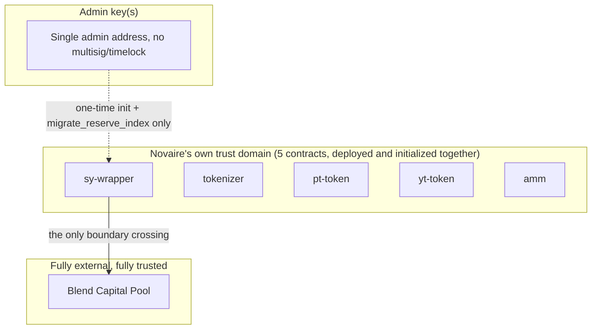

## Inside the trust domain

The five deployed contracts (`sy-wrapper`, `tokenizer`, `pt-token`, `yt-token`, `amm`) are deployed and initialized together as one system. Cross-contract calls between them are self-authorized by the calling contract, not re-authorized by the user each time — this is appropriate because all five are controlled by the same deploying party and their mutual trust is fixed at initialization (each is given the addresses of the others it needs to call).

## The one boundary that leaves it: Blend

`sy-wrapper` depends entirely on a real, external Blend Capital pool for:

- Custody of the underlying deposited assets (Blend holds the funds, not Novaire).
- The `b_rate` that determines AUM and therefore the SY exchange rate.
- Withdrawal availability on redeem.

There is **no fallback, no circuit breaker, and no rate-of-change bound** on this dependency in the current code. If Blend's reported rate were wrong, manipulated, or Blend itself were compromised, that would flow directly into Novaire's SY exchange rate with no on-chain check. `SECURITY.md`'s Remediation Roadmap lists deciding whether to reintroduce such a bound as an open, unresolved Medium-priority item.

## Admin key

The admin address is trusted only for:

1. One-time initialization parameters at deploy time.
2. `sy-wrapper.migrate_reserve_index` — a self-verifying recovery function (it re-derives the correct index itself rather than trusting the admin's input) for a Blend reserve re-indexing event.

The admin **cannot**: move user funds, mint or burn PT/YT/SY directly, change the AMM's pricing curve or fee, or pause any part of the protocol. There is no multisig or timelock on this key today — a single compromised key has the (limited) blast radius described above, not full protocol control.

## Off-chain / non-contract components

The frontend (`apps/web`), indexer (`apps/indexer`), and RPC infrastructure are outside the on-chain trust boundary entirely and are not covered by this section — they can display incorrect data or be unavailable without the on-chain contracts being affected, and vice versa.
