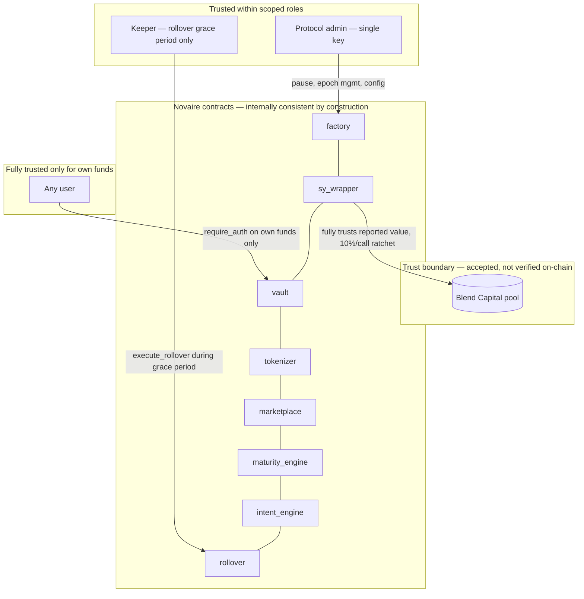

## The one external trust boundary

`sy_wrapper` is the single point where Novaire's trust perimeter extends outside its own contracts. Its exchange rate is derived entirely from what the configured Blend Capital pool reports, bounded only by a 10%-per-call ratchet on increases (see [SY](/protocol/sy)). Every other contract in the protocol is downstream of this one number — a compromised or dishonest Blend pool is, per `SECURITY.md`, a systemic risk to the whole protocol, only partially mitigated (rate-of-change limiting, not a correctness guarantee).

<Warning>
  `sy_wrapper`'s `YieldSource` (the Blend pool address) is set once at `initialize()` with **no rotation function**. Its correctness depends entirely on whoever runs `factory.deploy_epoch()` verifying, off-chain, that the address is genuinely Blend's official pool. `factory` cannot check this on-chain — see [Deployment → Verification](/deployment/verification).
</Warning>

## Internal boundaries (contract-to-contract)

Because every Novaire contract in an epoch is deployed and wired by the same `factory.deploy_epoch()` call, and `factory` cross-validates each contract's self-reported metadata against the deployment parameters before considering the epoch live, contract-to-contract calls within the protocol carry much less residual trust risk than the Blend boundary — misconfiguration (wrong address wired to the wrong role) is caught at deploy time, not discovered at runtime.

## Admin key

A single `Address` per contract, not a multisig or timelock, as of this documentation. A compromised admin key could pause the protocol, reassign PT/YT mint/burn authority (via `set_tokenizer`/`set_sy_wrapper`, now two-step per SEC-06), or misconfigure a new epoch deployment. It cannot directly move user-owned token balances — no admin function transfers user funds.

## Keeper

Scoped narrowly: a keeper can only trigger `rollover.execute_rollover` on a user's behalf, and only during the grace period after maturity. Funds always land in the position the user themselves registered — the keeper has no path to redirect funds elsewhere.
