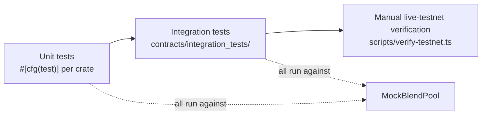

## Layers

Everything in the two automated layers (unit, integration) runs against `blend-adapter::MockBlendPool`, an in-memory test double — not against a live Blend pool. Only the manual `verify-testnet.ts` script exercises real contracts on real Stellar Testnet. See [Blend Testing](/testing/blend-testing) for exactly what that does and doesn't prove.

## What CI actually gates

Verified directly against `.github/workflows/*.yml` at the current `master` HEAD:

| Workflow | Trigger | What it runs |
|---|---|---|
| `ci.yml` | every PR/push to `main`/`master`/`develop` | `cargo fmt --check`, `cargo clippy --all-targets --all-features`, `cargo test --workspace --all-features`, `cargo audit`, wasm32v1-none release build per contract, plus `tsc`/lint/vitest/build for `web`/`indexer`/`scripts` |
| `protocol-integrity.yml` | PR/push touching `contracts/**` | `cargo test -p integration_tests` (matrixed by suite: PT/YT accounting, tokenization, untokenization, redemption, settlement, b_rate accounting, yield/APY, full invariant module), then a full `cargo test --workspace --all-features -- --nocapture` re-run with a NaN/Infinity accounting scan, plus targeted vitest for `protocolService.test.ts`/`yield.test.ts` |
| `security.yml` | every PR/push, daily 03:17 UTC | gitleaks, a custom secret-pattern scan, `cargo audit`, unsafe-Rust detection, `npm audit` |
| `deployment-validation.yml` | PR/push touching `scripts/deployments.*.json` or the deploy script, manual | Validates `scripts/deployments.{testnet,mainnet}.json` shape — **see the caveat in [Verification](/deployment/verification)** about what file this actually checks vs. what the current deploy script writes |
| `verify-testnet.yml` | **manual `workflow_dispatch` only** | `npm run verify:testnet` against live Stellar Testnet, plus optional Playwright real-wallet/portfolio e2e |
| `nightly.yml` | cron 02:00 UTC, manual | Reuses `protocol-integrity.yml` + `security.yml`, plus `verify:testnet` and a dependency scan |
| `release-validation.yml` | GitHub Release created, manual | Every gate above plus `verify:testnet`; produces `release-validation.md` + `deployment-summary.md` |

Required branch-protection status checks (per `.github/workflows/README.md`): `ci-gate`, `Protocol Integrity gate`, `Security gate`, `Deployment Validation gate`. **`verify-testnet` is not among the required merge gates** — live-network verification is not enforced automatically on every change.

## Property-based testing

The AMM's unit test module includes a `proptest!` block running 10,000 randomized cases, comparing on-chain state against an independent position model across random sequences of split/recombine/swap operations. The integration suite additionally has its own randomized test using a custom RNG (not `proptest`) covering cross-contract conservation properties.

## Where to look next

<CardGroup cols={2}>
  <Card title="Unit Tests" href="/testing/unit-tests" />
  <Card title="Integration Tests" href="/testing/integration-tests" />
  <Card title="AMM Tests" href="/testing/amm-tests" />
  <Card title="Blend Testing" href="/testing/blend-testing" />
</CardGroup>
