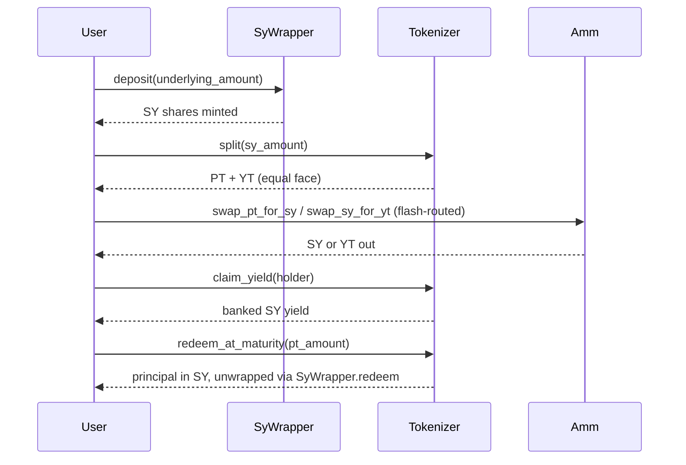

# Novaire Architecture

## Overview
Novaire is a yield-tokenization protocol on Stellar (Soroban): a lean
four-layer contract stack that wraps a yield-bearing asset (SY),
splits it into fixed principal (PT) and floating yield (YT), and trades PT
against SY on a time-decay AMM. This replaced a larger 10-contract design
(factory, marketplace, intent_engine, rollover, maturity_engine, vault) that
had grown its own multi-epoch deployment model, order/AMM hybrid market, and
automation layer; those product features were dropped in the migration and,
if wanted again, would be rebuilt on top of this leaner core rather than
restored as-is.

## Core Design Principles
1. **Layered, one-way dependencies:** each contract only knows about the
   layer below it — the SY wrapper doesn't know about the tokenizer, and the
   tokenizer doesn't know about the AMM.
2. **Capital Efficiency:** the SY wrapper (an ERC-4626-style vault) keeps the
   underlying productive (supplied to Blend) while PT/YT trade as its
   derivatives.
3. **PT as fixed principal, not a share claim:** PT always redeems to exactly
   its face value in underlying units at maturity, regardless of the SY
   exchange rate at mint time — this is what makes PT fungible across holders
   who split at different rates.
4. **Market-driven rates:** the AMM's time-decay curve, not an oracle, prices
   the fixed rate implied by PT's discount to face value.
5. **Priced, not blocked, insolvency:** a rate regression (a Blend-side loss)
   is priced as a pro-rata haircut at redemption rather than gated on-chain —
   gating on coverage turned dust-level rounding regressions into a frozen
   market in the prior design.

## Protocol Layers
1. **Asset Layer:** the underlying yield-bearing asset — a Blend Capital USDC
   lending pool (real yield, not simulated).
2. **Layer 1 — SY Wrapper:** wraps the Blend position into a standardized,
   ERC-4626-style share (`sy-wrapper`), exposing a single `exchange_rate()`
   that ticks up as Blend accrues interest.
3. **Layer 2 — Tokenizer:** splits SY into equal-face PT (`pt-token`) and YT
   (`yt-token`), holds the escrow, and settles yield to YT holders on an
   index/checkpoint model (`tokenizer`).
4. **Layer 3 — AMM:** a time-decay bonding curve (`amm`) trading PT against
   SY directly, with SY-against-YT flash-routed through the tokenizer inside
   a single call.
5. **Adapter:** `blend-adapter` is a library crate (not separately deployed)
   used internally by `sy-wrapper` to derive the exchange rate from Blend's
   bToken accounting.

## Architecture Diagram

```mermaid
graph TD
    subgraph Layer 3: Liquidity
        AMM(AMM · time-decay curve)
    end

    subgraph Layer 2: Derivatives
        T(Tokenizer)
        PT[PT Token]
        YT[YT Token]
    end

    subgraph Layer 1: Custody
        SY(SY Wrapper)
        BA(Blend Adapter · library)
    end

    subgraph Asset Layer
        Blend[(Blend USDC Pool)]
    end

    U([User])

    U -->|1. deposit underlying| SY
    SY -->|derives rate via| BA
    BA -->|reads| Blend
    SY -->|2. mints SY shares| U
    U -->|3. split(sy_amount)| T
    T -->|4. mint equal face| PT
    T -->|4. mint equal face| YT
    PT -.->|5. trade| AMM
    YT -.->|5. flash-routed trade| AMM
    AMM -.->|internal split/recombine| T
    U -->|6. claim_yield / redeem_at_maturity| T
```

## Detailed Lifecycle



### Yield Tokenization
Underlying deposited into the SY wrapper is priced against a live Blend
exchange rate. The Tokenizer escrows SY and mints equal-face PT and YT:
`pt_face = yt_face = sy_amount * exchange_rate / WAD`.

### Principal Separation
PT is fixed principal — it redeems to `pt_amount * WAD / rate_at_maturity`
SY (unwrapped to `pt_amount` underlying), never more, never less, regardless
of the exchange rate at mint. This is a deliberate correction over a
share-based design where PT redeemed 1:1 in shares and so captured yield
that belonged to YT.

### Yield Separation
YT captures everything the escrow earns above principal, tracked per-holder
via a `checkpoint` (the SY rate last settled at) and an `accrued_yield`
ledger, using a telescoping settle formula so that settling at every
transfer yields the same total as one settle at the end.

### Market Pricing
The AMM prices PT against SY on a log-implied-rate curve with time as an
explicit parameter — as maturity approaches, the curve concentrates around
the 1:1 PT:SY ratio. SY-against-YT trades are flash-routed through the
tokenizer's split/recombine inside the AMM's own call, so no separate YT
liquidity pool is needed.

### Redemption
After maturity, PT holders call `tokenizer.redeem_at_maturity` to burn PT
for principal, capped pro-rata to escrow coverage under an insolvency
regression. YT holders can `claim_yield` at any time, including after
maturity (a grace window), paid at the frozen maturity rate.

### Portfolio Calculation
The frontend calculates portfolio value by evaluating:
`Wallet Underlying + (PT Balance * Spot Price) + (YT Balance * Spot Price) + Claimable Yield`

### Yield Accrual
Yield accrues inside the SY wrapper's Blend position. `exchange_rate()`
ticks up as Blend's bToken position earns interest; the tokenizer reads this
rate to price splits, recombines, and redemptions.

### Analytics
The frontend reads all financial state **live from the contracts via Soroban
RPC** (generated TS bindings) and deliberately bypasses the off-chain
database for pricing. Historical chart data is kept in a file-based JSON
store (`history-store.json`, scoped by network + SY wrapper): the Next.js
API route `GET /api/history/sync` records protocol-price snapshots, and
`POST /api/history/snapshot` attaches client-side wallet balances to those
points. The standalone indexer (`apps/indexer`) polls the events the
contracts now emit (`deposit`, `redeem`, `split`, `recombine`,
`redeem_at_maturity`, `claim_yield`, `mint`, `burn`, `transfer`, `swap`,
`add_liquidity`, `remove_liquidity`) but its processor is still a stub — no
database writes are implemented yet, only topic routing.

## Detailed Module Explanations

### Frontend Architecture
Built in Next.js 16 (React 19), using React Server Components for
performance and SEO. The frontend relies on custom React hooks (`useTrade`,
`usePortfolio`, `useWallet`, `useYield`) that wrap the generated TypeScript
bindings for the Soroban contracts. State is managed via custom services +
`useSyncExternalStore` hooks with a subscription pattern (no SWR / server-
state library is used).

### Backend Architecture
Next.js API routes (`apps/web/src/app/api/*`) act as the middle layer:
CoinDCX market-data proxies (`/api/prices`, `/api/markets`), the file-backed
protocol-history store (`/api/history`, `/api/history/snapshot`,
`/api/history/sync`), the waitlist stub, and `registered_users.json`
registration. There is no standalone backend service. The `apps/indexer`
service polls Soroban events but its processor is stubbed; a Prisma/Postgres
schema exists but is not populated at runtime today.

### State Management
Custom services (`protocolService`, `walletService`, `priceOracleService`,
`portfolioService`, …) with singleton subscription patterns; React hooks
bridge them via `useSyncExternalStore`.

### Wallet Interaction
Freighter wallet integration via `@stellar/freighter-api`. All transactions
are assembled via `stellar-sdk`, signed by the user, and submitted to the
Soroban RPC.

### Security Considerations
- **Sandwich Attacks:** mitigated by AMM slippage bounds (`min_*_out` on
  every swap/liquidity entrypoint) and TWAP-based rate reads.
- **Yield Manipulation:** the SY wrapper prices deposits against the actual
  AUM increase after Blend's rounding, not the requested transfer amount,
  preventing a deposit from diluting the rate.
- **Insolvency:** priced pro-rata at redemption rather than gated on-chain
  (see Core Design Principles) — no entrypoint can be bricked by a dust-level
  rate regression.
- **Upgradability:** contracts are immutable once deployed. A new maturity or
  a new underlying is a fresh deployment, not an upgrade.

### Testnet Deployment Flow
Deployment is handled by `contracts/scripts/deploy-testnet-resilient.sh`
(invoked via `npm run deploy`), which builds optimized WASM for all 5
deployable contracts (sy-wrapper, pt-token, yt-token, tokenizer, amm —
blend-adapter is a library crate, not separately deployed), deploys and
cross-wires them by address, generates TS bindings for each, and writes
`deployments/$NETWORK.toml` (the committed public manifest),
`apps/web/src/config/deployments.$NETWORK.json` (the frontend address map),
and `apps/web/.env.local`. The script is resumable: it refuses a dirty
tracked source tree and persists progress so a failed run can pick back up.
See `deployments/README.md` for the manifest format.

### Metric Canonical Sources
To ensure economic correctness and avoid regressions, the Novaire web
terminal strictly defines the following canonical data sources for metrics:
- **Display APY (Primary Yield):** AMM TWAP -> implied-rate curve
- **Executable APY (Trading):** AMM spot price -> implied-rate curve
- **PT Price:** AMM spot price (`quote_pt_for_sy` / `quote_sy_for_pt`)
- **TWAP:** AMM on-chain TWAP checkpoint
- **TVL:** SY Wrapper underlying balance (`exchange_rate() * total_shares()`)
- **Portfolio Value:** spot prices (PT + YT + Claimable Yield)
- **Claimable Yield:** Tokenizer (`claim_yield` / YT `accrued_yield`)
