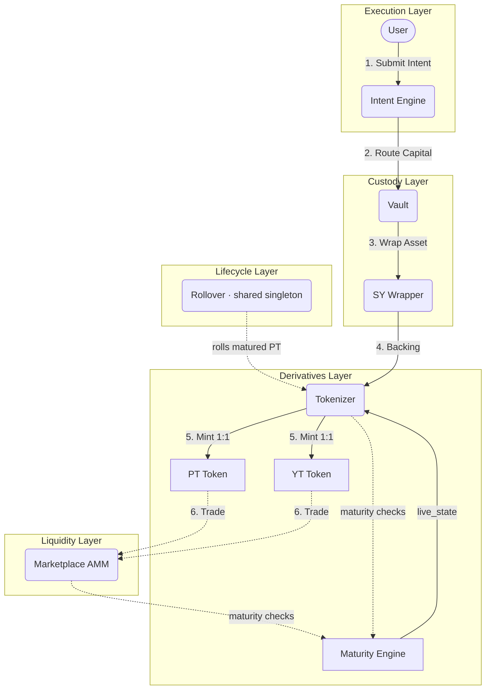
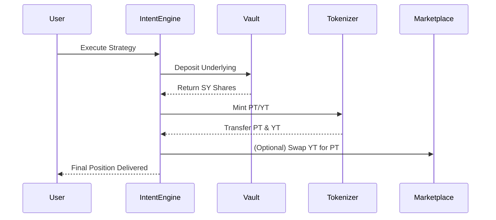

# Novaire Architecture

## Overview
Novaire is an institutional-grade protocol built on the Stellar network that enables the tokenization, separation, and trading of yield. By interacting with a modular suite of Soroban smart contracts, Novaire acts as the financial infrastructure for isolating future yield from principal assets, allowing markets to independently price the time-value of money.

## Core Design Principles
1. **Modularity:** Isolation of custody, tokenization, and market making into distinct Soroban contracts (currently non-upgradeable instances; see Security Considerations).
2. **Capital Efficiency:** Standardized Yield (SY) wrappers ensure underlying assets remain productive while their derivatives are traded.
3. **Intent-driven UX:** Users sign high-level intents rather than interacting with the complex underlying plumbing of tokenization and swaps.
4. **Market-driven Rates:** Yield is not determined by an oracle, but via an automated market maker (AMM) balancing the supply and demand of Principal Tokens (PT).

## Protocol Layers
1. **Asset Layer:** The base yield-bearing asset — currently the native XLM SAC supplied into a Blend Capital lending pool (real, not simulated, yield).
2. **Custody Layer:** Vaults and SY Wrappers that secure the underlying assets and standardize their accounting.
3. **Derivatives Layer:** Tokenizers that mint fixed-term PT and YT against the SY wrapper.
4. **Liquidity Layer:** The YieldSpace-style AMM providing deep liquidity and price discovery for PT and YT.
5. **Execution Layer:** The Intent Engine, routing complex strategies into single atomic transactions.
6. **Lifecycle Layer:** The Maturity Engine — a dedicated per-epoch FSM (`NO_EPOCH → ACTIVE → MATURED → SETTLED → ARCHIVED`) that everyone else queries via `live_state`; plus the Rollover singleton that migrates matured PT between epochs.

## Architecture Diagram

## Detailed Lifecycle

### Yield Tokenization
Assets deposited into Novaire are mapped into a standardized accounting format (SY Wrapper). The Tokenizer locks these shares for a defined epoch (maturity period) and mints Principal Tokens (PT) and Yield Tokens (YT) perfectly backed by the locked assets.

### Principal Separation
The PT guarantees the holder exactly 1 unit of the underlying asset upon maturity. Before maturity, it trades at a discount. The depth of this discount implies the fixed interest rate of the market.

### Yield Separation
The YT guarantees the holder all variable yield generated by 1 unit of the underlying asset between the time of minting and maturity.

### Market Pricing
Prices are discovered on the Marketplace, an AMM specifically designed for time-decaying assets. As PT approaches maturity, its price approaches 1.0 underlying. The AMM invariant adjusts for this time decay to prevent impermanent loss.

### Redemption
Upon maturity, the Tokenizer stops accepting new mints for the expired epoch. PT holders can burn their PT to redeem the underlying principal 1:1.

### Portfolio Calculation
The frontend calculates portfolio value by evaluating:
`Wallet Underlying + (PT Balance * Spot Price) + (YT Balance * Spot Price) + Claimable Yield`

### Yield Accrual
Yield accrues within the Vault. The Tokenizer calculates the exchange rate between the underlying asset and SY shares. As the Vault's underlying balance grows from yield, the exchange rate increases, making YT more valuable.

### Automation & Rollover
The Rollover contract facilitates the automated migration of capital. Users can opt-in to automatically roll their matured PT into the next epoch, saving gas and maintaining continuous fixed-yield exposure. Rollover is a **long-lived shared singleton** across all epochs (not redeployed per epoch); PT custody is tracked per PT-token contract and per position, and execution is permissionless after a keeper grace period.

### Epoch Lifecycle
Every epoch is governed by the Maturity Engine state machine. The Tokenizer, YT Token, and Marketplace all delegate maturity/expiry checks to it via `live_state()` rather than performing local ledger comparisons. Epoch creation on the Factory is admin-`propose` + **timelocked**, with deliberately **permissionless execution** — the protocol cannot be bricked by an unresponsive admin.

### Analytics
The frontend reads all financial state **live from the contracts via Soroban RPC** (generated TS bindings) and deliberately bypasses the off-chain database. Historical chart data is kept in a file-based JSON store (`history-store.json`, scoped by network + SY wrapper): the Next.js API route `GET /api/history/sync` records protocol-price snapshots when on-chain events occur on Marketplace/Vault, and `POST /api/history/snapshot` attaches client-side wallet balances to those points. The standalone indexer (`apps/indexer`) polls events but its processor is **stubbed** — no event reconstruction is implemented today.

## Detailed Module Explanations

### Frontend Architecture
Built in Next.js 16 (React 19), using React Server Components for performance and SEO. The frontend relies heavily on custom React hooks (`useTrade`, `usePortfolio`, `useWallet`, `useYield`) that wrap the generated TypeScript bindings for the Soroban contracts. State is managed via custom services + `useSyncExternalStore` hooks with a subscription pattern (no SWR / server-state library is used).

### Backend Architecture
Next.js API routes (`apps/web/src/app/api/*`) act as the middle layer: CoinDCX market-data proxies (`/api/prices`, `/api/markets`), the file-backed protocol-history store (`/api/history`, `/api/history/snapshot`, `/api/history/sync`), the waitlist stub, and `registered_users.json` registration. There is no standalone backend service. The `apps/indexer` service polls Soroban events but its processor is stubbed; a Prisma/Postgres schema exists but is not populated at runtime today.

### State Management
Custom services (`protocolService`, `walletService`, `priceOracleService`, `portfolioService`, …) with singleton subscription patterns; React hooks bridge them via `useSyncExternalStore`.

### Wallet Interaction
Freighter wallet integration via `@stellar/freighter-api`. All transactions are assembled via `stellar-sdk`, signed by the user, and submitted to the Soroban RPC.

### Security Considerations
- **Sandwich Attacks:** Mitigated by the Intent Engine using TWAP (Time-Weighted Average Price) checks and slippage limits.
- **Yield Manipulation:** The SY Wrapper strictly segregates accounting, preventing flash-loan yield inflation.
- **Upgradability:** Contracts are currently immutable on Testnet to guarantee deterministic behavior. Future versions will utilize a DAO-governed proxy architecture.

### Testnet Deployment Flow
Deployment is handled via `scripts/deploy.ts` which uses the `stellar` CLI to compile the Rust contracts to WASM, upload and deploy instances, initialize the Factory, invoke the timelocked+permissionless `deploy_epoch` flow (which wires the per-epoch Maturity Engine and all epoch contracts via `DeployEpochParams`), and generate the strictly-typed TypeScript bindings under `packages/bindings/`. The Rollover address is pinned by the first epoch and reused by all later epochs. Verification is done via `npm run verify:testnet` against the live Testnet deployment. (Caveat: the committed deploy scripts' `deploy_epoch` params payload predates the `maturity_engine` field required by the current Factory — see the known-issue note in the root `README.md`.)

### Metric Canonical Sources
To ensure economic correctness and avoid regressions, the Novaire web terminal strictly defines the following canonical data sources for metrics:
- **Display APY (Primary Yield):** Marketplace TWAP (Time-Weighted Average Price) -> Zero Coupon Formula
- **Executable APY (Trading):** Marketplace Spot Price -> Zero Coupon Formula
- **PT Price:** Marketplace Spot Price
- **TWAP:** Marketplace EMA Oracle
- **TVL:** Vault + SY Wrapper underlying balances
- **Portfolio Value:** Spot prices (PT + YT + Claimable Yield)
- **Claimable Yield:** Tokenizer / YT Contract state
- **Protocol Yield:** Autonomous Rollover (CumulativeIntentRecord)
