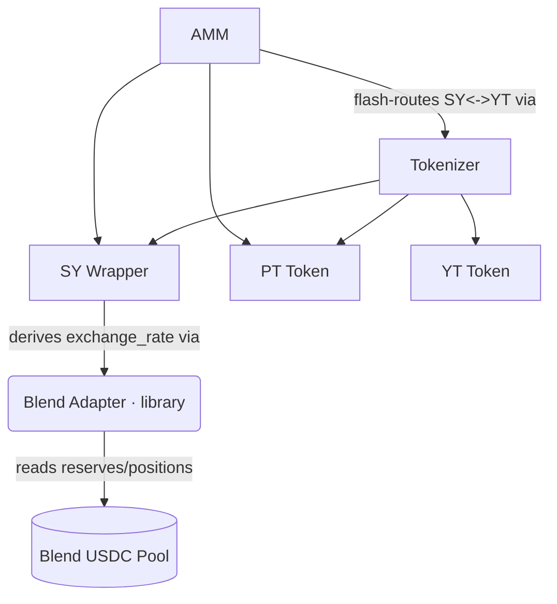

# Novaire Smart Contracts

This document provides a comprehensive breakdown of every smart contract comprising the Novaire protocol. All contracts are written in Rust using `soroban-sdk` and are deployed on the Stellar network.

The protocol consists of **6 crates**: `sy-wrapper`, `tokenizer`, `pt-token`, `yt-token`, `amm`, and `blend-adapter` (a library crate, not separately deployed), plus a `shared/types` trait crate defining the `StandardizedYield` and `Market` interfaces the SY wrapper and AMM implement. Entrypoint names below are taken directly from the source (`contracts/<name>/src/lib.rs`).

This replaces a prior 10-contract design (`factory`, `maturity_engine`, `sy_wrapper`, `vault`, `tokenizer`, `pt_token`, `yt_token`, `marketplace`, `intent_engine`, `rollover`) that added multi-epoch factory deploys, an order/AMM hybrid marketplace, an intent router, and automated rollover. Those product features are not part of the current design; see `CHANGELOG.md` for the migration.

## Contract Dependency Graph

> **Single market per deployment.** Unlike the prior factory model, each deployment is one market: one underlying, one maturity, one SY/PT/YT/AMM contract set. A new maturity or a new underlying is a fresh deployment (see `deployments/README.md`), not a factory-issued epoch.

---

## 1. SY Wrapper (Standardized Yield)

**Purpose:** Wraps a yield-bearing underlying position (a Blend Capital lending pool position) into a standardized ERC-4626-style share.

- **Responsibilities:** Supplies underlying into a mandatory, configured Blend pool, mints/burns SY shares against deposits/redemptions, and exposes `exchange_rate()` as the single source of truth other layers read. There is exactly one rate model: `exchange_rate()` is always derived from the configured Blend pool's reported assets under management. No administrator can directly set or inject the exchange rate, and there is no no-pool or manual-rate initialization path.
- **Storage:** `Config` (admin, underlying, pool, reserve_index), total shares, per-holder balance and principal, allowances.
- **Core Functions:** `initialize_blend(admin, underlying, pool)` (the sole initializer; `pool` is mandatory), `deposit(from, amount) -> shares`, `redeem(from, sy_amount) -> underlying`, `exchange_rate()`, `underlying()`, `accrued_yield(holder)`, `migrate_reserve_index(admin)` (recovers from a Blend reserve reindex), plus SEP-41 token surface on the SY share (`balance`, `total_supply`, `transfer`, `transfer_from`, `approve`, `allowance`).
- **Events:** `Deposit{holder, underlying_amount, shares_minted}`, `Redeem{holder, shares_burned, underlying_amount}`, `ReserveMigrated{old_index, new_index}`.
- **Security Model:** deposits are priced against the actual AUM increase after Blend's bToken rounding, not the requested transfer amount, so a deposit cannot dilute the rate. `migrate_reserve_index` re-derives the reserve index the same way `initialize_blend` does and cross-checks it against the pool's own record — an admin cannot redirect the wrapper at a different, more valuable asset, and cannot use it to set or inject a rate value. A legacy admin-set/no-pool mode existed on old testnet-only deployments; it has been fully removed from the contract and is not reachable through any entrypoint.

## 2. Blend Adapter (library crate)

**Purpose:** Pure adapter math plus a hand-written Blend v2 pool client, used internally by `sy-wrapper`. Not a separately deployed contract.

- **Responsibilities:** Derives the SY exchange rate from Blend's bToken accounting (`derived_exchange_rate`), converts between bTokens and asset units (`assets_from_b_tokens`, `b_tokens_from_assets`), and exposes a `BlendPoolClient` trait (`get_reserve_list`, `get_reserve`, `get_positions`, `submit`).
- **Why hand-written:** the published `blend-contract-sdk` targets an older Soroban SDK than this workspace pins; the client bindings here are hand-confirmed against Blend v2's real pool source.

## 3. Tokenizer Contract

**Purpose:** The core yield-stripping engine. Splits SY into equal-face PT and YT, holds the escrow, and settles redemptions/claims.

- **Responsibilities:** Mints PT/YT against escrowed SY; redeems principal at/after maturity; pays YT holders their accrued yield out of escrow, senior to nothing but capped so PT principal is always covered first.
- **Storage:** `Config` (maturity, sy_token, pt_token, yt_token addresses), frozen maturity-rate snapshot.
- **Core Functions:** `initialize(...)`, `split(from, sy_amount) -> (pt_face, yt_face)`, `recombine(from, pt_amount, yt_amount) -> sy_out`, `redeem_at_maturity(from, pt_amount) -> sy_out`, `claim_yield(holder) -> sy_out`, `preview_split`, `preview_recombine`, `observe_rate`, `freeze_maturity_rate`, `maturity_rate`, `escrowed_sy`, `position(holder)`, `maturity()`, `is_matured()`.
- **Events:** `Split{holder, sy_amount, face}`, `Recombine{holder, pt_amount, yt_amount, sy_out}`, `RedeemAtMaturity{holder, pt_amount, sy_out}`, `ClaimYield{holder, sy_out}`.
- **Lifecycle:**
  - *Pre-maturity:* `split` mints equal-face PT/YT against escrowed SY, collateral-neutral (escrow coverage cannot worsen). `recombine` burns equal PT+YT for principal, capped pro-rata to escrow coverage under a rate regression.
  - *At/after maturity:* the SY rate is frozen (`freeze_maturity_rate`, or snapshotted on first post-maturity access) so no post-maturity rate move changes redemption. `redeem_at_maturity` burns PT for principal, capped pro-rata. `claim_yield` remains open indefinitely (a grace window), paid at the frozen rate — PT principal is always senior to unclaimed YT yield.
- **Security Model:** no entrypoint gates on escrow coverage — a shortfall is priced as a haircut at redemption instead of reverting every call on a market that dipped a rounding notch underwater (the retired `Insolvent` error code is kept reserved, never reused).

## 4. PT Token (Principal Token)

**Purpose:** Fixed-principal claim on the underlying asset, denominated in asset units (not SY shares).

- **Responsibilities:** SEP-41-style token interface; mint/burn restricted to the tokenizer.
- **Core Functions:** `mint(to, amount)` (tokenizer-only), `burn`, `burn_from`, `transfer`, `transfer_from`, `approve`, `allowance`, `balance`, `total_supply`.
- **Events:** `Mint{to, amount}`, `Burn{from, amount}`, `Transfer{from, to, amount}`.
- **Principal Redemption:** PT never captures yield. At maturity it redeems via the tokenizer for `pt_amount * WAD / maturity_rate` SY, unwrapped to `pt_amount` underlying units — fixed regardless of the rate at mint time.

## 5. YT Token (Yield Token)

**Purpose:** Claim on all yield the escrow earns above principal, from mint until maturity.

- **Responsibilities:** SEP-41-style token interface plus per-holder yield accrual: a `checkpoint` (last-settled SY rate) and a banked `accrued_yield` ledger, settled on every balance-changing operation so yield already earned travels with the holder, not the balance.
- **Core Functions:** `mint(to, amount)` (tokenizer-only, settles the recipient first), `burn`, `burn_settled` (tokenizer-only, used by `recombine`), `transfer`, `transfer_from` (both settle sender and receiver before moving balance), `checkpoint(holder)`, `accrued_yield(holder)`, `preview_claim_yield(holder)`, `settle`/`consume` (tokenizer-only, used by `claim_yield`).
- **Events:** `Mint{to, amount}`, `Burn{from, amount}`, `Transfer{from, to, amount}`.
- **Claimable Yield:** actual claiming happens through `tokenizer.claim_yield`, not a YT entrypoint directly — the tokenizer settles the holder, prices the PT-senior surplus, and pays out of escrow.

## 6. AMM Contract

**Purpose:** Time-decay AMM trading PT against SY, with SY-against-YT flash-routed through the tokenizer.

- **Responsibilities:** Provides PT/SY liquidity on a log-implied-rate curve with time as an explicit parameter (concentrating toward 1:1 as maturity approaches), maintains a TWAP, and routes SY<->YT trades through the tokenizer's split/recombine inside its own call so no separate YT liquidity pool exists.
- **Storage:** `Config` (scalar_root, initial_anchor, fee_bps, twap_window, maturity), reserves (PT, SY), LP balances, TWAP accumulator.
- **Core Functions:** `initialize(...)`, `add_liquidity(from, pt_in, sy_in, min_lp_out)`, `remove_liquidity(from, lp_in, min_pt_out, min_sy_out)`, `swap_pt_for_sy(from, pt_in, min_sy_out)`, `swap_sy_for_pt(from, sy_in, min_pt_out)`, `swap_sy_for_yt(from, sy_in, min_yt_out)` (flash-routed), `swap_yt_for_sy(from, yt_in, min_sy_out)` (flash-routed), `quote_pt_for_sy`/`quote_sy_for_pt`/`quote_sy_for_yt`/`quote_yt_for_sy`, `spot_apy`, `twap_apy`, `twap_warming_up`, `implied_apy`, `reserve_pt`, `reserve_sy`, `total_lp`, `lp_balance(holder)`, `maturity()`.
- **Events:** `Swap{trader, route, amount_in, amount_out}` (route ∈ `pt_for_sy` / `sy_for_pt` / `sy_for_yt` / `yt_for_sy`), `AddLiquidity{provider, pt_in, sy_in, lp_out}`, `RemoveLiquidity{provider, lp_in, pt_out, sy_out}`.
- **Security Model:** every swap/liquidity entrypoint takes an explicit `min_*_out` bound checked after the underlying `Market`-trait call, reverting the entire invocation (transfers included) on slippage. There is no separate underlying<->PT swap — going from underlying to PT is `sy-wrapper.deposit` then `amm.swap_sy_for_pt`.

### Pricing and Implied Yield
- **Spot Price:** derived from the PT/SY reserve curve via `quote_pt_for_sy`/`quote_sy_for_pt`.
- **TWAP:** the AMM accumulates a time-weighted price on swaps; `twap_warming_up()` surfaces whether the window has enough history yet. The frontend refuses to compute financial numbers from a not-yet-warm TWAP.
- **Market-driven APY:** `spot_apy`, `twap_apy`, and `implied_apy` derive the fixed rate implied by PT's discount to face value directly from the curve — the protocol uses no price oracle for APY.

---

## Deployment Order

Deployment is orchestrated by `contracts/scripts/deploy-testnet-resilient.sh` (invoked via `npm run deploy`):

1. Build optimized WASM for `sy-wrapper`, `pt-token`, `yt-token`, `tokenizer`, `amm` (`blend-adapter` is a library crate, compiled in, not deployed separately).
2. Deploy and initialize `sy-wrapper` against the underlying and Blend pool.
3. Deploy `pt-token` and `yt-token`, then `tokenizer`, wiring all three together plus the SY wrapper address.
4. Deploy `amm`, wiring it to the PT token, SY wrapper, and tokenizer.
5. Regenerate TypeScript bindings into `packages/bindings/<contract>/` for each deployed contract.
6. Write `deployments/$NETWORK.toml` (the committed public manifest — see `deployments/README.md`), `apps/web/src/config/deployments.$NETWORK.json` (frontend address map), and `apps/web/.env.local`.

The script is resumable: it refuses to run against a dirty tracked source tree and persists deploy state so a failed run can resume rather than restart.
