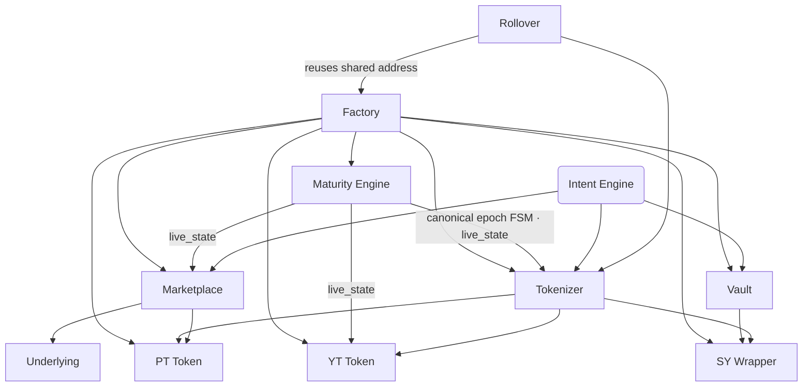
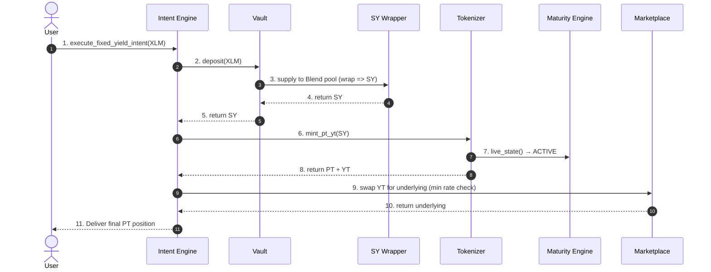

# Novaire Smart Contracts

This document provides a comprehensive breakdown of every smart contract comprising the Novaire protocol. All contracts are written in Rust using the `soroban-sdk` and are deployed on the Stellar network.

The protocol currently consists of **10 contracts**: `factory`, `maturity_engine`, `sy_wrapper`, `vault`, `tokenizer`, `pt_token`, `yt_token`, `marketplace`, `intent_engine`, and `rollover`. Entrypoint names below are taken directly from the source (`contracts/<name>/src/lib.rs`); for the on-chain invariant catalog see [`docs/PROTOCOL_INVARIANTS.md`](../PROTOCOL_INVARIANTS.md).

## Contract Dependency Graph

> **Per-epoch vs. shared contracts.** The Factory wires a fresh `maturity_engine`, `sy_wrapper`, `vault`, `pt_token`, `yt_token`, `tokenizer`, `marketplace`, and `intent_engine` for every epoch via `execute_deploy_epoch`. The **Rollover is a long-lived, shared singleton**: once the first epoch pins its address, every later epoch must reuse that exact address (proposals referencing a different rollover address are rejected).

---

## 1. Factory Contract

**Purpose:** Epoch deployment manager. Proposes and executes the deployment and wiring of every per-epoch contract.

- **Responsibilities:** Administers a timelocked epoch-proposal flow, deploys/wires per-epoch contracts, links epochs, and exposes read-only views for Rollover.
- **Storage:** Per-epoch `EpochRecord` (15 fields) indexed by epoch id and by maturity ledger; pending-deploy proposal; rollover-engine address; protocol version.
- **Core Functions:**
  - `initialize(admin, protocol_version)`
  - `propose_deploy_epoch(params)` — admin-only; stores a `PendingDeploy` with a public **timelock**.
  - `execute_deploy_epoch()` — **permissionless**; after the timelock elapses, anyone can execute. Deploys and initializes the per-epoch `maturity_engine`, wires `sy_wrapper`, `vault`, `pt_token`, `yt_token`, `tokenizer`, `marketplace`, and `intent_engine` against the epoch's `DeployEpochParams`, and records the factory-assigned epoch id (the maturity engine self-assigns epoch id `1` for the single epoch it opens).
  - Views: `get_epoch`, `latest_epoch`, `epoch_count`, `protocol_version`, `get_epoch_by_maturity`, `get_next_epoch`, `link_epochs`, `latest_epoch_view`, `next_epoch_view`.
- **`DeployEpochParams`:** `maturity_ledger`, `underlying_token`, `blend_pool`, `sy_wrapper`, `vault`, `pt_token`, `yt_token`, `tokenizer`, `marketplace`, `intent_engine`, `rollover_engine`, `keeper`, `grace_period_ledgers`, `maturity_engine`.
- **Security Model:** Epoch creation is **not** a single-key action. The admin *proposes* (timelocked); *execution* is permissionless so the protocol cannot be bricked by an unresponsive admin. Note (SEC-10): the proposer picks the Blend pool address, and no on-chain check can distinguish a genuine Blend pool from a convincing fake — deployment-time verification is required (see `SECURITY.md`).
- **Events:** `epoch_deployed`.

## 2. Maturity Engine Contract

**Purpose:** The canonical per-epoch lifecycle state machine (`NO_EPOCH → ACTIVE → MATURED → SETTLED → ARCHIVED`).

- **Responsibilities:** Owns maturity state for the epoch it is deployed with. Tokenizer, YT Token, and Marketplace delegate all maturity/expiry checks to it via `live_state` — they no longer do local `ledger_sequence >= maturity_ledger` comparisons.
- **Core Functions:** `initialize(admin)`, `open_epoch(maturity_ledger)` (called by the Factory during `execute_deploy_epoch`; returns the epoch id), `settle_epoch(epoch_id)` (**permissionless**), `archive_epoch(epoch_id)`, `live_state(epoch_id)`, `current_epoch()`, `next_epoch()`, `epoch_history(epoch_id)`, `protocol_status()`, `time_to_maturity()`, `is_active()`, `is_settled()`.
- **Security Model:** Settlement is deliberately permissionless so matured epochs can always be settled.

## 3. Vault Contract

**Purpose:** Securely custodies user deposits and locks/redeems SY shares against the SY Wrapper.

- **Responsibilities:** Converts deposited underlying into vault shares that proxy SY shares; tracks per-user shares; supports transfers.
- **Storage:** Total vault shares, per-user shares, SY wrapper address, admin.
- **Core Functions:** `deposit(depositor, amount)`, `withdraw(user, shares)`, `transfer_shares(user, to, shares)`, `withdraw_for(user, recipient, shares)`, `pause`/`unpause`, two-step `transfer_admin`/`accept_admin`, `balance_of`, `total_vault_shares`, `metadata`.
- **Events:** `vault_deposit`, `vault_withdraw`.
- **Security Model:** User-authorized via `user.require_auth()`; all exit paths are pause-exempt (an admin can block new activity but can never trap user funds).
- **Deposits/Withdrawals:** On deposit the Vault passes the underlying into the SY Wrapper and credits vault shares at the current exchange rate; withdrawal burns shares and returns the proportional underlying plus accrued yield.

## 4. SY Wrapper (Standardized Yield)

**Purpose:** Standardizes the accounting of a yield-bearing underlying asset (a Blend Capital lending pool position) into a common SY interface.

- **Responsibilities:** Supplies the underlying into the configured Blend pool, maintains the SY→underlying exchange rate, realizes losses, and harvests yield.
- **Storage:** Total shares / total underlying, yield-source (Blend pool) address, underlying address, exchange-rate state, pause flag, admin.
- **Core Functions:** `initialize(...)`, `deposit(from, amount)`, `withdraw(from, shares)`, `refresh_rate()` (refreshes the rate from Blend `b_rate`, clamped by a **+10% ratchet** per call), `mark_loss()` (**permissionless** — forces the rate down to the real measured on-chain balance), `harvest_yield()`, `pause`/`unpause`, two-step `transfer_admin`/`accept_admin`, `get_exchange_rate`, `preview_deposit`/`preview_withdraw`, `underlying_asset`.
- **Security Model:** The exchange rate can only increase via the clamped ratchet or be corrected down by the permissionless `mark_loss` — no admin lever can arbitrarily inflate yield. The yield source is immutable once initialized (no rotation function; SEC-10).

## 5. Tokenizer Contract

**Purpose:** The core yield-stripping engine. Locks SY shares and mints/burns PT and YT.

- **Responsibilities:** Mints PT/YT 1:1 against locked SY shares for its epoch; settles the epoch; redeems PT at maturity; tracks claimable yield.
- **Storage:** Epoch metadata, maturity engine address (source of truth for epoch state), PT/YT addresses, per-user yield checkpoints/index.
- **Core Functions:** `initialize(...)`, `mint_pt_yt(user, sy_shares)`, `settle_epoch()`, `redeem_pt(user, pt_amount)`, claimable-yield entrypoints, reward-per-YT surplus-baseline yield index.
- **Lifecycle (state comes from the Maturity Engine, not local ledger math):**
  - *Pre-Maturity (ACTIVE):* Users mint PT and YT by locking SY shares; burn PT + YT together to unlock SY shares; YT accrues yield via a per-user checkpoint system.
  - *Post-Maturity (MATURED → SETTLED):* Minting ceases. `settle_epoch` finalizes; PT holders burn PT 1:1 to redeem the underlying principal. YT holders claim accrued yield via reentry-safe `claimable_yield` / snapshot-based accounting.

## 6. PT Token (Principal Token)

**Purpose:** Represents a zero-coupon claim on the underlying asset.

- **Responsibilities:** Standard ERC20-style asset interface; also grants its contract address to the network for reserve accounting.
- **Core Functions:** `mint`, `burn`, `transfer`, `balance`, `allowance`, `pause`/`unpause`, two-step admin and tokenizer-address transfers.
- **Principal Redemption:** At maturity, 1 PT burns at the Tokenizer for exactly 1 unit of the underlying asset.

## 7. YT Token (Yield Token)

**Purpose:** Represents the claim to all variable yield generated by 1 unit of the underlying between mint time and maturity.

- **Responsibilities:** Standard asset interface plus yield-index accumulation with per-user checkpoints and claimable-yield accounting.
- **Core Functions:** `mint`/`burn` (tokenizer-admin only), `transfer`, `balance`, claimable-yield entrypoints (reentry-safe `claimable_yield_with_snapshot`), expiry via Maturity Engine `live_state`.
- **Claimable Yield:** YT holders claim their accrued yield without selling the YT itself.

## 8. Marketplace Contract

**Purpose:** AMM enabling the trading of PT and YT against the underlying asset, plus LP positions and AMM-level yield claiming.

- **Responsibilities:** Provides liquidity, executes four swap directions, maintains a TWAP with a staleness guard, prices PT/YT off the reserve curve.
- **Storage:** PT/YT/underlying reserves, LP balances, TWAP accumulators, pause flag.
- **Core Functions:** `initialize(...)`, `add_liquidity(...)`, `add_yt_liquidity(...)`, `remove_liquidity(...)`, `swap_underlying_for_pt`, `swap_pt_for_underlying`, `swap_underlying_for_yt`, `swap_yt_for_underlying`, `claim_amm_yield`, `get_pt_price`, `get_yt_price`, `get_twap_rate`, `get_twap_age`, `get_twap_rate_checked`, `quote_underlying_for_yt`, `quote_yt_for_underlying`, `get_reserves`, `pause`/`unpause`.
- **Security Model:** YieldSpace-style curve (`k = A(x+y) + xy`) that tightens toward a 1:1 constant-sum swap as maturity approaches; maturity/expiry guards delegate to the Maturity Engine's `live_state`; TWAP resists flash-loan/oracle manipulation but has not been independently verified (audit-less testnet codebase).

### Pricing and Implied Yield
- **Spot Price:** Derived from the PT reserve/curve; YT has no independent reserve and is priced synthetically off the PT curve via a bisection solver.
- **TWAP:** The contract accumulates a time-weighted price on swaps; `get_twap_rate_checked` surfaces staleness. The frontend refuses to compute financial numbers from stale reads.
- **Market-driven APY:** The PT discount directly equates to the market-implied fixed APY (`ptPrice → 1 − ptPrice` zero-coupon math); the protocol does not use a price oracle for APY.

## 9. Intent Engine Contract

**Purpose:** Transaction router that executes multi-step strategies in a single atomic transaction.

- **Responsibilities:** Routes user intents through Vault → SY Wrapper → Tokenizer → Marketplace so users sign one high-level intent instead of orchestrating each Soroban call.
- **Storage:** Per-user `CumulativeIntentRecord`.
- **Core Functions:** `initialize(...)`, `execute_fixed_yield_intent(...)` (deposit underlying, mint PT/YT, keep PT, sell YT on the Marketplace at a minimum rate), `execute_yield_speculation_intent(...)`.
- **Security Model:** Slippage protection via min-rate limits / TWAP checks; the whole intent reverts if the final output misses the user's minimum.

### Execution Flow
1. **Investment Intents:** User signs an intent (e.g., "deposit and mint PT/YT").
2. **Routing:** The Engine deposits to Vault → wraps via SY Wrapper → mints PT/YT via Tokenizer → optionally sells YT on Marketplace at the user's minimum rate.
3. **Settlement:** The user receives the PT (fixed yield) position.

## 10. Rollover Contract

**Purpose:** Automates migration of matured PT positions into a new epoch — as a **shared, long-lived singleton** across all epochs, not a per-epoch instance.

- **Responsibilities:** Registration locks a user's PT (with a minimum target rate); after maturity, redeems the PT via the Tokenizer and re-enters the new epoch through the Intent Engine; users can exit before execution.
- **Storage:** Per-epoch/per-position rollover records; PT custody is tracked **per PT-token contract** (positions from different epochs/PT contracts can be active simultaneously — there is no single "current PT" slot).
- **Core Functions:** `initialize(...)`, `register_rollover(...)` (locks PT with a min rate), `execute_rollover(...)` (after expiry: redeem PT + re-enter the new epoch; executable by the keeper or, after the grace period, permissionlessly), `exit_rollover(...)`.
- **Lifecycle:** When an epoch matures, users normally redeem manually; opted-in users have their PT redeemed and capital re-deployed into the next epoch automatically.
- **Security Model:** Keeper-executed with a permissionless-after-grace-period fallback so execution can never be bricked by an unresponsive keeper.

---

## Contract Interaction Diagram

## Deployment Order

Deployment is orchestrated by `scripts/deploy.ts` (Stellar CLI) and the Factory's `execute_deploy_epoch`:

1. Set the underlying token (native XLM SAC by default).
2. Build + upload WASM for `factory`, `sy_wrapper`, `vault`, `tokenizer`, `pt_token`, `yt_token`, `marketplace`, `intent_engine`, `rollover`; deploy each top-level instance.
3. Initialize the Factory (`initialize(admin, protocol_version)`).
4. `propose_deploy_epoch(DeployEpochParams)` → wait out the timelock → permissionless `execute_deploy_epoch()`, which deploys the per-epoch `maturity_engine` and wires all epoch contracts together.
5. The Rollover singleton address is pinned by the first epoch and reused by every later epoch.
6. Regenerate TypeScript bindings into `packages/bindings/<contract>/`.

> **Deploy-script caveat:** the committed `scripts/deploy.ts` invoke payload may be out of date with `DeployEpochParams` (it does not currently pass `maturity_engine`); see the known-issue note in the root `README.md`.